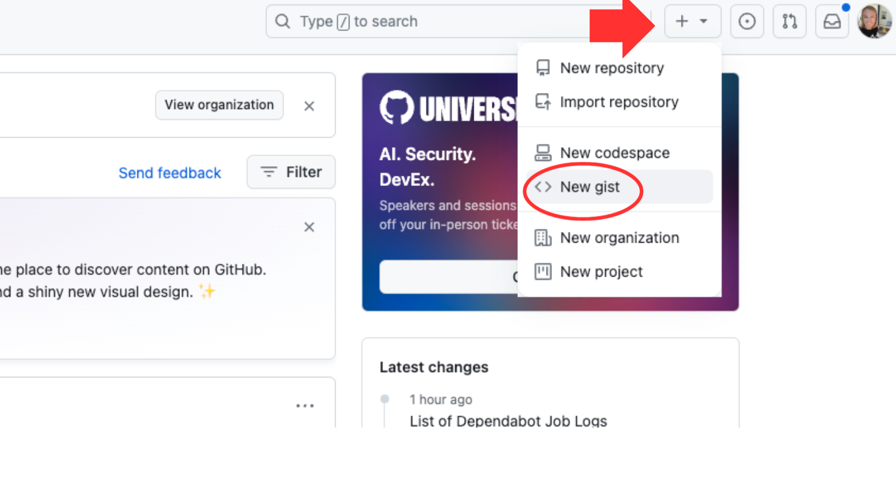
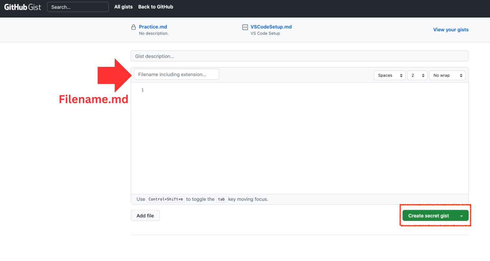

## Learning Goals

- Create new gists on GitHub to document information.
- Design a personal plan for success in Mod 0.
- Demonstrate understanding of Markdown syntax to create elements.

## Vocabulary

- <span class="vocab">Gist</span>
- <span class="vocab">Markdown</span>

## Reminder

If at any time throughout this lesson you feel lost, are unsure of something, or have questions, please add those to your Mod 0 slack channel! We will continue to utilize slack as your main communication hub during your time at Turing so interacting with this tool early and often will help you become comfortable using it.

## Gists on GitHub

Gists are an easy way to share code with others and they are often used to document technical processes and information. We usually write the information in our <span class="vocab">Gists</span> in a user-friendly language called Markdown.

## Markdown

<span class="vocab">Markdown</span> is a lightweight markup language that converts to HTML and can be displayed on the web. It is used widely in the tech industry for documentation. You'll use it in various ways at Turing. Most frequently, you'll use it to document and showcase your projects!

## Markdown Practice

Your task is to create a "Mod 0 Plan" **documenting your plan for success in Mod 0**, using Markdown. The purpose of this exercise is twofold:
- Design a plan for success in Mod 0.
- Practice creating different elements using Markdown. 

Use the tips and guidance that follows to ensure you complete it successfully.

- Log into your GitHub account.
- In the upper right corner, select the `+` sign and select `New gist`. 


<br/>
<br/>

- For the filename, follow this format: `firstName_lastName_mod_0_plan.md`. **Note:** It's important that you add the correct file extension `.md`.
- Make sure you save this as a 'secret gist' - this just means that only people with the link can see it!
<br/>
<br/>



<br/>
<br/>

- Notice that after you added the file extension for markdown (`.md`), you now have an `Edit new file` tab and a `Preview changes` tab. As you are working, you can use the `Preview changes` tab to see what your final product looks like! Note that a `.md` file extension is required at the end of your `Gist`'s filename. Otherwise it will not register as markdown.
- Include all of the elements listed in the Markdown Practice section below using [this Markdown cheat sheet](https://www.markdownguide.org/cheat-sheet/) as a guide.

<br/>
<br/>

<div class="s-card">
  <h3>Markdown Practice - Mod 0 Plan</h3>
  <p>Document your personal plan for success in Mod 0 while incorporating each of the following Markdown elements into your Gist:</p>
  <ul>
    <li>two headings of different sizes</li>
    <li>one ordered list (numbered)</li>
    <li>one unordered list (bullet points)</li>
    <li>bold text</li>
    <li>italicized text</li>
    <li>one image (it's easiest to grab one from the internet!)</li>
    <li>one link to a resource (technical or not) that you've used or plan to use</li>
  </ul>
  <p>Images from your computer can be a little tricky in Gists. Check out this <a href="https://www.loom.com/share/8f7ce8e2e58f42fbbcbe215288ed1386" target="blank">drag-n-drop shortcut</a> to quickly insert an image from your computer into a Gist!</p>
  <p>Ideas for your Mod 0 Success Plan can include:</p>
  <ul>
    <li>Your schedule for prework and live class sessions.</li>
    <li>What you'll do when you're stuck.</li>
    <li>Who will you ask for help?</li>
    <li>How much time will you commit to reviewing prework materials?</li>
    <li>Who will be on your emotional/mental health support team?</li>
    <li>What space will you use for studying and live classes?</li>
    <li>Any other factors that will contribute to your personal success.</li>
  </ul>
</div>

You created your first gist in GitHub using Markdown! Let's build on that understanding by adding some code to your Mod 0 Plan gist. We often use gists to share snippets of code and there are two ways to do this in Markdown. If we want to highlight a short phrase or word in the context of a longer sentence in plain English, we use an `inline code block`. To create an `inline code block`, we use a single backtic (the character to the left of the 1 on your keyboard) before and after the word or phrase. 

If it's a longer block of code, we use a `fenced code block`. A fenced code block with JavaScript code might look something like this:
```javascript
var name = "Kaitlyn";
var affirmation = "You are smart and capable!";
console.log(`Dear ${name} -- ${affirmation}`);
```

A fenced code block with Ruby code might look something like this:
```ruby
name = "Kaitlyn"
affirmation = "You are smart and capable!"
puts "Dear #{name} -- #{affirmation}"
```

To create the `fenced code block`, we use three backtics on a single line to open the fenced code block, followed by several lines of code, and another set of three backtics on a single line to close the code block.

<div class="s-card">
  <h3>Markdown Practice - Round 2</h3>
  <p>Update your gist with both types of code blocks.</p>
  <ul>
    <li><strong>Include at least one inline code block, highlighting a word or phrase in a sentence.</strong> Normally, we use this to highlight a very short snippet of code inside a paragraph or sentence. For now, you can use it to highlight any word or phrase in your Mod 0 Plan.</li>
    <li><strong>Include one fenced code block in either Ruby or JavaScript.</strong> If you don't know how to write any Ruby or JavaScript code, use one of the examples above and modify it to work for you!</li>
  </ul>
  <p>Note: To get the fancy colors on your fenced code block, include the name of the language you're using <em>right after</em> the three opening backtics (```javascript).</p>
</div>

When you are finished editing your Mod 0 Plan, click the green `Create secret gist` button. Check your work by ensuring that you have all 10 elements listed below and they render as expected in the final version.
1. A header
2. Another header of a different size
3. A numbered list
4. A bulleted list
5. Bold text
6. Italicized text
7. An image
8. A link
9. An inline code block
10. A fenced code block

## Check For Understanding

Add these questions and your responses to your Mod 0 plan gist. Feel free to use any and all resources to answer these questions! 

1. What is markdown? 
1. What is your favorite markdown resource? (link or screenshot)
1. What is the file extension for a markdown file? 
1. What are the different header options? 
1. How do you create a bulleted list?
1. How do you insert a hyperlink?
1. How do you insert code into a markdown file?