These instructions are only to be used as a short-term solution while you are waiting for your official Turing Laptop (which is a Mac).  As soon as you receive your Turing laptop, please complete the setup on our main [Computer Setup Page](./computer-setup)

If, at any point during this computer setup, things don't work as described, reach out to your instructors!

## Set up Windows Subsystem for Linux
1. Open Powershell
    * Click on the 'Start' icon on your keyboard or taskbar  
    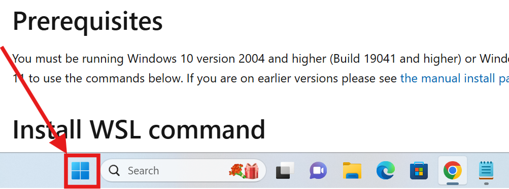
    * Search for 'Windows PowerShell'
    * Click on 'Run as Administrator'  
    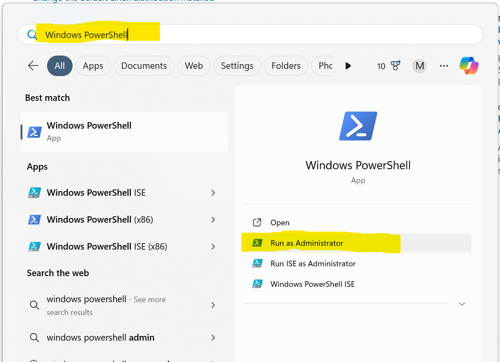
    * If asked 'Do you want to allow this app to make changes to your device?' (or similar), click 'Yes'
2. Install WSL
    * In the Powershell, run `wsl --install`
    * If asked if you want to allow changes, click 'Yes'
    * When complete, you should see something like:  
    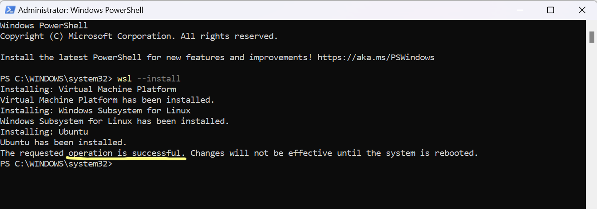
3. Restart you computer
4. When your computer restarts, Ubuntu should automatically launch
    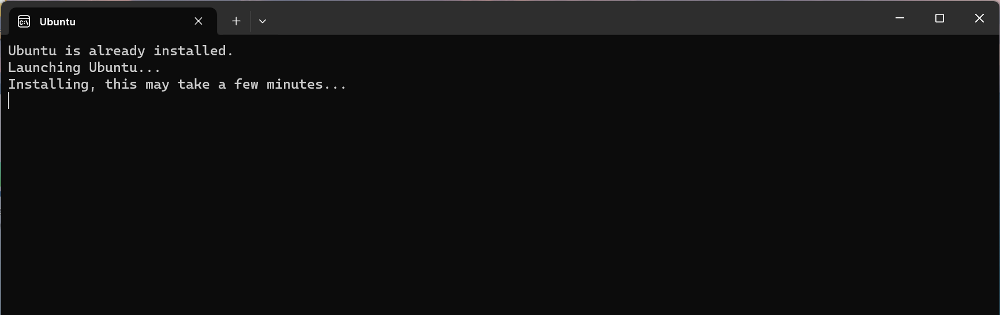
5. When prompted, enter a username (I used my first name) and a password
    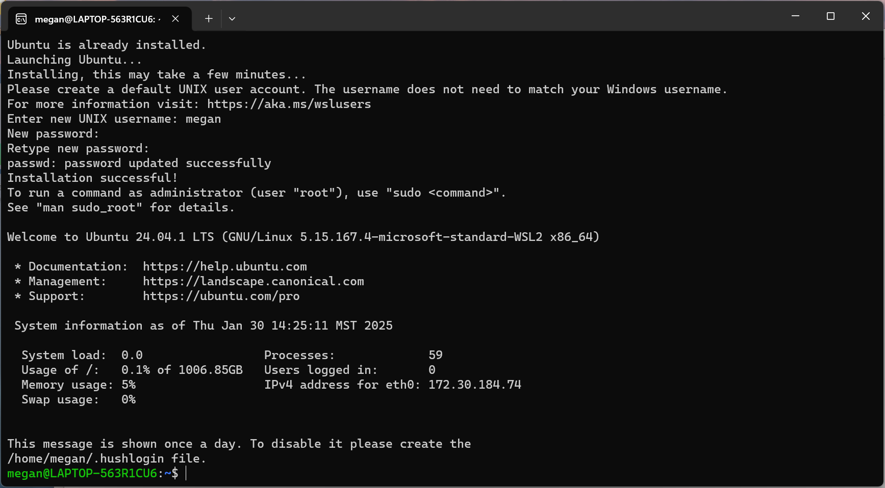

----------------------------------------------------

## Install Ruby
_All commands will be run in your Ubuntu Terminal_
1. update the apt package manager with `sudo apt-get update`
    * If asked for your password, enter the one you configured during the WSL setup above.
2. install ruby with `sudo apt-get install ruby-full`
    * enter 'Y' to continue through all prompts
3. Confirm that ruby has been installed by opening irb (interactive ruby)
    * `irb`
    * you can play around with ruby code here!
    * when you are ready to exit irb, enter `exit!`  
    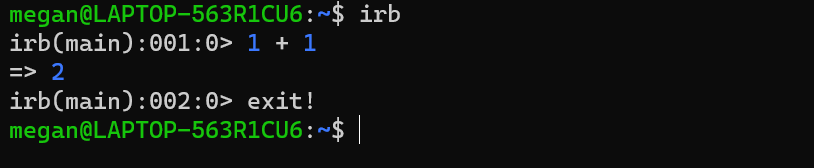
4. Configure your gem settings (don't worry about what gems are right now)
    * `echo '# Install Ruby Gems to ~/gems' >> ~/.bashrc`
    * `echo 'export GEM_HOME="$HOME/gems"' >> ~/.bashrc`
    * `echo 'export PATH="$HOME/gems/bin:$PATH"' >> ~/.bashrc`
    * `source ~/.bashrc`  
    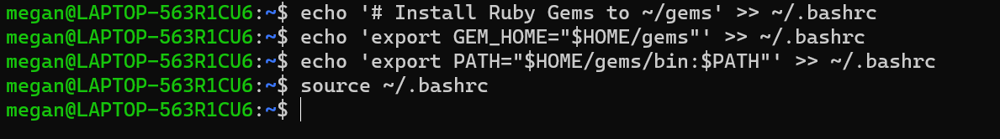
5. Confirm that your gem setup is configured correctly
    * `gem install pry`
    * `pry` - this opens an interactive ruby environment similar to irb
    * `exit!`  
    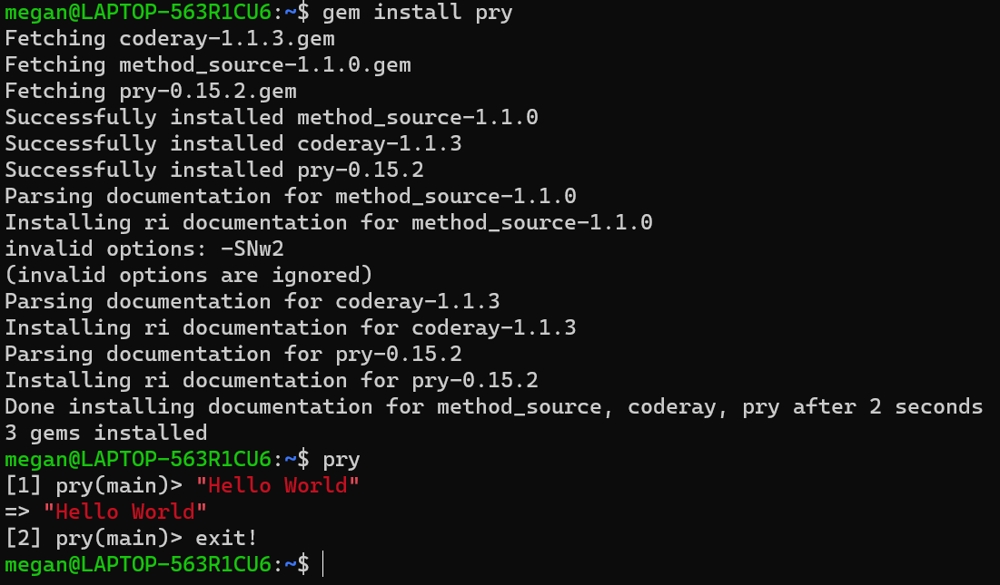

---------------------------------------------------------------------

## Install VSCode
_VSCode is the text editor that we will use for writing code_
1. Download and Install VSCode
    * Use the ['Windows Installer'](https://code.visualstudio.com/docs/setup/windows)
    * Keep all default settings in the install wizard
2. Close and Restart PowerShell
    * When you restart, you will need to switch to Ubuntu  
    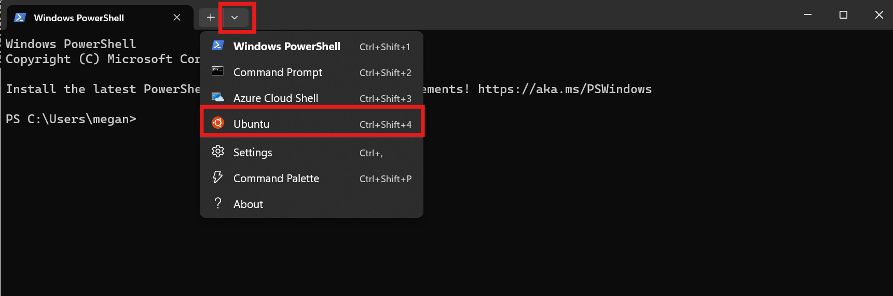
3. Verify setup
    * create a new file with `touch ruby-playground.rb`
    * open the file in VSCode with `code ruby-playground.rb`
    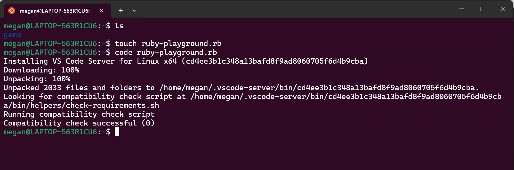
    * Add the following line to the file and save the file (ctrl+s): `puts "Hello World"`  
    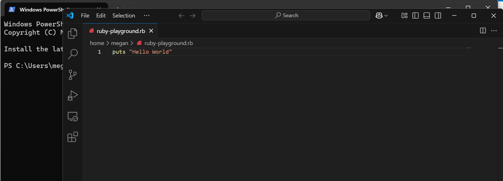
    * In PowerShell, run the file with `ruby ruby-playground.rb`  
    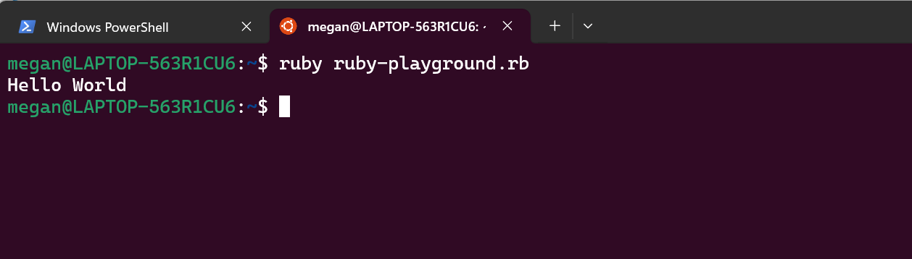

**Congrats! You have created and run your first Ruby program!!**

------------------------------------------------------------------------

## Configure GitHub
1. [Create an account on GitHub](https://github.com/)
2. Configure your local git settings
    * Run the following commands in PowerShell (make sure you are in your WSL Ubuntu environment!) and substitute your info for the first two settings:
    * `git config --global user.name "Megan McMahon"`
    * `git config --global user.email megan@example.com`
    * `git config --global init.defaultBranch main`
    * `git config --global core.editor "code --wait"`
    * `git config --global pull.rebase false`
3. Configure SSH
    * Open Powershell and run `ssh-keygen -t rsa -C "johndoe@example.com"` **use your email address**
    * When you’re prompted to “Enter a file in which to save the key,” press return. This accepts the default file location, which is `~/ssh/id_rsa`.
    * When asked to enter a password, press enter, which means “no password”. You’ll see a confirmation message that looks like what follows:  
    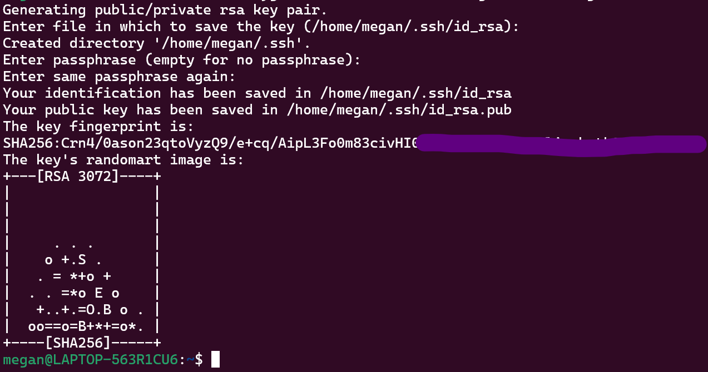
4. Retrieve your SSH key with: 
  * `eval `ssh-agent -s``
  * `ssh-add ~/.ssh/id_rsa`
  * `code ~/.ssh/id_rsa.pub`
  * copy the contents of the file that is opened.  It should look like: `ssh-rsa AAAAB3NzaC1yc2EAAAADAQABAAABgQCvmGeDckRnNY...= your@email.com`
5. Link SSH to GitHub	
    * Go to https://github.com/settings/keys. (You must be logged into your account!)
    * Click the green “New SSH key” button.
    * Leave the “title” section empty.
    * Paste the key into the “key” section.
    * Click the green “Add SSH key” button.
    * To test that our key is configured, run ssh -T git@github.com in the Terminal. You should see something similar to the following:
    ```
    The authenticity of host 'github.com (192.30.252.153)'... can't be established.
    RSA key fingerprint is 00:11:22:33:44:55:66:77:88:99:aa:bb:cc:dd:ee:ff.
    Are you sure you want to continue connecting (yes/no)?
    ```
    * When you see the above prompt, type yes and hit return. At this point, if everything is set up correctly, you should see the the following:
    ```
    Hi <your_username>! You've successfully authenticated, but GitHub does not provide shell access.
    ```

