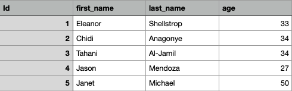

### File IO with CSV

### Vocabulary
- IO
- Read
- Parse
- CSV

### Introduction

Thinking back on projects and class lessons, how have you been making instances of objects so far? 

Likely you have been creating an instance of the object you need:
- Directly in a `runner.rb` file.
-  In your setup in spec files. 
-  Collecting user input and using that information to instantiate.
- Receiving API data (DMV Project), using that data to instantiate in a "factory".
- Creating a Class Method that takes data and turns creates instances with the data sent into the arguments.

What if there was a larger set of data that you wanted to use to create objects? Where do you think this large data set might come from?

### Interacting with non-Ruby files in Ruby

Sometimes the data that we want to use will be stored in files. Some common file types for programmatically importing data include .csv, .txt, JSON, XML, and more. Each programming language will have its own way of reading from, and writing to, these file types. We'll start with Ruby's [File class](https://ruby-doc.org/core-2.5.1/File.html).

In your terminal, run the following commands:

```bash
mkdir ruby_io
cd ruby_io
touch names.txt
touch read_file.rb
touch write_file.rb
```

First, we'll need `names.txt` to contain a list of names:

```
Eleanor Shellstrop
Chidi Anagonye
Tahani Al-Jamil
Jason Mendoza
```

Now, use `File.readlines` to puts the contents of `names.txt` to the terminal.

```ruby
# read_file.rb
file = File.readlines("names.txt")
puts file
```

Great! We've successfully gotten input, or __read__, from a text file using Ruby. But what if we want to use Ruby to 'output' (create) a file? 

The `File.open` method can accept two arguments. The first argument will be the file we want to open, and the second argument will be the 'mode.' From the docs:

<section class="call-to-action">
### Ruby allows the following open modes:

```
"r"  Read-only, starts at beginning of file  (default mode).

"r+" Read-write, starts at beginning of file.

"w"  Write-only, truncates existing file
     to zero length or creates a new file for writing.

"w+" Read-write, truncates existing file to zero length
     or creates a new file for reading and writing.

"a"  Write-only, each write call appends data at end of file.
     Creates a new file for writing if file does not exist.

"a+" Read-write, each write call appends data at end of file.
     Creates a new file for reading and writing if file does
     not exist.
```
</section>

To create a new list of names, we want "w" or "w+" mode.

```ruby
# write_file.rb

File.open("new_names.txt", "w") do |file|
  file.write "Simone Garnett\n"
  file.write "Mindy St. Claire"
end
```

Open the created `new_names.txt` file to verify that this worked correctly.

### Using CSV files to create objects

In the rest of this lesson we'll look at some examples of File IO using CSV. CSV is a file type that stands for _comma separated values_. Think of it similar to a spreadsheet or an excel sheet. The information within these files can be organized in columns and rows and might look like this:



The first row is the headers for each column which gives us information about the values in the rows below. Each row we can think of as being a package of information that belongs together. Looking at our example we should see the first package of information is `1, Eleanor, Shellstrop, 33`. We know that `1` is the id, `Eleanor` is the first name, `Shellstrop` is the last name and `33` is the age because of the header for each column in which the information is located.

Rows and columns are nice for us to visually organize information, but what if we want to use that information in our application? Ruby has helped us by having a defined class called CSV. This class contains methods that we can use to interact with a file.

In Ruby, there are classes already defined for us that will allow us to read and write files. Today we are going to focus on the `CSV` class and how to read a file to create instances of our objects. We will be using [this repo](https://github.com/turingschool-examples/se-mod1-exercises/tree/main/lessons/csv_files/class_exploration) as an example. Take a moment to look at the files and what they contain.

The `./lib/runner.rb` file is where we will be writing out code to read our files and create objects. To start, we are going to `require 'CSV'` so that we will have access to its methods. Next, we want to use the `foreach` method from `CSV` and pass it an argument of the file that we want to read. Similar to the `each` enumerable the `foreach` creates a block where the block variable will be a single row in the file. Now add a `pry` within the block so we can see what a row looks like in our block.

```ruby
require 'CSV'

CSV.foreach('./data/animal_lovers.csv') do |row|
  require 'pry'; binding.pry
end
```

Congrats, you are reading a csv! Since, we know we have access to the information in the file a row at a time we now just need to create objects using that information. As you noticed our first row is the headers row and doesn't contain any data to create an object. Let's update the `foreach` arguments to include the following:

```ruby
require 'CSV'
# headers: true & header_converter: :symbol are optional arguments
CSV.foreach('./data/animal_lovers.csv', headers: true, header_converters: :symbol) do |row|
  require 'pry'; binding.pry
end
```

Now what does `row` look like in `pry`?

What did these two options accomplish? You can check out the official documentation [here](https://ruby-doc.org/stdlib-3.0.0/libdoc/csv/rdoc/CSV.html#class-CSV-label-Options+for+Parsing) in the Ruby Docs for the CSV library.

These optional arguments help format the row information to be more manageable to work with so that you can create new objects. Now let's create an instance of the `Animal Lovers` class from our data.

With a partner see if you can explain what is happening in the code below and use `pry` to confirm your assumptions.

```ruby
require 'CSV'
require './lib/animal_lover'
# headers: true & header_converter: :symbol are optional arguments
CSV.foreach('./data/animal_lovers.csv', headers: true, header_converters: :symbol) do |row|
  id = row[:id].to_i
  first_name = row[:first_name]
  last_name = row[:last_name]
  age = row[:age].to_i
  animal_lover = AnimalLover.new(id,first_name,last_name,age)

  require 'pry'; binding.pry

  puts "#{animal_lover.full_name} has been created!"
end
```

### Using JavaScript to read a CSV file

In Node.js, we can require the 'File system' module to read from and write to files, similar to how we required the `'CSV'` class in Ruby.

```javascript
const fs = require('fs');
```

This `fs` module has a variety of methods for interacting with a file system, which you can read more about in the documentation [here](https://nodejs.org/api/fs.html#file-system).

In this example, we're going to use `fs.readFileSync()` and `forEach()` to create and print JavaScript objects for each row in our CSV file.

With a partner see if you can explain what is happening in the code below and use `console.log()` to confirm your assumptions.

```javascript
const fs = require('fs');

var data = fs.readFileSync('animal_lovers.csv').toString().split("\n");
data.forEach(formatRowData);

function formatRowData(row) {
  var lineArrays = row.split(",");
  if (lineArrays[0] != "id") {
    let rowObject = {
      "first_name": lineArrays[1],
      "last_name": lineArrays[2],
      "age": lineArrays[3]
    }
    console.log(rowObject);
  }
}
```

<section class="dropdown">
### Can we use the same method to work with file types other than CSV?

Yes! `fs.readFileSync()` and the async version, `fs.readFile()`, works with any file extension which supports reading (such as `.txt` and `.json`).
</section>

### Practice

1. On your own, try reading the file and creating magical pet objects.
1. Head over to the "big repo" and find the `event_manager` directory. It can be found under `../mod-1-be-exercises/lessons/csv_files/event_manager`. Follow the instructions in the `exercise.md` file. The Readme will also provide some additional information. 
