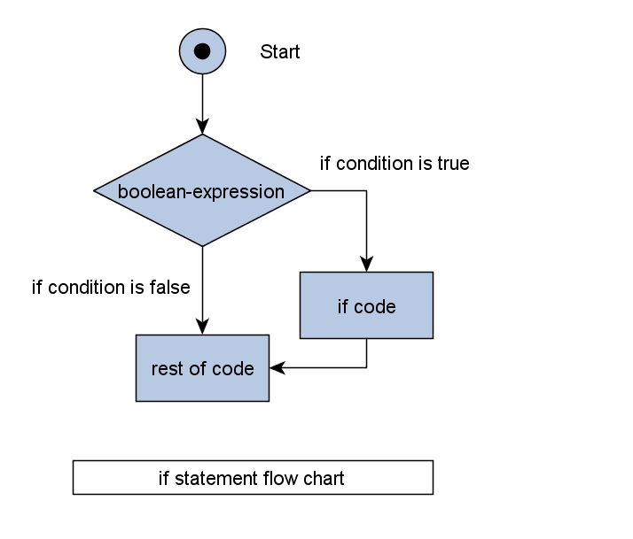
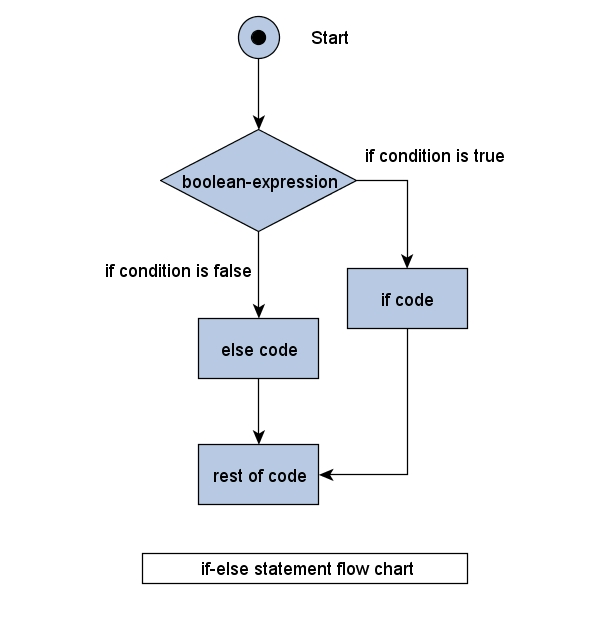

### But First, The Word Of The Day

**equifinality (n):** `the property of allowing or having the same effect or result from different events`

To put it another way, equifinality is when multiple paths end up at the same point, place, or result.

The result we want from this lesson is a functioning piece of software that forks or branches based on one or more conditions, and this lesson will show you a few of the logical tools that can help us arrive there.


## Learning Goals

* Explain the flow of execution through a chunk of code  
* Use `if` statements to control execution
* Use an `else` statement to create an alternative path
* Combine `if`, `elsif`, and `else` to create multiple branches
* Review common and basic loops in Ruby (`while`, `until`, `loop`, `times`)
* Break out of an infinite loop in both IRB and Javascript, as well as a Ruby program
* Generally compare/contrast Ruby's flow control with JavaScript

## Vocabulary  
* condition
* boolean
* conditional branching
* flow control  
* if/elsif/else
* loop
* while
* until
* times
* infinite loop
* break

### Note

You're going to learn different ways to accomplish the same thing in this lesson. Remember that these are tools, and as you learn to be a software developer, you'll get a better idea of which tool to use for which job. For now, just try to understand how the tool works, and at least one use for that tool.

# Conditions

In programming, we refer to something that is either `true` or `false` as a **Boolean**.

A condition is something that evaluates to a Boolean. This can be as simple as a variable that holds a Boolean value:

```ruby
play_again = false
play_again
# => false
```

And in JavaScript: 

```javascript
var play_again = false;
// => false
```

We can also use comparison operators to create a condition by comparing two values. The important comparison operators are:

* `==` equal to
  * Be careful not to mix this up with `=` which is used for **variable assignment**
* `>` greater than
* `>=` greater than or equal to
* `<` less than
* `<=` less than or equal to
* `!=` not equal

We can use them like so:

```ruby
mood = "hungry"
mood == "hungry"
#=> true

mood == "sleepy"
#=> false

mood.length > 5
#=> true

mood != "grumpy"
#=> true
```

You can also use the negation operator `!` (also known as a "bang") to reverse something from `true` to `false`. The "bang" will always return the **opposite** boolean of the boolean that is returned from a method or variable. (Hint: You can also think of the word "not" when speaking the code out-loud! E.g.: `!true` == "not true")

```ruby
!false
# => true

play_again = true
!play_again
# => false

def hungry?
  true
end
!hungry?
# => false
```
**not** `play_again` translates to **not** `true` which translates to `false`

**not** `hungry?` translates to **not** `true` which translates to `false`


There are also built-in Ruby methods that can be used as conditions. Although it's not a rule, Rubyists typically end these methods with a `?` to imply that a boolean will be returned:

```ruby
1.even?
#=> false

"hello".include? "h"
#=> true

"hello".end_with? 'o'
#=> true
```

## `||` and `&&`

We can use the "or" operator `||` and the "and" operator `&&` to combine two conditions into a single condition. `||` evaluates to true if **one** of the conditions is true. `&&` evaluates to true if **both** sides are true:

```ruby
breed = "Corgi"
age = 2

breed == "Corgi" || age == 3
#=> true

breed == "Corgi" && age == 3
#=> false
```

### Try: 
What would be returned from this statement?

```ruby
true || false && true
```
<section class="dropdown">

<h3>Answer</h3>

```ruby
true || false && true

# => true
```

This statement returns true, because the `||` statement looks for **either** side of the conditional to be true. 

The 2nd half (`false && true`) by itself returns `false`, since **both** sides of the `&&` are _not_ true. 

So the entire statement returns `true` because at least one of the sides of `||` is true!

</section>
<br/>

### Watch Out
Be careful... a common mistake is to try to use `||` with two possible values. If we want to say "the length is either equal to 0 or 10", you may try something like this:

```ruby
length = "letters".length
length == 0 || 10
```

This won't give us an error, but it isn't working like we expect. This condition will always evaluate to true, which probably isn't what we expect, and thus is not a very useful condition. If we read this as "length is equal to zero or ten", it makes sense to us, but that's not how Ruby reads it. Ruby evaluates each condition on the left and right independently and then combines them. So Ruby reads it as "Length is equal to zero; or ten.". The important point here is that both sides of an `||` or `&&` are valid conditions. This statement would be correctly written as:

```ruby
length = 5
length == 0 || length == 10
#=> false
```

### Bonus:
What is the return value of:

```ruby
length = "letters".length
length == 0 || 10
```

Why?

<section class="dropdown">
<h3>Answer</h3>

```ruby
length = "letters".length
length == 0 || 10
# => 10
```

If you were expecting either `true` or `false`, you might be surprised to see `10` returned instead! Remember, it will return the last value if it doesn't match the first (0). 

Since `length` is set to `7` (the length of the string that's evaluated), it does not equal `0`, so `10` is returned instead. 

</section>

---

# Conditional Branching

In programming, branching refers to a choice that is made depending on whether or not a condition is true or false. Think of branching as "choose your own adventure".

Examples:

- If a student earns a 3.8 GPA or higher, then they are invited to the honor roll ceremony. (One branch)

```ruby
if gpa >= 3.8
  invite_to_honor_roll
end
```




- If you want to spend a lot of money for dinner, go to a fancy restaurant. Otherwise, cook at home. (Two branches)

```ruby
if spend_that_money == true
  fancy_dinner
else
  cook_at_home
end
```




## `if`

All of our conditional branches will begin with an `if`. The code following the `if` will run if the condition is true.

```ruby
if condition
  # code to execute if condition is true
end
```

## `elsif`

Use an `elsif` to create more branches.

```ruby
if condition1
  # code to execute if above condition1 evaluates to true
elsif condition2
  # code to execute if above condition2 evaluates to true
elsif condition3
  # code to execute if above condition3 evaluates to true
end
```

*NOTE*: In JavaScript, the logic is the same, but we spell out both words entirely. Example: 

```javascript
//JavaScript Only

if (condition1) {
  // code to execute if above condition1 evaluates to true
} else if (condition2) {
  // code to execute if above condition2 evaluates to true
} else if (condition3) {
  // code to execute if above condition3 evaluates to true
} 

```

## `else`

Code inside an `else` will run when none of the previous conditions are true.

```ruby
if condition1
  # code to execute if above condition1 evaluates to true
elsif condition2
  # code to execute if above condition2 evaluates to true
elsif condition3
  # code to execute if above condition3 evaluates to true
else
  # code to execute if all previous conditions evaluate to false
end
```

## Other rules

* Conditional branches have exactly one `if`
* The `if` can be following by any number of `elsif`s
* A conditional branch will have either zero or one `else`
* The `else` comes after the `if`/`elsif`s
* The conditional branch always ends with an `end`
  * NOTE: JavaScript does not use `end`, rather it just ends with a closing curly brace (`}`).
* Only one branch can be taken.
* Conditions are evaluated in order.

---

## Conditionals: Check for Understanding

What will the following code print to the screen?

```ruby
play_again = true
lives = 3
if lives == 0
  puts "You Lose!"
elsif !play_again
  puts "Game Over!"
elsif play_again && lives > 0
  puts "Welcome back!"
else
  puts "invalid input"
end
```

What values would `play_again` and `lives` need to be assigned to in order to print each of the following to your terminal:
  * "You Lose!"
  * "Game Over!"
  * "Welcome back!"
  * "Invalid input

---

Now that we understand conditionals, it's time to practice **repeating instructions**. 

## Looping

A loop is a set of instructions that is executed repeatedly until some condition is met. This condition may be a certain number of times that the loop is executed, for example:

- After baking cookies, you pull the cookie sheet out of the oven which holds 24 cookies. One by one, you remove each of the cookies from the sheet and place them on a cooling rack. (24.times do...)
(Set of instructions that executes 24 times)

or it may be a question that returns a true/false (boolean) answer. For example:

- While looking for a parking spot at a crowded sporting event, a car continues to drive up and down the rows until an empty spot is found (full == false).   
(Loop that executes until a question returns true or false)

## Ruby Loops

The most commonly used loops in Ruby are generally `while` and `until`. When you start using enumerables, you'll learn a different kind of "loop" called the `.each` method. While not strictly a looping mechanism, it operates similarly, but over a specific collection of objects. Normal loops, however, can operate independently of any set of data. 


#### `while`

```ruby
while condition
 # code to execute as long as condition evaluates to true
end
```

Example: 

```ruby
while parking_spot.full?
  keep_driving
end
```

❓ Assuming the parking spot is indeed full, we would `keep_driving`. What would it take for the `keep_driving` method to NOT run? 


<section class="dropdown">
<h3>Answer</h3>
<p>The `parking_spot.full?` method would have to come back as `false` instead of `true`. If it comes back `false`, the `while` loop is stopped.</p>
</section>

#### `until`

```ruby
until condition
  # code to execute if above condition evaluates to false, stop when condition evaluates to true  
end
```  

```ruby
until parking_spot.empty?  
 keep_driving  
end
```

The above example is similar to the `while` example, but the logic is reversed because we're saying `"until"` instead of `"while"`. 

**NOTE**: If you get stuck in a loop, you can use `control + c` to stop it.

### Other Ruby Loops

Expand the section below to try out other loops in Ruby and to use the `break` keyword! 

<section class="dropdown">
<h3>Other Ruby Loops</h3>
## `times`

A `times` loop executes code an exact number of times.

```ruby
5.times do
  # code to execute a given number of times. This code block will run 5 times before exiting
end
```

We can also include a **Block Variable** that tells us which iteration of the loop is running.

This code

```ruby
5.times do |number|
 puts number
end
```  

will print out

```
0
1
2
3
4
```

## loop do

`loop do` allows you to run code in an infinite loop.


```ruby
loop do
  # code will run forever
end
```

You can use the `break` keyword to end a `loop do`:

```ruby
count = 0
loop do
  count += 1
  if count == 3
    break
  end
end
```

</section>

## Looping in JavaScript

For now, we'll look at one example in JavaScript of a `for` loop. 

`for` looks like this: 
```javascript
for (var i = 0; i < 10; i++) {
  console.log(i);
}
```

This code translates roughly to: 

1. Using a variable called `i`, we'll set it to the value 0.
2. Then, our condition for running the loop is `i < 10`. 
   - This means this condition must return `true` in order for the loop to run. If it evaluates to `false`, it will stop. 
3. During each loop, we'll increment `i` by 1 (`i++`) _after_ running the code. 

Each time the loop runs, we'll be logging the value of `i`. The first time we log the value it will print `0`, then `1`, `2`, and so on. 

❓ If this loop prints `0` first, what will the __last__ value be? (Hint: check the condition for running the loop!)

_Highlight below for the answer_:
<p style="color: #fff;">The answer is __9__! This is because i starts at 0, and the condition for running is that i must be less than 10. Once the value of i is incremented, it reaches 10, and stops before printing it. </p>

❓ In your opinion, how does this JavaScript `for` loop compare to Ruby's `while` or `until`? Write your thoughts in your notebook.

---

## Looping: Check for Understanding
* REMEMBER: If you accidentally get stuck in an infinite loop in a Terminal, use `control + c` to stop it.

* Using `while`, `until`, `times`, and `loop` respectively, write a program that prints the word "Beetlejuice" to the terminal 3 times. 🐝
