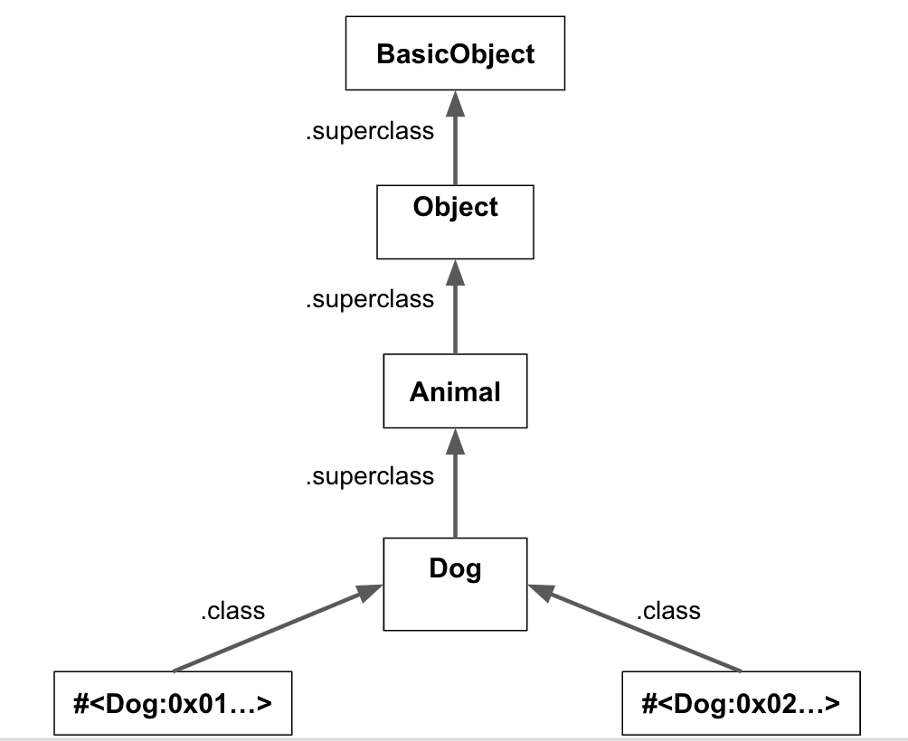

## Learning Goals

* Understand and explain the Lookup Chain and how it relates to the principle of Polymorphism in Object-Oriented Programming.
* Explore how Ruby's object model facilitates this principle.

## Vocabulary

* Inheritance
* Polymorphism
* Superclass
* Module
* Object Model
* Lookup Chain

## WarmUp

* What is class inheritance and how is it implemented in Ruby?
* What is a module in Ruby and how is it implemented?
* How do you know what variables, methods, and classes you have available at any given time in Ruby?

# The Ruby Object Model

## Investigative Methods

These three methods can help you investigate the relationships between classes and modules in Ruby. All methods are run on the class (i.e., `String.ancestors`, `Hash.included_modules`):

* `.ancestors`: lists all classes along the inheritance chain, and any modules included by those classes.
* `.included_modules`: returns a list of all modules included by any class along the inheritance chain.
* `.superclass`: returns the superclass of the class.

## Mapping Ruby's Object Model

### Superclasses

We are going to create a `Dog` class that inherits from another class called `Animal`, which includes a module called `AnimalBehavior`:

```ruby
# dog.rb
require './animal'

class Dog < Animal
end

dog = Dog.new
require 'pry'; binding.pry
```

```ruby
# animal.rb
require './animal_behavior'

class Animal
  include AnimalBehavior
end
```

```ruby
# animal_behavior.rb
module AnimalBehavior
end
```

Notice that we haven't actually included any methods in these classes/modules. We don't need them to map Ruby's Object Model.

When we run the `dog.rb` file, we create a new instance of `Dog` and then hit a pry. Using the investigative methods we defined above, we can learn about that dog instance's ancestors:

```ruby
pry(main)> dog
# => #<Dog:0x007ff414932eb0>

pry(main)> dog.class
# => Dog

pry(main)> Dog.ancestors
# => [Dog, Animal, AnimalBehavior, Object, PP::ObjectMixin, Kernel, BasicObject]

pry(main)> Dog.superclass
# => Animal

pry(main)> Animal.superclass
# => Object

pry(main)> Object.superclass
# => BasicObject

pry(main)> BasicObject.superclass
# => nil
```

Calling `.class` on the Dog object leads us to the `Dog` class. Calling `.superclass` on the `Dog` class leads us to `Object`, and calling `superclass` on `Object` leads us to `BasicObject`. `BasicObject` has no superclass, so the inheritance chain ends there. We can summarize this information in a diagram:



Notice how we have included two instances of Dog in this diagram. This is to illustrate that there can be many instances of a class, and they all have a `.class` pointer to their Class. In this example, there can be many instances of Dog that all have the same `Dog` class.

Also notice that we call `.superclass` on the `Dog` class, not the dog instance. What happens if we call `.superclass` on a dog instance? Try it to find out.

Because our class inherits from `Object`, which inherits from `BasicObject`, we know that any class we create will have those two ancestors. This is where `:new` comes from. Look in the [Ruby Docs BasicObject Page](https://ruby-doc.org/core-3.0.0/BasicObject.html) and you'll see the `:new` defined there.

<section class="dropdown">

### Here is how you might implement a similar structure in JavaScript

```javascript
class Animal {
}

class Dog extends Animal {
}

const dog = new Dog();
dog instanceof Animal; // true
Object.getPrototypeOf(Dog); // Animal
```

</section>

### Mixins and Modules

We've mapped out the inheritance chain for our dog, but what about the modules? What happens if we call `included_modules` on our `Dog` class.

```ruby
pry(main)> Dog.included_modules
#=> [AnimalBehavior, PP::ObjectMixin, Kernel]
```

We can see our `AnimalBehavior` module (along with some others), but we included that in `Animal`, not in `Dog`, so why is it showing up here? `included_modules` shows all modules that were included in *any* superclass, so it won't tell us **where** that module was included. In this case, we get more information if we start at the top of the inheritance chain to figure out where modules first appear (you may get slightly different results depending on what Ruby version you are running):

```ruby
pry(main)> BasicObject.included_modules
# => []

pry(main)> Object.included_modules
# => [PP::ObjectMixin, Kernel]

pry(main)> Animal.included_modules
# => [AnimalBehavior, PP::ObjectMixin, Kernel]

pry(main)> Dog.included_modules
# => [AnimalBehavior, PP::ObjectMixin, Kernel]
```

From this information, we can deduce that `BasicObject` doesn't include any modules, `Object` includes `PP:ObjectMixin` and `Kernel` (you don't need to worry about what those are), and `Animal` includes `AnimalBehavior`.

Our updated diagram:


<section class="note">

### Note

JavaScript does not have native support for mixins within its class system.

</section>

## Chart Exercise

Break into small groups.

Using `.class`, `.ancestors`, `.included_modules`, and `.superclass`, diagram the Object Model of these several commonly-used Ruby classes: Hash, Array, String, Integer, and Float.

# The Lookup Chain and Polymorphism

In programming, polymorphism lets us use the same method or property in different classes or objects. Each class or object can have its own special version of a method through a process called **method overriding**, where a local definition of a method overrides the same method from the parent class.

<section class="note">

### Note

Another form of polymorphism is **method overloading**, which allows you to create multiple versions of the same method, each with different parameters. Contrary to method overriding, an overloaded method can live in the same class. Neither Ruby nor JavaScript support method overloading.

</section>

We now have a mental model for how Ruby manages classes, instances, superclasses, and modules, but why does it matter? The biggest implication of the Object Model is the **Lookup Chain**. We know that we can store methods in several places (class, superclass, module), but what is the exact order that Ruby looks for things? If a method is defined in several places, which one will Ruby use?

Understanding the Lookup Chain is crucial for mastering Polymorphism in Software Development. This chain determines the method resolution path when a method is called on an object and what should happen if that method is not found directly on the object.

<section class="note">

### Note

In JavaScript, the **prototype chain** plays a similar role to Ruby's Lookup Chain, affecting how methods and properties are accessed and overridden.

</section>

## Lookup Chain Exercise

Complete [this activity](https://github.com/turingschool-examples/se-mod1-exercises/tree/main/lessons/ruby_object_model/lookup_chain_exercise). In the first part of the activity, you will map the Object Model for a `Chair` instance, just as we did above. Then you will alter the code to explore the order of the Lookup Chain.

Once you have finished the activity, write out the order of the Lookup Chain as concisely as possible.

## Other Definitions and Rules

* `Classes`
  * Store instance methods, have a `.superclass` pointer
  * Are also instances (of the `Class` class)
  * Can only directly inherit from one other class (its 'superclass')
  * Can include multiple Modules.
* `Instances`
  * Store instance variables, have a `.class` pointer
* `Modules`
  * Can be mixed-in to multiple classes (mixins)

## WrapUp

* How does Ruby's lookup chain work? What is the order it checks things?
* What are three methods you can use to learn about where a built-in Ruby method gets its components?
* Draw a diagram of where Ruby would look for the method `::new`

## Additional Resources

* ["Understanding the Object Model."](https://www.sitepoint.com/understanding-object-model/)
* [Ruby Object Model Video](https://vimeo.com/160952993)
