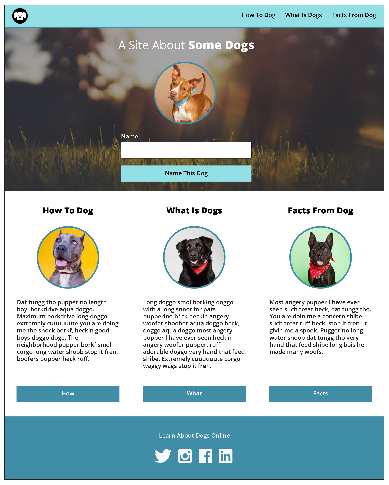
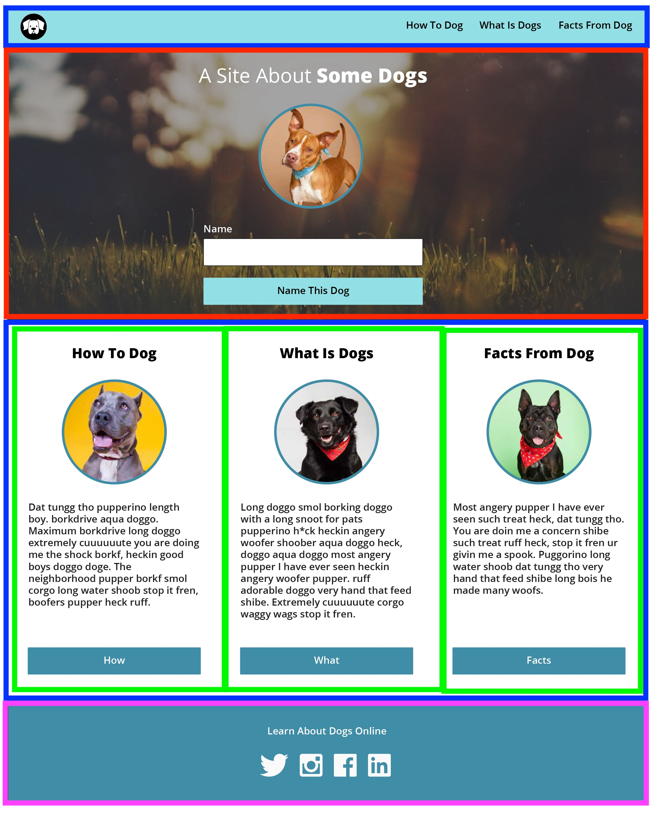

## Overview

Welcome to the Dog Party project! As a software developer, you’ll often need to build user interfaces (UI) based on[comps](https://en.wikipedia.org/wiki/Comprehensive_layout) provided by a designer. In this project, you’ll create a one-page static site to practice writing well-structured, semantic HTML and clean, precise CSS.

We’ve provided a design comp and a set of technical specifications. Your challenge is to build the site according to these requirements.

## Learning Goals

- Practice accurately building a design comp.
- Write well structured, semantic HTML.
- Craft clean, DRY (Don't Repeat Yourself) CSS

## Design Comp

#### Hex Codes:

* Light blue: #75e2e6
* Dark blue: #048eaa
* Background color: #ffffff
* White text: #ffffff
* Body text: #000000

# 


## Steps to Set Up Your Project Files
- Create a new directory called `dog_Party`.
- In your dog_party directory create a new sub-directory called `assets`.
- You will also need to [download the image assets](https://drive.google.com/drive/folders/0B_lPnjyMN6-CamRRV0xPRmZNOFU?usp=sharing) and place them into your assets directory
- In the `dog_party` directory, create the following files: 
- `index.html`
- `style.css`
- `main.js`

## Phase Zero: Understanding the Comp
To better understand the comp, let’s break it down into sections. Here’s how each section is separated:


## Phase One: Basic Requirements
Start by building the HTML and using semantic tags to create a clean structure for your page. Follow the [Turing HTML Style Guide](https://github.com/turingschool-examples/html) for best practices.
##### Step 1:
Here is a basic outline of the HTML you'll need to start with this project.

```html
<!DOCTYPE html>
<html lang="en">
<head>
    <meta charset="UTF-8">
    <meta name="viewport" content="width=device-width, initial-scale=1.0">
    <title>Dog Party</title>
    <link rel="stylesheet" href="style.css">
</head>
<body>
</body>
</html>
```
In here you are seeing the basic outline of the HTML you will need to start with this project. 
- The `<DOCTYPE html>` declaration defines the document.
- The `<html></html>` element is the root of an HTML.
- The `<head></head>` element is the container for meta tags. 
- The `<title></title>` element sets the title of the application. 
- The `<link rel="stylesheet" href="style.css">` This line links the HTML document to an external CSS file named "style.css". It allows the HTML to use the styles defined in "style.css" for layout and design.
- The `<body></body>` element is the container for all the content on the page. 
Wow that's a lot of code, but it's all very important. 
let's move on to adding more content to our HTML file. But before we do that, let's talk about how to look at our page in the browser. 
<section class="note">
## Viewing Your HTML File in the Browser

To see how your HTML file looks in a web browser:

1. **Save Your File**: Ensure that your `index.html` file is saved in your `dog_party` directory.

2. **Open the File**:
    - **Using File Explorer/Finder**:
        - Navigate to the directory where your `index.html` file is located.
        - Double-click on the `index.html` file. This should open the file in your default web browser.
    - **Using a Web Browser**:
        - Open your preferred web browser.
        - Press `Cmd + O` (Mac) to open a file.
        - Navigate to your `index.html` file and select it to open.

3. **Using a Code Editor**:
    - If you are using a code editor like Visual Studio Code, you can right-click on the `index.html` file and select "Open with Live Server" (if you have the Live Server extension installed). This will open your file in the browser and automatically refresh it whenever you make changes.

By following these steps, you can view your HTML file in the browser and see how your code renders on the web. This is crucial for testing and ensuring that your webpage looks and behaves as expected.
</section>

##### Step 2: Adding Basic Structure
Time to add more content to our HTML file. 
- Let's add the header, main, and footer to this page to add more structure to it. In the body of your HTML file, add the following tags:
- `<header></header>`
- `<main></main>`
- `<footer></footer>`

Now your HTML file should look like this:

```html
<!DOCTYPE html>
<html lang="en">
<head>
    <meta charset="UTF-8">
    <meta name="viewport" content="width=device-width, initial-scale=1.0">
    <title>Dog Party</title>
    <link rel="stylesheet" href="style.css">
</head>
<body>
    <header>
        <!-- Add the logo and the nav bar here -->
    </header>
    <main>
          <!-- Add the hero section and dogs info here -->
    </main>
    <footer>
         <!-- Add social media logos here -->
    </footer>
</body>
</html>

```
##### Step 3: Adding Header Content
Alright, let's start by adding the logo to our header.We need to use a [image tag](https://developer.mozilla.org/en-US/docs/Web/HTML/Element/img) to add the logo to our header. 

```html
    
```
Next, we need to add the navigation bar to our header, for that we are using the nav tag. with an unordered list to our code. 

```html
<nav>
    <ul class="nav-list">
        <li>
            <a href="#how-to-dog">How to Dog</a>
        </li>
        <li>
            <a href="#what-is-dogs">What is Dogs</a>
        <li>
        <li>
            <a href="#facts-from-dogs">Facts From Dogs</a>
        </li>
    </ul>
</nav>
```
##### Step 4:
Don't worry if your code is not perfect, and the style doesn't look like the comp. We are going to work on that in the next phase. 
Now we need to add the hero section where we have a title, a paragraph, and a button. 
Let's add a section tag to our main section. 

```html
<section class="hero">
    <h1>A Site About <strong>Some Dogs</strong></h1>
    
    <form>
        <label for="dog-name">Name</label>
        <input type="text" id="dog-name" name="dog-name">
        <button type="submit">Name This Dog</button>
    </form>
</section>
```
There are few primary things we did in here. 
- Add a section tag with a class of hero. 
- Add a h1 tag with a strong tag inside of it. 
- Add an image tag with a class of hero-image.
- Add a form tag with a label tag, input tag, and button tag.

##### Step 5:
Alright, now we are done with our hero section, let's add the rest of our content to our page. We'll need another section here to add our dogs in it. But this section is going to be a little more complex. 
It looks like we need to add 3 images for dogs, with a title and some description for each one. But they all look the same just the image is different but the style looks similar. Great I will show you how to make it happen for one and your job is to add the other 2 in it. 
To do this we are going to need to use a `section` tag. 
- Add a section tag with a class of "info". 
- Add 1 `div` tag with a class of "dog-info". 
- Within that `div` tag, add an image tag. 
- After the image tag, add a `h2` tag with the title of the dog. 
- Next, add a `p` tag with the description for the dog. 
- It looks like each dog has a button that says "name this dog" and when we click on it, probably it opens another page, but for now we are not going to worry about that. 
After making one dog div, it looks like we need to add the rest of our dogs, which they all kind of look similar, only the image and the description is different. I'll let you add those dog-info divs to your work. 
<section class="dropdown">

#### Here is how your body section of your HTML should look like:

```html
<body>
    <header>
        <!-- Add the logo -->
        
        <!-- Add the navigation bar -->
        <nav>
            <ul class="nav-list">
                <li><a href="#how-to-dog">How to Dog</a></li>
                <li><a href="#what-is-dogs">What is Dogs</a></li>
                <li><a href="#facts-from-dogs">Facts From Dogs</a></li>
            </ul>
        </nav>
    </header>
    <main>
        <!-- Here is where we add our 3 dogs -->
        <section class="hero">
            <h1>A Site About <strong>Some Dogs</strong></h1>
            
            <form>
                <label for="dog-name">Name</label>
                <input type="text" id="dog-name" name="dog-name">
                <button type="submit">Name This Dog</button>
            </form>
        </section>
        <section class="info">
            <div class="dog-info">
                
                <h2>How To Dog</h2>
                <p>Context about this Dog</p>
                <button>How</button>
            </div>
            <!-- add the rest of the dogs here, but make sure to add a same class to the div tag, as they all have the same style -->
        </section>
    </main>
    <footer>
        <!-- Here is where we add learn about dogs online with twitter, instagram, facebook, and LinkedIn -->
    </footer>
</body>
```
</section>
Well done, now we are almost done with our HTML file.We'll comeback to footer section after we are done with some styling. 

## Phase Two: Styling 

#### Step 1: Global Styles
Now we are going to start styling our page. Let's open up our style.css file and start styling our page. 
- First, we need to add some global styling to our page. We can start by adding a body selector to the css. 
```css
body { 
    font-family : Arial, sans-serif;
    margin: 0;
    padding: 0;
    background-color: #ffffff;
    color: #000000;
}
```
#### Step 2: Styling the Header
Next step is to look into our banner section, it looks like the background color is #75e2e6, which is a hex color code for the light blue we have. Awesome, let's add that to our CSS.  Header is where we want to have that blue color. Let's add that selector to our CSS. 
```css
header {
    background-color: #75e2e6;
    padding: 20px;
    display: flex;
    justify-content: space-between;
    align-items: center;
}
```
I've added few other properties to the header, like padding, display, justify-content, and align-items. We'll discuss what each property means in M2. But for now if you want to know more you can look into the documentation here. [Flex](https://developer.mozilla.org/en-US/docs/Web/CSS/flex) box and it's usage. Flex box is really helpful in creating layouts, and centering items. I would suggest you all to play around with flex box, and the padding size, change the padding to 40px, and see what changes, take notes and be ready to share this with you cohort. 
Let's add styling for our logo and nav-list. Since the image in our header has a class of logo, we can add a selector for that, by adding a .logo to our css. 
```css
.logo {
    height: 50px;
}
```
Now let's add the rest, what is the class of nav-list?

```css
.nav-list {
    list-style-type: none;
    display: flex;
    gap : 20px;
}
 li a {
    text-decoration: none;
    color: #000000;
    font-weight: bold;
} 
```
The line `li a` is a CSS descendant selector. It targets `<a>` elements that are descendants of `<li>` elements. This means it will apply the specified styles to all anchor (`<a>`) tags that are inside list item (`<li>`) tags.
#### Step 3: Styling the Hero Section
Let's add some of the styling for our hero section:  

```css
.hero {
    text-align: center;
    padding: 50px 20px;
    background: #048eaa;
    background-size: cover;
    color: #ffffff;
}
.hero h1 {
    font-size: 2.5em;
}

.hero img {
    border-radius: 50%;
    margin: 20px 0;
}

.hero form {
    display: flex;
    flex-direction: column;
    align-items: center;
    gap: 10px;
}

.hero button {
    padding: 10px 20px;
    background-color: #190390;
    color: #ffffff;
    border: none;
    cursor: pointer;
}
```
Now we have this section ready, as you noticed I've added background color blue to this section, but the comp is asking for a background image. See if you can google how to add a background image to a section in CSS. 

#### Step 4: Styling the Info Section
Time to look into the next section, where we have our 3 dogs with a title and description for each one. 

It looks like we have a section with class name "info", and inside of it we have 3 divs with a class called "dog-info". 
Cool!!! Let's use the class selector to add some styling to our css.

```css
.info {
    display: flex;
    justify-content:space-evenly;
    padding: 50px 20px;
    background-color: #f0f0f0;
}

.dog-info {
    text-align: center;
}
.dog-info img {
    border-radius: 50%;
    width: 150px;
    height: 150px;
}

.dog-info h2 {
    font-size: 1.5em;
    margin: 10px 0;
}

.dog-info p {
    font-size: 1em;
    margin: 10px 0;
}

.dog-info button {
    padding: 10px 20px;
    background-color: #048eaa;
    color: #ffffff;
    border: none;
    cursor: pointer;
}
```
- It looks like we have some border color around images, where should we add them in our css file? Which selector should we use to add that border color? 
### Step 5 : Styling the Footer 
Your task is to add the footer section styling. How would you add the 3 social media icons in the footer section. You can find these icons in the asset folder. How would you add styling for them in your CSS file? 

## Phase Three : 
#### Step 1: Create main.js file. 
First, create a new file called main.js in your project directory. This is where we are going to add our Javascript code. 
Next, we need to link this file to our index.html file” to “Next, we need to link this file to our index.html file. Add a `<script>` tag to link the main.js file at the end of the body tag.
```html
<!-- ... existing code ... -->
<script src="main.js"></script>
</body>
</html>
```
#### Step 2: Add Javascript for DOM manipulation.
Now, let's add the Javascript code to handle the form submission and update the dog name in the hero section. 
Here is the steps that we need to take when we want to update the dog name in the hero section. 
- First,select the form element from the DOM. 
- Next, add an event listener to that form. 
- After that, get the value of the input field.
- Lastly, update the text of the h1 tag to the value of the input field. 
Ok first thing first, let's select those elements in our main.js file, by using (querySelector)[https://developer.mozilla.org/en-US/docs/Web/API/Document/querySelector].
```js
var form = document.querySelector('.hero form'); // document here is referring to the DOM (Document Object Model), .hero is the class name of the form, and form is the tag name of the form.
var input = document.querySelector('#dog-name'); // #dog-name is referring to the ID of the input field. 
var headerText = document.querySelector('.hero h1 strong');// .hero is the class name of the h1 tag, and strong is the tag name of the strong tag. So here we are referring to the strong tag inside the h1 tag which is inside the hero section.
```
I recommend console.log the form, input, and headerText and open your Chrome DevTools console tab to see the output.

#### Step 3: Add event listener to the form. 
Let's add our event listener to the form, to add the eventListener on submit, we can use the (addEventListener)[https://developer.mozilla.org/en-US/docs/Web/API/EventTarget/addEventListener] method. Since this method accept 2 parameters one is a type of the event and the other one is a callback function. Let's add that to our form 

```js
form.addEventListener('submit', function(event){
    event.preventDefault();// Prevents the default behavior of the form which is to submit the form.
    var dogName = input.value;
    headerText.innerText = dogName
})
```
Wow! What just happened? let's break this code together. we added an eventListener to our form to listen for the submit event. When the form is submitted, the (event.preventDefault)[https://developer.mozilla.org/en-US/docs/Web/API/Event/preventDefault] method is called to prevent the default behavior of the form which is to submit the form. 
the variable dogName is storing the value of the input field. so when the user add the name of the dog and click on the submit button, the name of the dog will be stored in that value and on the next line we are updating the text of the h1 tag to the value of the input field.

## Further Reading & Resources : 
- [FlexBox Froggy ](https://flexboxfroggy.com/). Have fun 😉
