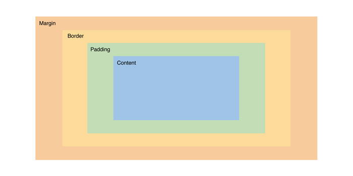

## Learning Goals

* Use Chrome Dev Tools to debug CSS
* Demonstrate understanding of:
  * selectors and specificity
  * sharing styles across multiple elements
  * the box model
* Start to use CSS to match a provided comp

## Vocabulary

- `CSS` Cascading Style Sheets
- `HTML element` A building block that makes up the structure of a web page
- `id` / `class` attributes on HTML elements that allow us to identify HTML elements in our CSS
- `property` (CSS property) The name of a style property of an HTML element (e.g., color, border)
- `value` The value that is paired with a given style property
- `declaration` A property/value pair within a CSS rule
- `declaration blocks` multiple declarations
- `selector` used to target HTML elements on our web pages that we want to style
- `rule` selector(s) and a declaration block come together to create a rule

## What is CSS?
CSS can do SO MUCH more than just add color or make things pretty. CSS can be used to create artwork like [this project](https://www.cssartist.com/inprogress) by Kassandra Sanchez. CSS can also make complex processes more intuitive and accessible users, like [TurboTax](https://turbotax.intuit.com/personal-taxes/online/) and [airbnb](https://www.airbnb.com/). CSS is a powerful tool for frontend developers. This [CSS Zen Garden](https://csszengarden.com/) demonstrates just how powerful it can be.

It’s a “style sheet language” that lets you style the HTML elements on your page. CSS works _with_ HTML and controls the positioning, sizing, colors, and specific fonts on your page.  

CSS can be implemented as `inline css`, `internal css` or `external css`.  We will always implement CSS externally with a css file that gets linked in the HTML document - the approach used by modern applications.  Why don't we want to use inline or internal CSS styling? 


## Anatomy of a Basic CSS Rule


### Selectors  
There is a `class` and `id` attribute available to use on __every__ HTML element. In addition to the plain old element names themselves, these attributes are selectors that allow you to "target" and manipulate HTML elements in CSS and in JavaScript.  

We can target HTML elements in CSS in many ways:
```css
// by element name
h1 {
  color: red;
}

// by class name
.primary-font {
  font-family: "Montserrat", sans-serif;
  font-size: 45px;
}

// by id name
#about-page {
  background-color: lightgrey;
}

// by a combination of above
.primary-font p {
  font-size: 15px;
  color: darkgrey;
}
```
<br>

### Sharing styles across multiple elements
Remember: an HTML element can have zero, one, or _multiple_ classes applied to it. Class attributes can help us write cleaner and more DRY (don’t repeat yourself) CSS **because we can apply the same class to multiple elements in our HTML that share certain styles**. Then, in our CSS, we simply apply all the shared styles to that shared class. We can also apply CSS declarations to multiple elements at once by stacking the selectors. 

Open up this [CSS: Sharing Styles Across Multiple Elements Codepen](https://codepen.io/turingschool/pen/LYwbaZJ?editors=1100).  Look at the HTML and CSS closely.  Digest which styles are being applied to which elements and how.  Ignore the commented out CSS styles at the bottom of the file for now.  Together we will learn how to make this CSS more DRY.

<section class="dropdown">
### DRY solution options 

We can keep things DRY in CSS by stacking selectors and/or applying shared styles to a single class then applying that class to multiple elements.

```html
<h1 class="italic">Hello, World!</h1>
<nav>
  <button class="nav-button">Home</button>
  <button class="nav-button">About</button>
  <button class="nav-button">Contact Us</button>
</nav>
<p>Very important text</p>
<input type="text" id="name" name="name-input">
<button class="submit-button italic" type="submit">Submit</button>
<p class="italic">Yes, yes, very very important info here</p>
<button class="delete-button">Delete</button>
```

```css
//stack selectors and separate with commas
.nav-button, 
.submit-button,
.delete-button {
  border-radius: 5px;
  color: blue;
  padding: 10px;
}

//individually apply styles that are not shared
.nav-button {
  background-color: lightblue;
}

.submit-button {
  background-color: grey;
}

.delete-button {
  width: 100px;
}

//Apply italic styling to the h1, a p tag and the submit button all at once via this shared class
.italic {
  font-style: italic;
}
```
</section>


<section class="note">
### Unique IDs

IDs help us accomplish a similar goal as classes do. The difference is that IDs should be unique, never used more than once. Think of it like this:  
- A `class` of students has a code like 2408. All students share a piece of information that applies to them.
- An individual student has a personal `ID` number, like a drivers license or SSN, etc. that is unique to them.
</section>

### Specificity
**CSS Specificity** is a mechanism within the CSS cascade that helps browsers resolve conflicting rules. Suppose you have two (or more) conflicting CSS rules that are being applied to the same element. In that case, the browser follows some rules to determine which one is most specific and that particular CSS declaration will take precedence, with the others being overridden.  

You don't need to memorize the specificity rules, but its worth doing some additional research to wrap your head around the concept. The CodePen below will demonstrate some examples of this.

<p class="codepen" data-height="300" data-theme-id="37918" data-default-tab="html,result" data-user="kaylaewood" data-slug-hash="mdEexwR" style="height: 300px; box-sizing: border-box; display: flex; align-items: center; justify-content: center; border: 2px solid; margin: 1em 0; padding: 1em;" data-pen-title="CSS Rules">
  <span>See the Pen <a href="https://codepen.io/kaylaewood/pen/mdEexwR">
  CSS Rules</a> by Kayla Wood (<a href="https://codepen.io/kaylaewood">@kaylaewood</a>)
  on <a href="https://codepen.io">CodePen</a>.</span>
</p>
<script async src="https://static.codepen.io/assets/embed/ei.js"></script>

<section class="call-to-action">
### Explore

With your partner, use the CodePen above to explore.
* Uncomment each line in the CSS file at a time (starting at the top). Before you uncomment, make a prediction about what you will see on the page.
* Do you notice a pattern for what styling is taking precedent?
* Write down any questions that come up!
</section>

<section class="dropdown">
### Key Takeaways - Specificity

- Styles declared with an `.class` selector will override styles declared with the element selector (like `h1`)
- Styles declared with an `#id` selector will override styles declared with an `.class` selector
- Styles declared with multiple selector (like `div p` or `#nav li.active`) may override others styles depending on how many and which types of selectors they include

Next we'll see how we can use the browser's dev tools to improve our CSS workflow - included getting visibility into which styles are getting overridden.   
</section>

## Dev Tools and CSS

Developer Tools, or Dev Tools, are available to use in every browser. They help us debug, experiment, and test assumptions in our HTML, CSS, and JavaScript quickly and with a low-risk in the browser. They're your friend when it comes to understanding how CSS works (or untangling why it *isn't* working) -- get in the habit of using them early and often!

### Editing CSS

To the right of the HTML pane, there's a small sidebar that gives us styling information for the currently selected element. Similar to the HTML pane, we can add or remove styles and adjust CSS property values from this pane. You can click on any style property associated with the selected element and change its value. You can also use the blue checkbox to toggle the style on or off.


<section class="call-to-action">
### Dev Tools Challenge

Directly from the CSS pane, we can edit the CSS and see the changes reflected immediately.

Let's make the following edits on this lesson page:
* Make the title of this page have a font size of 200 pixels.
* Change the left border color of all elements with a `.call-to-action` class to purple.
* Make all of the `h2` elements red.
* Change the font of the whole page to `serif`

Discussion Questions:
* Experiment with deselecting a few CSS styles. What happens?
* What do you think it means when a style is crossed out?
* Refresh the page. What happened to your changes? Given that they don't persist, why/when would using the Dev Tools be useful?
</section>

<section class="dropdown">
### Chrome Dev Tools Takeaways

* When a CSS property is crossed out, it means that the style was overridden by another style - either because there is a more specific selector somewhere else in your CSS file or because there is a competing style applied later in your file (Remember: CSS reads top to bottom!)
* The Dev Tools are a great tool when you are working on your app's CSS. It's helpful to see the changes in real time and be able to mess with the styles until it's just right. It's also helpful for debugging to see what styles are being unintentionally overridden. Since the styles don't persist, you want to be careful to not make too many changes at a time without updating your CSS file!
* [Here is a great resource](https://developer.chrome.com/docs/devtools/css/) on manipulating CSS through the Chrome Dev Tools.
</section>

## The Box Model

Each element's content is in a rectangular box. CSS leverages **the box model** to control layout and design. An HTML element is comprised of its content and the padding, borders, and margins surrounding it. Boxes are "stacked" in the order they appear in your HTML. You can stack them horizontally, vertically, and in the z-plane.

This diagram can be found in the CSS Dev Tools and the same color coding is used when we hover over elements in the browser with the inspector selected.

# 

Tip:  When trying to get more visibility into a specific element, put a border around it.  This is particularly helpful when trying to see the spacial parts of an element like the padding and margins.

## Recreating Comps

We can apply all the margin and padding we want, but when it comes down to it, many times Front End Developers are tasked with re-creating something a designer has provided them with, commonly called "comps". Let's use our tools to build something professional-grade.  

Throughout both Mod 1 CSS lessons, you are going to work on recreating a piece of the [Imperfect Foods website](https://web.archive.org/web/20220118162321/https://try.imperfectfoods.com/overview).  

Today you will work on `iteration 1` of [this activity](https://github.com/kaylagordon/css-intro-imperfectfoods). You will work on `iteration 2` after you've had the CSS Flexbox lesson.

<section class="dropdown">
### Just SOME common CSS properties you may reach for

- display (none, inline, block, etc)
- border
- border-radius
- padding
- margin
- color (for text)
- font-size
- background-color
- height
- width

</section>


## Wrap Up

<section class="call-to-action">
### Solo Journaling

- How does CSS get applied to HTML elements?
- Explain the Box Model
- What questions do you still have about CSS?

</section>

## Additional Resources

* [MDN Common CSS Properties](https://developer.mozilla.org/en-US/docs/Web/CSS/CSS_Properties_Reference)
* [Complex CSS Selectors](https://learn.shayhowe.com/advanced-html-css/complex-selectors/)
* [Turing CSS Style Guide](https://github.com/turingschool-examples/css)
* [Visual Guide to CSS](http://cssreference.io/)
* [MDN CSS Box Model](https://developer.mozilla.org/en-US/docs/Web/CSS/CSS_Box_Model/Introduction_to_the_CSS_box_model)
* [CSS Border Box](https://dev.to/ameseee/meet-border-box-my-best-friend-a56)
* [Chrome Dev Tools - CSS](https://developer.chrome.com/docs/devtools/css/)