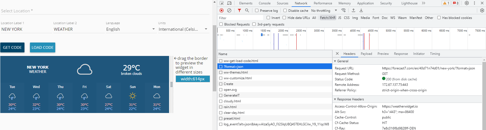

## Learning Goals

- Review the structure of a HTTP Request, and HTTP Response
- Describe how users/clients send information through a request - body, path, query parameters
- Introduce the concept of an API as a type of server at a conceptual level
- Introduce JSON
- Practice requests to an existing API - using Postman

## Vocab

- HTTP Request/Response
- Request Line
- Status Line
- Headers
- Body
- Query Params
- API
- JSON

## Warm Up

- In your notebooks, diagram the request/response cycle.
- What are the 5 common HTTP verbs? And, which CRUD actions do they correspond to?

## HTTP Requests and Responses Review

<!-- ## HTTP Requests and Responses -->

### HTTP

The **HyperText Transfer Protocol** gives us rules about how messages should be sent around the Internet. The system that initiates a connection (the **Client**), sends a "request", and the system that answers (the **Server**), sends a "response".

### HTTP Request

When a **Client** (like a web browser) retrieves information, it sends a payload of data to a **Server** as a "request". This request is made up of three main parts:

1. The **Request** line, (containing three piece of information):

   - the **HTTP verb** [or HTTP method] (GET, POST, PUT, PATCH, DELETE) for sending or retrieving information
   - the **URI path** of the resource where we're sending or retrieving information for
   - the **HTTP protocol** version our "client" software is using, usually `HTTP/1.1`

2. **Headers**: Key/value pairs, which contain supplemental information about our request

3. An optional **body**: Containing data only sent to the server when creating or modifying resources

### HTTP Response

When the server or web application is finished processing our request, it will send back a response which is a payload of data, and is made up of three main parts:

1. The **Status** line, (containing three piece of information):

   - the **HTTP protocol** version that the "server" is using
   - a **Status code**, a 3-digit numeric value indicating the outcome of the request (i.e., 200, 404, 500)
   - a **Status message**, a user-friendly string description of what the "status code" means

2. **Headers**: Similar to request headers, sent as key/value pairs

3. Optional **body**: Contains the requested data (often HTML, JSON, etc.). Almost all responses will contain additional data in the body.

### Seeing HTTP requests and responses in action

Let's open a terminal and run some commands to connect to Google's home page.

Enter `curl google.com -v` in a terminal window and review the output.

```bash
* Rebuilt URL to: google.com/
*   Trying 2607:f8b0:400f:800::200e...
* Connected to google.com (2607:f8b0:400f:800::200e) port 80 (#0)
> GET / HTTP/1.1
> Host: google.com
> User-Agent: curl/7.43.0
> Accept: */*
>
< HTTP/1.1 301 Moved Permanently
< Location: http://www.google.com/
< Content-Type: text/html; charset=UTF-8
< Date: Thu, 31 Aug 2017 01:09:30 GMT
< Expires: Sat, 30 Sep 2017 01:09:30 GMT
< Cache-Control: public, max-age=2592000
< Server: gws
< Content-Length: 219
< X-XSS-Protection: 1; mode=block
< X-Frame-Options: SAMEORIGIN
<
<HTML><HEAD><meta http-equiv="content-type" content="text/html;charset=utf-8">
<TITLE>301 Moved</TITLE></HEAD><BODY>
<H1>301 Moved</H1>
The document has moved
<A HREF="http://www.google.com/">here</A>.
</BODY></HTML>
* Connection #0 to host google.com left intact
```

The `>` symbols indicate part of the request being sent to the server. The `<` symbols indicate the response coming back to our system.

Sending a `curl` request to `https://google.com` will provide the actual site that is displayed when we visit google in a browser.

<section class="checks-for-understanding">
### Check for Understanding

See if you can identify the different parts of the HTTP request and HTTP response.

</section>

#### curl Student Site

Send a `curl` request to a web site of your choice. Note many of the same pieces from the request/response above, with slightly more HTML. Also note, the CSS is not in any way included in the response when you make a request to a student site (unless they used inline CSS). In order to get a CSS file we need to make a second request to something like `https://username.github.io/main.css`.

## Sending Data Through HTTP Requests

Now that we're a little bit more familiar with HTTP requests, which parts are we most concerned about? The key pieces of information in the request are:

- Verb
- Path
- Query Params (part of the path)
- Body

Clients can send information to servers in three main ways:

1. **Request Body**: Used for sending larger amounts of data, typically with POST, PUT, or PATCH requests.

2. **Path Parameters**: Part of the URL path, used to identify a specific resource.

   - Example: `/users/123` (123 is a path parameter)

3. **Query Parameters**: Added to the end of the URL after a question mark.
   - Example: `/search?q=web+development&lang=en`

### How do We Create Requests?

A User doesn't need to know the inner workings of HTTP in order to use a website. They don't need to know they are sending a `POST` request to `/orders`. The requests they send are generated for them by the browser.

Requests are created by:

1. Typing a URL into a browser address bar
   - Always a `GET` request
   - Path is hand-typed
   - Can include Query Params that must be hand-typed
   - Does not include a body
1. Clicking Links or Buttons
   - The developer decides what Verb, Path and Query Params are included
   - Does not include a body
1. Form submission
   - Developer decides on Verb and Path
   - Can include query params but usually does not.
   - User inputs data into form fields. This data is included in the body of the request

## Introduction to APIs

An API (Application Programming Interface) is a set of rules and protocols that allows different software applications to communicate with each other. In the context of web development, an API often refers to a web server that accepts requests and sends data responses, typically in JSON format, instead of HTML.

Frontend applications call APIs all the time to get information to display to users.

For example, when you see a weather widget on a website, that frontend is requesting data from a weather API. That weather API is just sending back raw JSON data, and it is up to the client application to display it.



### Key Concepts of Web APIs

1. **Endpoints**: Specific URLs that represent different resources or actions, typically used to retrieve data
2. **Request Methods**: HTTP verbs that indicate the desired action
3. **Request/Response Format**: Often JSON for modern web APIs

## Introduction to JSON

JSON (JavaScript Object Notation) is a lightweight data interchange format that is easy for humans to read and write and easy for machines to parse and generate.

```json
{
  "name": "John Doe",
  "age": 30,
  "city": "New York",
  "is_member": false,
  "hobbies": ["coding", "gaming", "reading"]
}
```

## Practicing API Requests with Postman

Another common way to call an API is by using an application such as Postman. Postman is a popular tool for testing API requests. Let's practice making requests to a sample API:

1. Install Postman if you haven't already
2. We'll use the [Github API](https://docs.github.com/en/rest?apiVersion=2022-11-28) for practice.
3. Try the following requests:
   - GET `https://api.github.com/users`
   - GET `https://api.github.com/users/<your_username>`

When thinking about the role that APIs play in our web applications, they are another data source for us to call on to retrieve some data, similar to accessing data from your own database. The biggest difference being, you don't have to manage the API database yourself. How cool is that!

<section class="dropdown">
### What are some potential drawbacks of using an API?

- **API Dependency:** Your application relies on a third-party service, which can be risky if the API changes or becomes unavailable.
- **Rate Limiting:** Many APIs restrict the number of requests you can make in a given time period.
- **Cost:** Some APIs charge for usage, which can become expensive as your application scales.
- **Versioning Issues:** API providers may update their services, potentially breaking your integration if you don't keep up.
- **Limited Conrol:** You're bound by the API's functionality and can't easily modify it to suit your specific needs.
</section>

## Additional Postman Practice

Endpoint: `https://pets-api.turingschool-examples.com/api/v1`

Observe the responses, including status codes, headers, and body content.

- GET `/pets`
- GET `/pets/:id`
- POST `/pets` (with a JSON body)
- PUT `/pets/:id` (with a JSON body)
- DELETE `/pets/:id`

## Checks for Understanding

- What are the main components of an HTTP Request and an HTTP Response?
- What are the ways that requests get generated?
- How can a client send data to a server in an HTTP request?
- What is an API in the context of web development?
- What is JSON and why is it commonly used with APIs?
