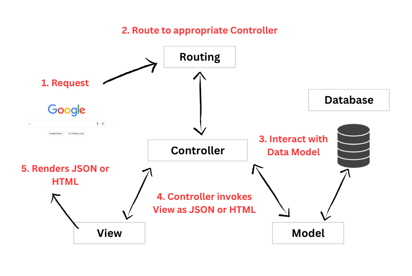

## Learning Goals

- Identify the elements of the MVC design pattern
- Describe the single responsibility of each of the Model, View, and Controller
- Describe how data is passed through the MVC pattern

## Vocabulary

- MVC
- Model
- View
- Serializer
- Controller
- DSL (Domain Specific Language)

## Warmup

- Open the Task Manager app you completed earlier in the inning. If you need a fresh copy of that application for any reason, a complete version can be found [here](https://github.com/turingschool-examples/task-manager-7-complete).
<!-- TODO: Will need a complete version of this to link here -->
- In your own words, what are the primary responsibilities of the models, serializers, and controllers in Task Manager?

## Overview

- **Models** - Interact with the database. Holds other methods related to a particular resource (e.g. a `task`)
- **Views** - Presents an application's data to the user. In Task Manager, this was the JSON rendered in the controller with the use of Serializers. In other applications this might look like an HTML template.
- **Controllers** - Coordinate the response to an HTTP request. In Task Manager, we just had one, but it is common to have multiple controllers.

## Controller

Look at your Task Manager `routes.rb`.

- Routes in Rails are defined as part of its DSL (Domain Specific Language).
- The first keyword, a predefined method, of these routes corresponds with the **HTTP verb** the request is making to the route.
- The argument this method takes is a string version of the **path** the request is being made to.
- The second argument specifies which controller action should handle the request. The DSL syntax is `<controller>#<action>`

Look at your `tasks_controller.rb`:

- Each route maps to a controller **action**
- A controller **action** is a **method** defined in a Controller class
- Controller **methods** and **actions** are synonymous
- Controllers send commands to models to perform database interactions
    - ex: the `index` action retrieves all the tasks
    - ex: the `create` action saves a new task
- Controllers pass data to our serializers or html templates

## Model

Look at your Task model.

- Nothing! So where do we get the ability to call methods like `Task.all` and `Task.find`?
- Every controller within the controllers directory will have access to EVERY model in the database.
- The file naming conventions for models is singular.
- A model that inherits from `ApplicationRecord` should have a corresponding table in the Database.

## View

In our first iteration of Task Manager, we allowed Rails to send back all data we had about our `Task` resources in our database with `Task.all`. Recall that we refactored our controllers to use a Serializer instead. Look at a Serializer from Task Manager. Our Serializer allows us to control exactly what data we send to the user from our database, how we want it formatted, and even the ability to add in additional information that may not be stored in our database.

- Serializers are used to generate custom JSON so we can control exactly what the controller sends back to our user.
- It's good to know that in some applications, the View might be HTML instead of JSON. 
- Regardless of the format returned by the controller, the View represents how we present data to our user. 
        

## Putting it All Together

- Someone sends a request to your application. That request includes:
    - An HTTP verb (GET, POST, etc.)
    - A URI path (`/tasks`, `/`, `/tasks/2`)
- Rails inspects the verb/path combo and determines what controller action to call based on what routes you've defined in `routes.rb`
- Within that controller action, we:
    1. Perform any data manipulation we need using our model
    2. Collect any data we need to use in our view (using a model as a go-between)
    3. Render a view (as JSON or HTML) or redirect

Let's draw a diagram to represent this process.

  

    
  

### Logic "Responsibilities"

The MVC Design Pattern describes the primary responsibility of each portion of code that we'll describe a little bit deeper here.

### Models -- Data Logic

We saw earlier that the Model is responsible for interaction with the database. In MVC, we say that the Model is responsible for "data logic". *Calculations, filtering of data, or other manipulation of data should happen at the Model level.* When fetching data from a Model, the Model should only return raw data in an appropriate data structure -- usually an array, but can also be a hash.

A Model generally does not alter data. For example, it would be appropriate for the Model to calculate the average age of all students, but it should NOT 'round' that data to, say, two decimal places. It can force the result to be a floating point number with `.to_f`, but it should return raw data as much as possible.

### Views as Serializers -- Presentation Logic

Serializers have very little logic in them, generally just if/else statements and perhaps doing some basic iteration over a dataset. *The primary goal of the View layer is to manipulate raw data given to it by a Controller to present that data* in a way that is useful to our users.

Serializers are typically given a resource or collection of resources from our database to iterate over. It's appropriate for the Serializer to call instance methods from the Model class if needed. A Serializer should not call *class* methods except in extremely rare cases where a data builder requires it, such as working with associated database resources (you haven't learned about these yet, so it's okay if you aren't sure what that means).

<section class="call-to-action">
### MVC and data

In MVC applications, we can get and manipulate data in multiple ways. Sometimes we use HTML and forms. You've collected data from a user with JavaScript eventListeners as part of the Hang In There project, and now we are using JSON from HTTP requests to send data to our controller, as well as from our controller to our view layer, which in our case is JSON.
</section>

### Controllers -- Business Logic, or Application Logic

Our Controllers are the "traffic cop" between our Models and our View layer. Based on the incoming request, each controller method knows precisely which Model(s) it needs to utilize to fetch or write data, and will generally hand that data off to a Serializer for presentation.

Controllers should limit their database actions to very simple lookups, or creation of a resource. A controller should not do very much data manipulation, that "data logic" is the role of the Model. Likewise, the controller should pre-fetch as much data as possible so the Serializer or HTML template does not call Class methods from the Models.

### Experiment

- Add a new route and serializer so that the user can successfully visit `localhost:3000/easteregg` and see a new JSON formatting of your choice.
- Add a new route so that the user can go to `localhost:3000/showmethetasks` and be redirected to all of the tasks.

NOTE: For task 2, You should not have to create a new serializer.

**Let’s also quickly talk about why the 2nd path isn’t a good idea.**

### Recap

- What does MVC stand for?
- What are the "logic responsibilities" for each part of the MVC pattern?
- How is data passed through the MVC pattern?
