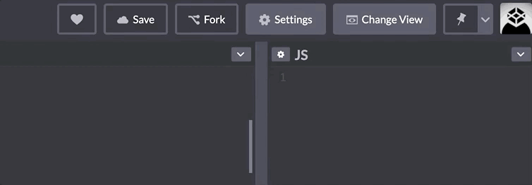

## Learning Goals

* Understand how to attach event listeners to DOM elements
* Understand how to write event handler functions that can
  * Change styles programatically by adding, removing and toggling classes
  * Add new elements to the DOM programatically
* Use Chrome dev tools to explore the event and event.target


## Vocabulary

- `Event` Any event which takes place in the DOM, these can be generated by users or the browser.
- `Event Listener` A function invoked on a DOM node which fires the `event handler` when a specified event occurs on the node or its children
- `Event Handler` A function that will run when a specific event occurs
- `event.target` The element that is the "target" of the event. For example, the element that is clicked on in a click event.

<section class="call-to-action">
### Warm Up
Complete the tasks listed in the JS file on [this codepen](https://codepen.io/turingschool/pen/MWMeopJ?editors=1010).
</section>

## Event Listeners

Changing stuff on the page with JavaScript is great, but you might as well have just written it in the markup to begin with. The real power of JavaScript comes into play when we write code that **responds to user input**.

This power emerges when we start **listening for user events**. This is the crux of front-end engineering. We present a user interface and then as the user interacts with the UI, we change and update what they see.

<section class="call-to-action">
Let's revisit the codepen from the Warm Up and add in an Event Listener. We still want to change the title, fact, and image, but we want to do so only when a users clicks a button.  
  
- Add a "Click Me" button to your html above the <h1> element. Let's give it an id of 'click-me'.
- In your js file, use `document.querySelector()` to grab that button by its id and save it to a variable
- Now add an eventListener to the button.
  - We want the eventListener to listen for a "click" event that happens on that button. 
  - When the "click" happens on the button, we want to invoke a function that does all the things we want to do. Let's call that function changePageContent().
- In the warmup, you wrote code to change the title, fact and image.  Move this code into a changePageContent() function that will be invoked by the eventListener.

Consider:  
- Why don't we invoke the function within the eventListener?  What happens if we do?
</section>

## Explore

There are many types of events beyond just "click".   Explore this list of [Mouse Events](https://developer.mozilla.org/en-US/docs/Web/API/Element#mouse_events) on MDN. Scroll beyond just mouse events to explore keyboard events, focus events, etc.  

Open up a webpage that you often visit. Maybe it's a social media page, maybe it's your bank's website, maybe it's a news site. Take a few minutes and list all the event listeners that you think might be on that page! What do they do?

<section class="call-to-action">
### Pair Challenge

DOM manipulation based on user interaction requires putting several pieces together which is challenging! It is valuable to pseudocode out the steps of what you're trying to do before you try to do it in code.

Fork [this Codepen](https://codepen.io/turingschool/pen/qBzNraG). 

With your partner you will write code so that if a user clicks on the gray box, it will turn purple!  

First plan it out:
* Looking at the existing HTML and CSS
* Pseudocoding the directions, as step-by-step as possible, that you want to give to the computer.
  * Remember, we avoid inline styling in our JS and instead prefer to add/remove classes that have the desired styling applied to them in our CSS.
* What are the DOM elements that your JS will need to know about? What variable names will you use for them?
* What event do you want to be "listening" for?  What element does that event need to happen on?
* What do you want to happen when the event occurs on the specified element?  What will you name the function that holds that code?

Then code it out: 
* Implement your ideas in code.  
* One person should share their screen and drive while the other navigates.  
* The navigator should be coding along in their machine as well.

</section>

<section class="dropdown">

### Key Takeaways

We saw in the first two examples that DOM manipulation based on user interaction requires at least 3 steps.  
* Elements: Querying the elements we'll need 
* Event Listener: Adding the event listener
* Function: Creating the function that the event listener will trigger
</section>


## Taking it Further  

Clicking a box and changing its color is cool, but not a super likely feature to show up in a real application.  Let's make this more realistic, more challenging and more dynamic.  

**Objective:**  
* Users should be able to click on the "Add Box" button to add additional boxes to the page.  

First, we need to think it through, break it down and plan it out.  

Let's pseudocode baby!  
Everyone pseudocodes a little differently.  Here's one example of what that thought process and pseudocode might look like....

```js
// Goal: clicks the button.....Add a box
// query button
// add event listener for "click" on button
// event listener will invoke addBox function
// addBox function should add a new box to the DOM.  
// Can i copy the html for the box from the html file??
// innerText?  innerHTML?  insertAdjacentHTML? *need to check MDN
// wait, where on the dom am i adding the boxes??  *check html
// i can add the boxes to the <section>. i'll need to query that too...
```

<section class="call-to-action">
### Write the code

*Users should be able to click on the “Add Box” button to add additional boxes to the page.*

In your breakout room, put it together in code.  Switch driver-navigator roles from the last breakout.  Driver should screen share. Navigator can code along on their own machine too. 

</section>

## Event.target
Let's add another feature together: *Users should be able to click on any of the boxes they've added and see that box change from gray to purple.*  

First think it through, break it down and plan it out.  
*After user adds more boxes...clicks any box...that box turns purple...*

Take a few minutes to ask yourself and pseudocode out:
* What are the DOM elements that your JS will need to know about? What variable names will you use for them?
* What event do you want to be "listening" for?  What element does that event need to happen on?
* What do you want to happen when the event occurs on the specified element?  What will you name the function that holds that code?

Hm, usually we just use `document.querySelector()` to grab the element we want to add the eventListener to.  But the boxes are being dynamically added to the DOM when the user clicks the Add Box button.  We can't grab them using `document.querySelector()` because they don't exist yet when the files load.  We'll have to use a workaround approach that leverages the `event.target`.

What we can do is write code that says:
1. "Listen" for a "click" within the entire <section> that the boxes live in...
1. When a click happens within that section, figure out which box was clicked on...
1. Turn that box purple by adding the "purple" class that's already styled in the CSS file

<section class="dropdown">
### Step 1: "Listen" for a "click" within the entire section that the boxes live in

- Query the <section> and save to a variable
- Add eventListener to the <section> which will listen for a "click" and invoke a changeColor function
- Build the changeColor function skeleton (we'll add the functionality in step 2)
</section>

<section class="dropdown">
### Step 2: When a click happens within that section, figure out which box was clicked on...

Ok...but, how??

- In the changeColor function, console log the keyword "event"
- Open the dev console and click one of the boxes to see the event print to the console
- Woooooow!  Use the dropdown arrow to dig deeper into the event.

<br>
Complete this Scavenger Hunt, jotting the answers in your notes:
  - What is the event type?   
  - What is the target of the event?  
  - If we dig into that target's classList, what class(es) does the classList contain?
    - Open the DOMTokenList dropdown within the target's classList.  
    - What are some built in methods we could run on the target's classList property? List 3 you might find useful.
  - Does the target have an id?
  - What is the target's innerText?
  - What is the target's innerHTML?
  - What is the parentNode of the target?
  - What is the target's previousElementSibling?
  - What is the target's nextElementSibling?
  - Add another console log that prints the `event.target`

Now that we know about `event.target`, we can use that to access whichever box was clicked on.
</section>

<section class="dropdown">
### Step 3: Turn the clicked-on box purple by adding the "purple" class that is already styled in the CSS file

- Within the changeColor() function, add the "purple" class to the event.target's classList

Uh-oh!  What happens if we click in the `<section>` but not on one of the boxes?  That's not what we want to happen.

What logic can we add to our changeColor() function so that it only adds the purple class to the classList **if** the target of the click is one of the boxes?  

Every box has the class "box".  Maybe we can use code to say: "if the element that was clicked on has the "box" class *contained* in its classList....then add the purple class"

</section>

<section class="dropdown">
### Key Takeaways:

- You can console log the event to get visibility into its many properties and their build in methods.
- We can use dot notation to access these properties and run the built in methods.
- Each DOM element has a classList with methods for .add(), .remove(), .contains(), .toggle()
- When a user takes an action, that action is an "event" and the "target" of that event is whatever element it happened on. We can access it via `event.target`.
- This is all related to the concepts of event delegation and event bubbling.  Not essential to dig into now but something you'll want to google and learn about down the road. Maybe as interview prep.

</section>

<section class="dropdown">
### Optional Practice - Get Weird

- What if we want to toggle between gray and purple on each click? 
- What if in addition to turning it purple, we wanted to add the text "Hi!" inside the box when it gets clicked?
- What if we wanted to have a user click a box and have the box right BEFORE it turn purple instead? 
- What if we wanted to have a user click a box and have the box that is TWO boxes AFTER it turn purple instead? 

</section>


## Get User Input

We can use the `.value` property available on an `input` DOM element to get the value that a user has typed into it.

<section class="call-to-action">
### Explore

Follow the steps below to explore how `.value` works!
1. Open your dev tools and inspect this box, specifically, the input field below. What is its class name?
2. In the console, call `document.querySelector('.check-me');`
3. In the console. call `document.querySelector('.check-me').value;`
4. Type your favorite food into the input
5. In the console. call `document.querySelector('.check-me').value;`

<input type="text" class="check-me" placeholder="this is the input!">

</section>

When called, the `.value` property on an input element will return the **current value**.

<section class="note">
One of the top misconceptions/mistakes we see students make while in Mod 1 is attempt to capture the value of an input while the input is empty. If you want to get a user's input, we have to get the value *after* the user has entered it.  We do this by accessing the `.value` property **via some event listener** - on an event that happens *after* the user has typed into the input field - like clicking Submit after filling out a form. 
</section>

<section class="call-to-action">
### Paired Practice
Go back to your initial codepen from the warm up.  We've already written code to change the content of the page on button click.  But now that we know that we can access the user input with the `.value` property, we can refactor this to be more realistic! 

Delete the Click Me button we previously added and copy-paste this simple form into the html so the user can input the new title, fact and image url.  

```js
<form>
  <input id="title-input" placeholder="title">
  <input id="fact-input" placeholder="fact">
  <input id="image-input" placeholder="image url">
  <button>Submit</button>
</form>
```

Use JavaScript to capture the input values when the user clicks the submit button and update the content of the page accordingly.

First think it through, break it down and plan it out.  
*User types in inputs then clicks submit.  Values from the inputs become the new title, fact and image displayed on the page.*

Take a few minutes to ask yourself and pseudocode out:
* What are the DOM elements that your JS will need to know about? What variable names will you use for them?
* What event do you want to be "listening" for?  What element does that event need to happen on?
* What do you want to happen when the event occurs on the specified element?  What will you name the function that holds that code?
* When and how will you grab the values the user has typed in?

Now code it out.  One person should screen share and drive, the other should navigate.  Navigator can also be coding along on their machine.

Psst... [here](https://images.unsplash.com/photo-1512742282398-91d6f0580591?q=80&w=2874&auto=format&fit=crop&ixlib=rb-4.0.3&ixid=M3wxMjA3fDB8MHxwaG90by1wYWdlfHx8fGVufDB8fHx8fA%3D%3D) is an image url for a cute hedgehog photo, in case you want to use it.

</section>


## Check For Understanding

<section class="call-to-action">
### Think About It  

* What are 3 steps required when doing DOM manipulation based on user interaction?
* How do you access the values a user has entered?
* What is the preferred way to change styles programmatically?
* How do you access the element that a click event (or other type of event) occurred on?
* How do you access and manipulate elements that have been dynamically added to the DOM (since you can't use a simple querySelector)?

Consider:  
What if you wanted to invoke 3 functions in a row on button click?  
What if you need to use logic to determine which function should be invoked on an event?   
</section>  

## Suggested re-teaching practice

- Create a codepen with an HTML form that collects to-do list info:  task, priority level, description. When the user enters info and submits the form, create a litte "card" of that info and display it on the DOM. 
- Read up on the [event listener documentation](https://developer.mozilla.org/en-US/docs/Web/API/EventTarget/addEventListener)
- Explore event bubbling and event delegation using google, youtube and MDN


<!-- Actual learning goals and topics needing covered

See example and syntax for eventListener

Practice the steps of putting together an event listener
 - what elements do i need to grab?  What element do i want to add the listener to?  What elements will i manipulate when the listener is triggered?
 - write the event listener
 - write the function the event listener will trigger

See that the code to change things on the DOM can/will be tied to a user event.
Practing adding html to the dom with innerHTML
Practice adding, removing and toggling classList
Practice checking if classList contains a specific class

Clearly outlined key takeaways


Examples:
2 codepens, do more in each of them.

 -->

<!-- This is the codepen where I was working through the brainstorming. need to create new one for lesson starting boilerplate -->
<!-- https://codepen.io/hfaerber/pen/wvLGoVv -->


<!-- Hoarding of the examples/practice exercises I've cut from this original lesson: -->

<!-- Below is an example of a small application that takes a user input, then changes the color of a box based on that input: -->

<!-- <p class="codepen" data-height="300" data-theme-id="37918" data-default-tab="html,result" data-user="turing-school" data-slug-hash="bGGeKVa" style="height: 300px; box-sizing: border-box; display: flex; align-items: center; justify-content: center; border: 2px solid; margin: 1em 0; padding: 1em;" data-pen-title="Color Box"> -->
  <!-- <span>See the Pen <a href="https://codepen.io/turing-school/pen/bGGeKVa"> -->
  <!-- Color Box</a> by Turing School (<a href="https://codepen.io/turing-school">@turing-school</a>) -->
  <!-- on <a href="https://codepen.io">CodePen</a>.</span> -->
<!-- </p> -->
<!-- <script async src="https://static.codepen.io/assets/embed/ei.js"></script> -->

<!-- Let's break down what's happening in the CodePen above:
- **Lines 1-3:** Declare variables for the DOM elements that we will need (box, input field, button)
- **Line 5:** Attach an event listener to the button
- **Line 7:** Declare a function that will execute when the button is clicked
  - Declare a variable, `color` that takes the value the user selected and stores it
  - Applies an inline style, `backgroundColor` with that newly selected color -->


<!-- ## Style Change on Button Click

Like we mentioned earlier, it's pretty common for a user to experience helpful feedback from an application after they've taken some sort of action.

Take for example the "heart" icon on CodePen. CodePen has 4 levels of "love" - 0, 1, 2, and 3. Each time a heart is clicked, the user increments their love up by one. (Until the click when it is red and at level 3 - at that point, it goes back to 0). While the "love leveling" is a bit confusing, this is still a great example of **styles changing based on user interaction**.



Note: Refer to the Introduction to the [DOM](https://curriculum.turing.edu/module2/lessons/js_intro_to_dom) for changing styles based on user interaction.. -->