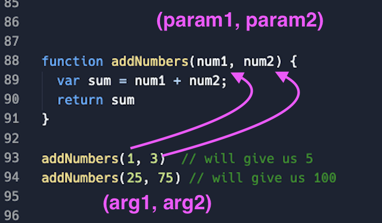

## Learning Goals

In this lesson we'll cover:

* JavaScript data types and variables
* Operators, concatenation and interpolation
* JavaScript functions with or without arguments and parameters
* Conditionals and when to use them
* for loops and iteration with JavaScript

## History of JavaScript

Way back in the early days of the web, Brendan Eich created JavaScript. Legend has it that he wrote it in 10 days in 1995 while he was working as an engineer at Netscape. The language was first released with Netscape 2 in 1996. The name 'JavaScript' was an oh-so-clever marketing push to try to pick up on the momentum of Sun Microsystems' popular language Java, but instead it led to years of confusion about the names of these two mostly unrelated programming languages.

## What is JavaScript and Why?

JavaScript was created to make the web more dynamic. It is an object-oriented scripting language that can also be written functionally and is made to run inside a host environment like a web browser and provide programmatic control over the objects of that environment. For example, when you click a button and you want something about the webpage to change, you will use JavaScript.

JavaScript can be _client-side_ and _server-side_, meaning that it can be used to control user-facing interfaces as well as handle the server-side extensions that connect with a database.

It's a highly versatile and flexible language, and has become the most commonly used language of the web.

Now that we know a little bit about JavaScript, let's talk about how to actually use it!

_Note_: ES6 is the most current version of the ECMA Script Spec. We will be using the ES6 syntax.

## Variables & Data Types

### Variables

In any programming language, variables are what we use to store data values so that we can access and reuse those values throughout our code.  The name "variables" drives home the point that the stored data can change (or *vary*) along the way.  Variables can start off holding one value and later be reassigned to hold a different value.  

In Ruby, you declare a variable simply by assigning a value to it (`person_age = 21`, `country_name = "Spain"`). In JavaScript, you declare the variable using a keyword of either `var`, `let`, or `const`. You do not specify the data type.

Check out the JS syntax in this [repl](https://replit.com/@replit1369/jsfundamentals#index.js).  Fork the repl so you can play with this code.  Run it, break it, get weird with it.
<section class="dropdown">
### JS Syntax Examples

```javascript
var firstName = 'Ben';
var age = 26;
const isNice = true;

const policeSketchDescription = {
  hair: 'blond',
  eyes: 'brown',
  isTall: false,
  visibleTattoos: 1
}

let favoriteFoods = ['pizza', 'blueberries', 'ice cream', 'sushi']

let partnerName = null;
let jobTitle;
```
</section>

<!-- _Note_: Until you've added the assignment operator and the variable value, the variable is considered _undefined_. -->
### Data Types

We can see each of the 7 data types we'll be working with in JavaScript in the syntax examples above. Let's identify each as we go through them.   
  
The basic (primitive) data types we'll work with are BUNNS:  
* **Boolean**
  * a `true` or `false` value (*not* in quotation marks)

* **Undefined**
  * the absence of a declared/defined value
  * maybe we declared a variable name but didn't assign a value yet  

* **Null**
  * an intentionally declared value of "nothing"
  * maybe a placeholder value until data comes through to replace it

* **Number**
  * any number - a negative, decimal or whole number (*not* in quotation marks)
 
* **String**
  * text data - any characters wrapped in quotation marks (including lettesr, numbers, symbols, spaces)
  * in JS you can use 'single quotes' or "double quotes"

The complex data types we'll work with are:
* **Objects** 
  * like hashes in Ruby - groupings of related data in key-value pairs
* **Arrays**
  * like, well, arrays in Ruby  

We access data in objects and arrays similarly to how we would do so in Ruby - using dot notation or bracket notation.

### Your Turn (in your forked repl)

* Use console.log and dot notation to print the value "brown" from the policeSketchDescription object
* Use console.log and dot notation to print # of visible tattoos from the policeSketchDescription object
* Use console.log and bracket notation to print first element in the favoriteFoods array - 'pizza'
* Use console.log and bracket notation to print last element in the favoriteFoods array - 'sushi'

<section class="call-to-action">

### Rules for Naming Variables
- Variables must begin with a letter, dollar sign, or an underscore. They cannot begin with a number.
- Variables can contain any of the above characters plus a number, but you cannot use a dash (-) or a period (.) within the name.
- You cannot use any JS keywords or reserved words (such as `var` or `for`) as a variable name.
- Variables are case sensitive.  `dog` is different than `Dog`
- Use names that describe the kind of information you plan to assign the variable.
- If your variable is made up of more than one word, then use camelCase. Capitalize every word AFTER the first word, which is lower case: `thisIsMyVariableName`.

</section>


### Your Turn (in your forked repl)

* Declare 2 variables, one named "quantity" and one named "mythicalCreature".
* Declare a variable named "creatureCount" but don't assign it a value quite yet.  If you console log it, it should give you "undefined"

## Using Variables Together

Let's make the value to our "creatureCount" variable be our "quantity" `+` our "mythicalCreature".
<section class="dropdown">

```javascript
let quantity = 3;
let mythicalCreature = " unicorns";
let creatureCount = quantity + mythicalCreature;
```
</section>

In your repl, console log your "creatureCount" variable.  What do you get?  

## Concatenating Variable Values

In the example above, we used the `+` string operator to combine the values of two different variables. This is called _concatenation_.  **Concatenation** is using the `+` string operator to essentially smash values together to form a bigger longer string.

We can concatenate html tags, text, numbers, and variable values. Let's revisit our example above to concatenate a more readable phrase as the value of our creatureCount variable:

```javascript
let quantity = 3;
let mythicalCreature = " unicorns";
let creatureCount = "<p>I have " + quantity + " very fancy" + mythicalCreature + "</p>"
```
This is very useful when we want to append data to our webpage, because it means we can write out an entire HTML tag and concatenate the data from our variable.

## Interpolating Variable Values

Another syntax option for accomplishing the same goal is called interpolation.  **Interpolation** lets us smash values together to form a bigger longer string using backticks. We can plug in variable values using `${}`.

```js
let quantity = 3;
let mythicalCreature = "unicorns"; //notice no extra space in the "unicorns" string
let creatureCount = `<p>I have ${quantity} very fancy ${mythicalCreature}</p>`
```

<section class="dropdown">
### Key Points So Far

That was a lot of information. Let's go over the most important things we need to know.  

<section class="dropdown">
### What are JavaScript's primitive data types? Complex data types?
Primitive: BUNNS!  boolean, undefined, null, number, string  
Complex: objects and arrays

Technically also:
- Symbol (new in ECMAScript 6)
- BigInt (new in ECMAScript 2020)  
You won't likely need either of these in your time at Turing so we won't dig into them.
</section>

<section class="dropdown">
### What do we need to know about each data type?

- Boolean: true or false (not in quotation marks)  

- Undefined: not yet given a value (the value hasn't been defined so its UNdefined)  

- Null: intentional absence of a value  

- Number: regular ol’ numbers as we know them  

- String: any characters wrapped in quotation marks (single or double quotes) - often just normal text/words

- Object: like a hash in Ruby - access data using bracket or dot notation

- Array: like an array in Ruby - access data using bracket notation

</section>

<section class="dropdown">
### What are the differencs and use cases for undefined vs null?
Both mean "nothing".  
Null is like a placeholder where someone proactively decided to specifically declare "nothing".  
Undefined is kind of unintentional. Like, it's nothing because no one got around to declaring anything so it defaults to "nothing".

A use case for null might be creating a `userEmail` variable and assigning it to null in case the user does not provide an email.   

You aren't likely to specifically assign a value of `undefined` so there's not a great use case to use as an example.  
</section>

<section class="dropdown">
### Why do we need variables?
To be able to store pieces of data in a way that we can reference and use them later.
</section>

<section class="dropdown">
### What are best practices for naming variables in JS?
  - Variable names cannot begin with a number.  They can begin with a letter, dollar sign, or an underscore.  
  - You cannot use a dash (-) or a period (.) within a variable name
  - You cannot use keywords or reserved words (such as var or for)
  - Variables are case sensitive.  
  - Choose names that describe the kind of information you plan to assign the variable. Call it what it is.
  - Use camelCase for multiple word names i.e., thisIsMyVariableName
</section>

<section class="dropdown">
### What is the difference between concatenation and interpolation?
Concatenation and interpolation are two different ways to accomplish the same goal. The only different is the syntax - neither is better than the other.

Concatenation:  
  - Uses the `+` string operator to combine variables and other values (strings, numbers, html tags) to make a big, long string.

```js
var name = "Hillary";
var age = 30;
var location = "Denver";

var concatenatedString = "My friend " + name + "is " + age + "years old and lives in " + location + "."
```

Interpolation:  
  - Uses the backticks and `${ }` to inject variables to make a big, long string.  

```js
var name = "Hillary";
var age = 30;
var location = "Denver";

var interpolatedString = `My friend ${name} is ${age} years old and lives in ${Denver}.`
```

</section>

<section class="dropdown">
### What is type coercion?
We didn't cover this yet today but you may have seen it in your JS party in Mod 1.  Sometimes JavaScript tries to help us by deciding to change a data type to accomplish a goal without us explicitly telling it to do so. A common example is coercing a number into a string.

For example:
```js
var num = 30;
var word = "Rock";
var showName = num + word;

//showName will be a string of "30Rock" because JavaScript coerced the number 30 into a string to accomplish the goal of combining the two differing data types.
```

</section>

<section class="dropdown">
### `var` vs `let` vs `const`?

`var`, `let`, and `const` are all keywords for declaring variables. Modern JavaScript uses ES6's `let` and `const` but the ES5's `var` is alive and well and used in production code to this day. Throughout Turing, you'll see and work with all 3.  

We're not covering it today but eventually, you'll want [do your research on their differences.](https://codeburst.io/difference-between-var-let-and-const-in-javascript-fbce2fba7b4). They each behave a little differently in terms of scope and reassignment, so it's important to understand the differences. If you don't, you might run into some errors.

</section>
</section>


# Operators

Expressions rely on operators to calculate their single value. There are 5 basic types of operators to get you started:

1. [Assignment operators](https://developer.mozilla.org/en-US/docs/Web/JavaScript/Guide/Expressions_and_Operators#Assignment_operators) assign a value to a variable. (hint: you've got these down already) `var color = 'magenta';`
2. [Arithmetic operators](https://developer.mozilla.org/en-US/docs/Web/JavaScript/Guide/Expressions_and_Operators#Arithmetic_operators) perform basic math. `var addTwo = 2 + 2;`
3. [String operators](https://developer.mozilla.org/en-US/docs/Web/JavaScript/Guide/Expressions_and_Operators#String_operators) combine strings. `var greeting = 'Hello! ' + 'Nice to meet you.';`
4. [Comparison operators](https://developer.mozilla.org/en-US/docs/Web/JavaScript/Guide/Expressions_and_Operators#Comparison_operators) compare two values and return a __true__ or __false__. `var buy = 3 > 5; // Value of buy is false`
5. [Logical operators](https://developer.mozilla.org/en-US/docs/Web/JavaScript/Guide/Expressions_and_Operators#Logical_operators) combine __expressions__ and return a Boolean value of true or false. `var buy = (5 > 3) && (2 < 4);`

# Statements

A script is a series of instructions that a computer can follow one by one. Each individual instruction is known as a statement. Every line of code we've seen and written today is a statement.  

Each statement in JavaScript is followed by a semicolon....sometimes.  In JS, the semicolon is often optional and has no impact on the functionality of your code.  Some devs love this "freedom", some hate this "inconsistency".

Example statements:

```javascript
console.log('BOOM');
alert('POW');
```

# Functions
Just like methods in Ruby, in JS functions are reusable blocks of code that group statements together to perform a specific task. To create a function, you must give it a name and then write the statements required for the function to achieve its task inside the function's curly braces. Let's work through the pieces and parts of a function.

## Anatomy of a Function:
```javascript
// ES 5 syntax for declaring a function
function logStatement() {
  let myFirstStatement = "Assigning a string to a variable called 'myFirstStatement'";
  alert('This is my second statement!');
  console.log(myFirstStatement);
}

// ES6 syntax for declaring a function (arrow function)
// const logStatement = () => {
//   let myFirstStatement = "Assigning a string to a variable called 'myFirstStatement'";
//   alert('This is my second statement!');
//   console.log(myFirstStatement);
// }
```

- You declare a function using the keyword `function`.
- You name the function based on what it does using a present-tense action verb. Then include a set of parentheses after the name, which can be empty or accept parameters.
- After the parenthesis you open a set of curly braces, which act as bookends to hold the set of statements you want the function to run when it is called.
- Calling, or "invoking" the function is quite easy. Simply type the function name with its parenthesis and any associated parameters.

## Call a Function:
```javascript
// Calling a function without arguments
logStatement();

// Calling a function with arguments.  You can only pass arguments if you've created parameters to accept those values in the function declaration.
logStatement("arg1", "arg2");
```

When this code is read, `logStatement()` is "called", all three statements within the function's body (those curly braces) get run.

### Your Turn
Let's go ahead and declare `logStatement()` in the console together and then call it. What do you notice about the code as it is being run? What do you notice about the code being run if you swap the 2nd and 3rd statements?

Create your own functions in the console:

- Write a function called "greetPerson" that declares a `firstName` variable and a `lastName` variable, then prints a greeting message that incorporates the full name, and then prints a random number just for fun.
- Write a function that assigns three different math equations to three different variables:  
  - an "addition" variable with a simple addition equation  
  - a "subtraction" variable with a simple subtraction equation
  - a "multiplication" variable with a simple multiplication equation
  - then, add up the values of all three variables and log it to the console

## Pass Information to a Function:
Functions often need data to do their job. We pass data into function with _parameters and arguments_. You declare your parameters inside the () parenthesis of the function declaration.  Parameters act like variables INSIDE the function. They get their values when you pass _arguments_ in the function invocation and you can use the parameters within the function just like you would use variables.

### Parameters vs. Arguments
There's a subtle difference. Parameters are the placeholders declared in the function declaration (similar to declaring a variable).
Arguments are the assigned values you provide for each parameter/placeholder each time you invoke the function.

```javascript
// parameters named on declaration of function
function myDreamCar(make, model) {
  return "Buy me " + make + " " + model;
}

// arguments "Audi" and "R8" passed into the invocation of the function
myDreamCar("Audi", "R8");
```

## Getting A Value from Functions  

Sometimes we have functions that need to do some sort of calculation or data manipulation, then give us back the result so that we can use that value elsewhere in our code. Often, we will take that returned value and use it to update what is being displayed to our user in an application.

For example:

- A user enters their birthday.
- We have a function that takes in that birthdate and uses it to calculate their age.
- Our function will then _return_ their age value.
- We use that returned age value in our code that displays user info on the webpage.  

You will often be invoking functions within other functions and using their return values elsewhere as you build your code. Some functions return something, other functions just do something.  

To get a value back from a function, you have to use the `return` keyword.  
Let's practice in our repl:

```javascript
function addTwoNumbers(num1, num2) {
  console.log('Boom');
  return num1 + num2;
}

var result = addTwoNumbers(4, 7)
```

We are capturing the value being returned from the function invocation in our "result" variable.  If we console.log the "result" variable, we should see 11 printed to the console after "Boom" is printed.

<section class="dropdown">
### What happens if we move the console log statement to come after the return statement?

The return statement **ends the execution of the function** and **provides the value to be returned to the function caller**. Any lines of code that come after the return statement in a function will not run.   

If there is no return statement in a function, "undefined" is returned by default.   Remember, some functions need to return a value, others just do stuff without needing to return any value.  In that case, they would by default return "undefined.  

The following return statements all break the function execution:

```javascript
return;
return true;
return false;
return x;
return x + y / 3;
```
</section>


## Conditionals

Sometimes we want to perform an action based on some kind of condition. In English, we can say "If this thing is true, then do that."  Let's look at the basic structure of a conditional in JavaScript:  

```javascript
if (expression) {
  statement;
} else {
  statement;
}
```

If the expression evaluates to `true`, then the statement(s) for that condition will run. Otherwise, if the expression is `false`, then the statement(s) will not run at all. The expression will usually contain an operator to make a comparison (that evaluates to true or false).

Some examples of expressions we could use for a conditional are:

* `myNum < 5`
* `userCity === "Denver"`
* `isTired === true`

Now for some real conditional examples.

```javascript
function identifyCookie(cookie) {
  if (cookie === "chocolate chip") {
    console.log("This cookie is a chocolate chip cookie!");
  } else if (cookie === "oatmeal raisin") {
    console.log("This should not even be called a cookie :(");
  } else {
    console.log("I bet you wish you had a chocolate chip cookie");
  }
}

identifyCookie("chocolate chip")
identifyCookie("oatmeal raisin")
identifyCookie("sugar")
```

```javascript
function evaluateSleep(hoursOfSleep) {  
  if (hoursOfSleep < 6) {
    console.log('I am groggy.');
  } else {
    console.log('I feel fantastic!');
  }
}

evaluateSleep(8)
evaluateSleep(4)
```

## for loops

All programming languages have ways to loop (or iterate) through data. JS is no exception. 

Copy/paste this JavaScript for loop into your repl and run it to see how the value of "i" changes on each "loop"
```javascript
for (let i = 0; i < 10; i++) {
  console.log(i);
}
```

If we break this down, we see that our loop is constructed from the following parts:

* the keyword `for`
* a set of rules, or conditions (var i = 0; i < 10; i++ )
  * `let i = 0` is the _initialization_. Creating a variable "i" and starting it at a value of 0.
  * `i < 10` is the _condition_. Stating "keep looping as long as the current value of `i` is less than 10".
  * `i++` is the _increment_.  Adding 1 to the value of `i` after each loop.
* opening and closing curly braces that contain the code statements we want executed on each loop. In this case: `console.log(i);`

We can use `for` loops to execute some code a certain number of times, like we're doing above.  More commonly, we can use `for` loops with arrays to access each element in the array one at a time using `i` and bracket notation, and then do something _to_ that element or _with_ that element.

Copy/paste the following examples into your repl and run the code.
```js
//Example 1
let fruits = ['apples', 'oranges', 'bananas'];

function bragYourFruits() {
  for (let i = 0; i < fruits.length; i++) {
    console.log("I have some " + fruits[i]);
  }
}

bragYourFruits()
```

```js
//Example 2
let kids = ['chris', 'heather', 'erica', 'rachel', 'becca'];

function shoutForChildren() {
  for (let i = 0; i < kids.length; i++) {
    console.log(kids[i].toUpperCase());
  }
}

shoutForChildren()
```

<section class="call-to-action">
### In your repl:  

Copy/paste the code below into your repl. Finish building the "guts" of the calculateTotalPoint function based on the commented out directions.

```js
// Practice 1
let points = [7, 3, 0, 14];

function calculateTotalPoints() {
  // add code here to loop over the points array, adding up all the numbers as you go until you get the total sum
  // return the total sum as the return value of the function
  // Hint!  You'll probably need a variable to keep track of the running sum total as you add it all up


}

console.log(calculateTotalPoints()) //this invocation is inside a console log so we can see the return value printed to the console
```

<section class="dropdown">
### Solution

```js
let points = [7, 3, 0, 14];

function calculateTotalPoints() {
  let counter = 0
  for (let i = 0; i < points.length; i++) {
    counter += points[i]
  }
  return counter
}

console.log(calculateTotalPoints())

// Our function should return 24
```
</section>

Now let's actually _use_ the return value elsewhere in some code.

Copy/paste the code below after your completed calculateTotalPoints function. Run it!
```js
function printTotalPoints() {
  return `Your team scored ${calculateTotalPoints()} points!`;
}

console.log(printTotalPoints());
// expected output: "Your team scored 24 points!"
```


</section>

<section class="note">

`for` loops are not the only way to loop over an array. Next week you'll learn about build-in array prototype iterator methods like:

.forEach(), .map(), .sort(), .filter(), .reduce()

These were all written into the JavaScript language "under the hood" with a for loop!
</section>


<section class="dropdown">
### More Key Points

That was a lot of information. Let's go over the most important things we need to know.  

<section class="dropdown">
### Various operators allow us to store data, do logic, math, comparisons and more  

Common examples:  
`=` Assign and reassign values.  
`+` Add numbers or concatenate strings.  
`===` Strictly equals (checks for an exact match)

  
`+=`  Add _and_ reassign.  
```js
var counter = 0;
counter += 1  //adds one to the previous value of counter and saves it as counter's new value
```
</section>

<section class="dropdown">
### Statements and Expressions

Statements are our lines of code that get executed one by one and do something.  
`console.log('hello world')`  
  
Expressions are parts of our code that get _evaluated_ down to a single value.   
`(user.location === 'Denver')`  < an expression that evaluates to true or false

</section>

<section class="dropdown">
### We use parameters and arguments to pass values (data) to functions

* We declare the parameters in the function declaration.  
* We pass new values to the parameters each time we call the function by passing arguments in the invocation.
* Usually we want to pass an argument for every parameter.  2 parameters? Pass 2 arguments.
* Arguments provide values to the parameters _in order_.  First arg becomes the value of the first param. 2nd arg > 2nd param. Etc


</section>

<section class="dropdown">
### The "return" keyword lets us get a value from a function when we invoke it.

* Once JS runs the `return` statement, the function execution stops and no more code is executed.  
* If no return value is specified in a function, it returns "undefined" by default.

</section>

<section class="dropdown">
### for loops let us repeat a block of code a certain number of times, often the length of a specific array

* In a `for` loop we can use `i` in bracket notation `[i]` to access each element in an array, loop by loop 

</section>

</section>


### Debugging in Javascript

In Ruby, debugging often involves using tools like pry to insert breakpoints and inspect the state of the program. Ruby's interactive console allows you to pause execution and explore variables, methods, and the call stack.
In JavaScript, especially on the client-side, debugging is done within the browser's developer tools. You can use the console.log() method to print values to the console, or the debugger statement to pause execution and inspect the state of the program. Modern browsers provide a rich set of tools for stepping through code, setting breakpoints, and examining the call stack and variables.

Because client-side JS is run entirely in the browser, the technique for troubleshooting broken code is more complicated than debugging in Visual Studio. Luckily, modern browsers provide a collection of options for digging into your code.

#### 1. Developer Tools
One of the first things you should familiarize yourself with when working with JavaScript (or HTML... or CSS...) are the dev tools. You can find a cool tutorial to dive deeper with [Code School's Discover-DevTools Tutorial.](http://discover-devtools.codeschool.com/) (Chapters 3 & 4 are particularly helpful)

To open developer tools in Chrome:
- on Mac: `command` + `option` + `i`
- (or) Right click on the browser window and select `inspect`
- (or) Select `View` in the navbar, then `Developer`, then `Developer Tools`.

When working with JavaScript, it is useful to keep your console open at all times to watch for errors and anything you've told your code to print out. Bringing us to...

#### 2. console.log()
`console.log()` prints whatever is provided as an argument to the console.

Given the following function called `printStuff()`, adding `console.log()` will print the value of `myVariable` to the console.

```js
const printStuff = function(){
  var myVariable = 5 + 5
  console.log(myVariable);
}

printStuff()
=> 10
```

If you're confused about what a variable or function is returning, throw `console.log()` into your code or directly into the `dev console` in your browser to confirm/deny suspicions.

#### 3. Debugging In the Console

You can stick `debugger;` within a function to pause the browser from running the script when it hits a particular part of your code.

```javascript
// index.js
let var1 = 5
let var2 = "Ilana"
const myMath = (var1, var2) => {
  var1 * var2
  debugger;
}
```
<section class="note">

***Warning***: **A `debugger` statement will not trigger unless your inspector tools in the browser are open.** This is meant to not interrupt a users experience if a developer accidentally commits and deploys a `debugger` statement.

In the browser, if we open up the dev tools, navigate to the console and try to search for something.  The program will freeze on the line `debugger`. This lets us type stuff into our `console` to see what's going on. It also lets us take the reins and step through the code piece by piece from that point forward to get greater visibility.  The console is similar to a pry session in this context.

For a more in-depth lesson on working with DevTools - check out [advanced debugging](https://github.com/turingschool-examples/intro-to-debugging) or the [Chrome Documentation](https://developer.chrome.com/devtools/docs/javascript-debugging).

---
</section>