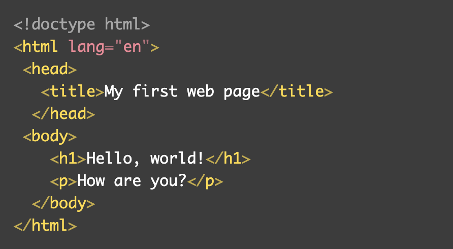
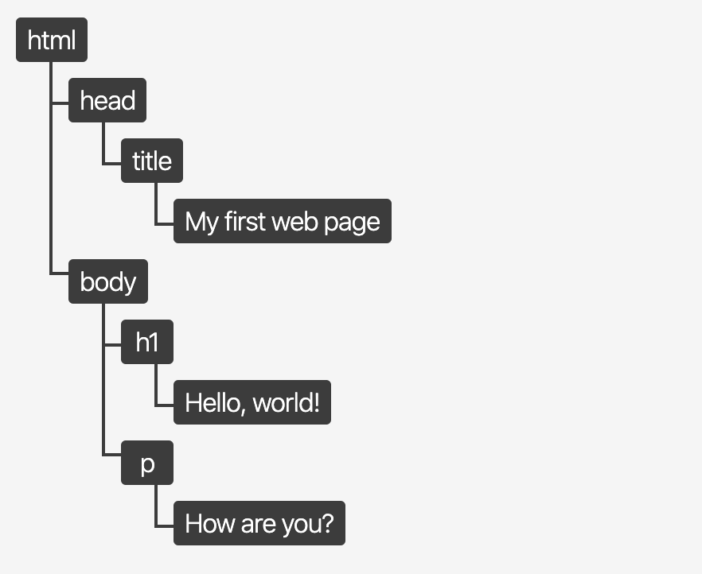

## Learning Goals

* Access and use the Chrome Developer Tools
* Understand how to query DOM elements
* Understand how to attach event listeners to DOM elements
* Understand how to write functions that can
  * Change styles programatically by adding, removing and toggling classes
  * Manipulate existing text and html on the DOM
  * Add new elements to the DOM programatically


## Vocabulary

- `HTML Element` A building block that makes up the structure of a web page.
- `CSS Selector` A way to identify a set of elements to which a set of CSS styles apply, typically using a tag, class or id.
- `Interface` a shared boundary across which two separate components exchange information.
- `DOM` Document Object Model, the JS interface used to interact with HTML
- `Event` Any event which takes place in the DOM, these can be generated by users or the browser.
- `Event Listener` A function invoked on a DOM node which fires the `event handler` when a specified event occurs on the node or its children
- `Event Handler` A function that will run when a specific event occurs


<section class="call-to-action">
### Warm Up
Fork [this Animal codepen](https://codepen.io/turingschool/pen/MWMeopJ?editors=1010).  
Digest the code in the html file. Ignore the CSS file for now. Read the comments in the JS file outlining what we're going to try to accomplish.  Brainstorm, how might we approach this.
</section>

## Document Object Model

The Document Object Model, DOM, is an interface for HTML. It is what allows us to use JavaScript to manipulate the elements or content of elements on a page. Think about a form on a website (maybe signing up to use an application, or paying for your food delivery). Somehow, JavaScript has to know what was typed into an input field, know that the submission button was clicked, and be able to do whatever needs to happen next (maybe showing you a confirmation message). If we didn't have the DOM, this wouldn't be possible.

Once the browser runs/interprets our HTML, it creates the DOM. The DOM represents what is in the HTML, but it is formatted in a way that we can interact with those elements via JavaScript. It is _not_ the exact same thing as your HTML document.

Here's a small HTML file:



Here's the DOM tree that would be created:



Image credit: [bitsofcode](https://bitsofco.de/what-exactly-is-the-dom/).

This is an abstract concept and can be hard to wrap your mind around - we'll come back to it. For now, you need to know two things:
1. The DOM is essential to building functionality on a page
2. We can use the `document` variable in our JavaScript file to interact with the DOM. From there, we can travel through the DOM and ask for specific elements, or instruct the program to change elements.

<section id="check-it-out-1" class="call-to-action">
### Check It Out

In your browser dev tools, type in `document`. Click that small arrow to the left of the output.  
- What do you see?
- Where else can you find that content?
</section>

At any time, you can call `document` to access the DOM. This is very close to the same thing as viewing the document in the Elements panel of the Dev Tools. We won't get into the details of those small differences; if you are interested, start by reading [this blog post](https://bitsofco.de/what-exactly-is-the-dom/).

## Accessing a Specific Element

Our `document` object - it really is a object! - comes built-in with a lot of methods we can use. Today, we will learn about `.querySelector()`. This method allows us to request a specific element from the DOM tree, by its selector. It uses the same syntax for selectors that CSS does.  

Remember that in JS, unlike Ruby, we can use dot notation to access methods or properties of an object.  In JS, we always need `()` to invoke a method or function. 

Here's an example:

```javascript
var title = document.querySelector('h1');

title;

//=> <h1>JS: Intro to DOM Manipulation</h1>
```

<section id="explore-querySelector" class="call-to-action">
### Explore

Open the Dev Tools while you are looking at this lesson. In the console, paste this in:

`var box = document.querySelector('.call-to-action');`

Then, call the `box` variable (by typing in `box`, then hitting `return`).

**Consider:**
- What is returned?
- Where does that element appear in the browser?
- There are several sections with that class name on this page - why do you think that only _one_ of them is stored in the `box` variable?
- If we were wanting to get _this_ Explore box instead, is there a unique identifier on it that we could use to be more specific when querying?  
  - Let's change our code to use that unique identifier for this box instead!
</section>

We've already seen three of the different selector options we can use in our query:
- by html element tag: `document.querySelector('h1')`
- by class: `document.querySelector('.call-to-action')`
- by id: : `document.querySelector('#explore-querySelector')`

Take Note:
- selectors must always be in quotation marks (single or double)
- class selectors must be prefaced with a `.`
- id selectors must be prefaced with a `#`


<section class="call-to-action">
### Your Turn

In the warmup Animal codepen, query the three elements we're going to want access to.  Save each in a well-named variable.  

- the title  
- the elephant fact  
- the image  

Then, add a console.log() to your code for each variable so you can see what is stored in it.  You can see this in the dev tools console (command + option + i) or in the codepen console.

Include a helpful string in each console log to serve as a 'label' for what you're printing. Separate the string from the variable with a comma.
```js
console.log('title', title)
```
</section>

## Updating Content of an Element

Now that we know how to query elements, let's look at how to update the content of an element we've accessed.

```javascript
var title = document.querySelector('h1');
```

When we query a DOM element and store it in a variable, we now have access to all the properties and methods that are attached to that DOM element. We won't learn about all of them today. Just a few to get you started.

### `innerText`

The [innerText](https://developer.mozilla.org/en-US/docs/Web/API/HTMLElement/innerText) property holds the text that lives inside of a given element. In our codepen, the text content inside of the `h1` is `Elephants!`.  We can access that text content by accessing the element's `innerText` property. We can use the `=` assignment operator to change it.

<section class="call-to-action">
### Try It Together 

In our codepen let's:
- Change our console.log()s so that they print each element's innerText
  - What happens when we try to print the `.innerText` of our `` element?
 
- Write a line of code that changes the title's text to a different animal
- Write a line of code that changes the elephant fact to a different animal fact

**Consider:**  
How would we change the elephant image to a different image?  Hmm...   
We've seen from the console log that we won't be able to use `innerText` property for the image.  
Looking at the `` in the html, is there a different property we might be able to manipulate?

*Psst...here is a short link for a hedgehog image if you want to use it.*
https://upload.wikimedia.org/wikipedia/commons/thumb/7/72/Igel.JPG/440px-Igel.JPG
</section>


<section class="call-to-action">
### Your Turn

Fork [this Report Card CodePen](https://codepen.io/turingschool/pen/rNEqEVw).  In the `JS` file of the CodePen, complete the steps listed below.  Work through each bullet one at a time.

- Declare a variable `studentName` and assign the value of the element with the class of `student` to it
- Declare a variable `bestGrade` and assign the value of the element with a class of `grade-2` to it

Now that we've queried the elements we need, we're going to change the data being displayed to users.  So we need somewhere to store the new data that we're going to display instead.
- Declare a variable `newData` to store an object with keys of `newName` and `newGrade`.  Make the value of each key be the new student name and grade that you'll want to change the display to.   

Now, change the text of each queried element to display the data you saved in your newData object.
- Change the `innerText` of the `studentName` variable to be the `newName` value from your `newData` object (use dot notation)
- Change the `innerText` of the `bestGrade` variable to be the `newGrade` value from your `newData` object
</section>

## Event Listeners

Changing stuff on the page with JavaScript is great, but you might as well have just written it in the markup to begin with. The real power of JavaScript comes into play when we write code that **responds to user actions**.

This power emerges when we start **listening for user events**. This is the crux of front-end engineering. **We present a user interface and then as the user interacts with the UI, we change and update what they see.**

<section id="try-it" class="call-to-action">
### Try It Together

Let's add an eventListener to our Report Card codepen. We still want to change the student name and grade, but we want to do so only when the user takes an action.  Let's say we want to change that data if a user clicks on the "Report Card" title
  
- We'll use `document.querySelector()` to grab the "Report Card" `<h1>` and save it to a variable
- Now we can add an eventListener to that `<h1>` title.
  - We want the eventListener to listen for a "click" event that happens on that title element. 
  - When the "click" happens on the title element, we want to invoke a function that does all the things we want to do. Let's call that function `editReportCard`.
- You've already written the code to change the student name and grade.  Now we can move this code into the `editReportCard` function that is being invoked by the eventListener.

Consider:  
- Why don't we use `()` to invoke the function within the eventListener?  What happens if we do?

</section>

<section class="dropdown">
### Possible solution

```js
const studentName = document.querySelector(".student")
const bestGrade = document.querySelector(".grade-2")
const title = document.querySelector("h1")

const newData = {
  studentName: "Heather",
  bestGrade: "A+"
}

title.addEventListener("click", editReportCard)

function editReportCard() {
  studentName.innerText = newData.studentName;
  bestGrade.innerText = newData.bestGrade;
}
```

Pretty cool how one simple line of code lets us respond to user actions, right?  

`title.addEventListener("click", editReportCard)`
</section>


<section class="call-to-action">
### Your Turn

In the codepen from the Warm Up, follow the bullets below to add in an Event Listener. We still want to change the title, fact, and image, but we want to do so only when the user clicks a button.  
  
- Add a "Change Animal" button to your html above the <h1> element. Give it an id of  'change-animal-btn'.
- In your js file, use `document.querySelector()` to grab that button by its id and save it to a variable
- Now add an eventListener to the button.
  - We want the eventListener to listen for a "click" event that happens on that button. 
  - When the "click" happens on the button, invoke a function that does all the things we want to do. Call that function `changePageContent`.
- You've already written the code to change the title, fact and image.  Move this code into the `changePageContent` function that is being invoked by the eventListener.

Psst...here is a short link for a hedgehog image if you want to use it.
https://upload.wikimedia.org/wikipedia/commons/thumb/7/72/Igel.JPG/440px-Igel.JPG
</section>

### Explore

There are many types of events beyond just "click".   Explore this list of [Mouse Events](https://developer.mozilla.org/en-US/docs/Web/API/Element#mouse_events) on MDN. Scroll beyond just mouse events to explore keyboard events, focus events, etc.  

Think of a webpage you often visit. Maybe it's a social media page, maybe it's your bank's website, maybe it's a news site. Take a moment and consider all the event listeners that might be on that page! What type of events might they be listening for? What functionality occurs when those events happen? 

## More Programmatic DOM Manipulation

### `innerHTML`

The [innerHTML](https://developer.mozilla.org/en-US/docs/Web/API/Element/innerHTML) property essentially works the same, but has the capacity to do something a little more complex for us.

It can not only insert plain text, but it can insert HTML elements. For the example below, we will query and manipulate the Try It Together section above.


### Check It Out

<section class="dropdown">

In your browser dev tools, copy paste the following code:
```javascript
var box = document.querySelector('#try-it');
```
Then type `box` and hit return to see the value of that variable. Click on the dropdown arrow to see the full html within the box section.   
</section>

<section class="dropdown">


What do you think the following code will do? Make a guess.
Now, run it in your console: 
```javascript
box.innerHTML = `
  <h3>Pizza is Tasty</h3>
  <p>Yum!</p>
`;
```
Log the box variable again and open up the dropdown to see what has changed.  
</section>

<section class="dropdown">


What do you think the following code will do? How will it be different than the code we just ran?
Guess, then run it in your console: 
```javascript
box.innerHTML += `
  <p>Pepperoni!</p>
`;
```
Log the box variable again and open up the dropdown to see what has changed.
</section>

<section class="dropdown">

### Key Takeaways

We can _access_ the text/html content of an element using dot notation with `innerText`/`innerHTML`.  
We can _change_ the text/html content of an element using `=` or `+=`.

</section>


## Changing Styles Programmatically

It isn't uncommon to see an application change the color of something after a user interacts with it.

We see things like...
- Toggling light and dark mode
- A grey check mark turn into a green one
- A box or button changing colors once we've already clicked it, or visited that link
... on almost a daily basis!

We talked earlier about how powerful the DOM is because it allows us to interact with HTML elements via JavaScript. This also gives us the power to **modify the styles applied to said elements** via JavaScript.  

Even though you haven't yet learned CSS, we will briefly discuss two ways to do this:
1. Directly manipulate the style of the element through inline styles (not best practice)
2. **Add or remove classes from the element** (the preferred way).

### Directly Manipulate the Style of the Element

We can use dot notation to call the `.style` property on an element, then reference any CSS property and assign a new style value.

<section id="change-my-border-box" class="call-to-action">
### Change My Border!

We'll use inline styling to change the border of this box to purple.   
Type or copy/paste the code snippet below into the dev tools to see it change!
</section>

```javascript
var box = document.querySelector('#change-my-border-box');

box.style.borderColor = "purple";
```

We actually avoid inline styling because we usually want to make more than one tiny change and each inline style change requires it's own line of code. This can make for long functions that are difficult to read. Adding or removing classes (examples below) is strongly preferred. Plus, that lets us keep all our styling declarations in one place - the CSS file. Much more maintainable!

<section class="note">
### Then Why Bring It Up?

Often times, your instructors at Turing will share with you an overview of something, including the multiple ways something can be done, but tell you that one is preferred. Why do we bother to bring up the less-than-ideal approaches?

As a developer, a huge part of your job is researching and learning on your own. That will also be a huge part of being a student at Turing. You'll sift through documentation, blog posts, and Stack Overflow posts. It's important to be familiar with the multiple ways of doing things, different syntax, best practices, etc. so you can more easily sift through those resources and determine what is good and helpful.
</section>

### Add or Remove Classes from the Element

Since it's common to need to change multiple CSS declarations, we can instead add or remove a class from the list of classes a given element has on it.

<section id="check-it-out-2" class="call-to-action">
### Check It Out

Fork [this Color Box CodePen](https://codepen.io/turingschool/pen/yLdRWxY) and follow the directions below:
- Read through the code that is currently written, and observe the result in the mini-browser
- Un-comment line 3. What changed about the box? What remained the same?
- Un-comment line 4. What changed about the box? What remained the same?

- Read up on [this documentation](https://developer.mozilla.org/en-US/docs/Web/API/Element/classList) to learn how to **remove** a class from an elements classList! _Hint: `toggle` may soon be a friend of yours, as well!_
</section>

In summary, in your CSS file you can **apply styles to a specific class selector - like a "pink" class.  Then, in your JS file, you can use `button.classList.add('pink')` to apply all those styles at once by adding that "pink" class to the specified button.  **

Note that if you are going to add/remove a class via JavaScript, that class should be declared **below** the original styling for the given element in the CSS file. This is because of the cascading nature of CSS; any time rules conflict, the rule declared lower on the sheet will take precedence.

<section class="dropdown">

### Key Takeaways
- In your CSS file you can apply styles to specific class selectors.  Then you can use JS to add/remove/toggle that class to specified elements so that it will/will not have those styles applied.
- If you're going to add/remove a class with JavaScript, the styling for that class should be declared **below** the original styling for the given element in the CSS file. 
- We _can_ apply styles to an element directly with JavaScript by manipulating the `.style` property - but we do not want to do this.


</section>
<br>

## Putting it all together
We've seen that DOM manipulation based on user interaction requires at least 3 steps.  
* Elements: Querying the elements we'll need 
* Event Listener: Adding the event listener
* Function: Creating the function that the event listener will trigger

As you work through the practice below, first **psuedocode** out what each of those three steps entail so you can take a methodical approach to writing the code.  


<section class="call-to-action">
### Your Turn

In the Animals codepen from the warmup:

Add Fact:
- Add another button with "Add Fact" text and id of "add-fact-btn".
- Write code so that when a user clicks the Add Fact button, another `<p>` element with another animal fact is added to the `<section>` element, just below the image  

Change Color:
- Add another button with "Change Color" text and id of "change-color-btn"
- Write code so that when a user clicks the Change Color button, the ".blue" class styling from the CSS file is applied to the `<section>` element, making its background blue.

Spicy:
- Refactor your Add Fact code so that it uses the [.insertAdjacentHTML() method](https://developer.mozilla.org/en-US/docs/Web/API/Element/insertAdjacentHTML) to acheive the same result
- Refactor your Change Color code so that it toggles the background color blue/not-blue with each click.

</section>


## Wrap Up

Let's take a few minutes to look back at what we've started to learn!

- What is the DOM?  How is it created?
<!-- the browser loads the html file and creates the DOM/DOM tree, turning each html element into a DOM node -->
- How can we grab elements from the DOM to work with them in our JS?
<!-- document.querySelector can be used to grab elements by html tag 'h1', class '.call-to-action' or '#id'. Also, querySelectorAll, getElementById, etc.  There are also more complex CSS selectors we can use that arent need to know right now-->
- How can we change the text of an element?
<!-- .innerText -->
- How can we change the html of an element?
<!-- .innerHTML or .insertAdjacentHTML (not taught today) -->
- How can we change styling applied to an element?  
<!-- classList.add('className')  also .remove and .toggle -->
- What are the 3 steps for writing code that response to user interactions?
<!-- * Elements: Querying the elements we'll need  -->
<!-- * Event Listener: Adding the event listener -->
<!-- * Function: Creating the function that the event listener will trigger -->


