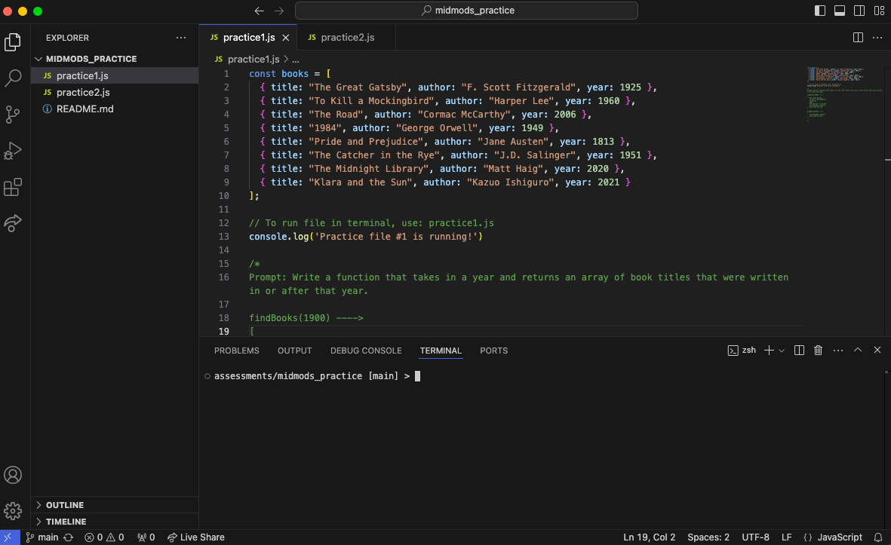

## Learning Goals
- Preview the format of midmods
- Prepare your computer for midmods
- Practice speaking aloud while you code

<section class="note">
### Assign Roles

Before you go any further, determine who will be the `Student` and who will play the `Instructor` for the first round. (You will switch later.)
</section>

## Screen Set Up

**Both people should follow these steps:**
- Clone **[this repo](https://github.com/turingschool-examples/se2-midmods-practice/tree/main)**.

**Instructor, follow these steps:**
- Open up the files in your text editor.
- Organize your screen so you have the `practice1.js` file open, with VS Code’s Terminal on the bottom. You can open up VS Code’s terminal with control + ` (backtick). You screen should look something like this:



## VS Code Live Share

**Both people should follow these steps:**
We will use VS Code's Live Share extension to collaborate on the midmods. It's also a great tool for project collaboration!  

It is extremely important that you've gotten this extension working on your computer prior to your midmods assessment. Failing to do so will result in lost assessment time.  

Follow **[this link](https://marketplace.visualstudio.com/items?itemName=MS-vsliveshare.vsliveshare)** and install the VS Code Live Share extension. 

You’ll now notice this button on your left side bar:  
  
  

**Instructor, start a live session:**  
- Click the button shown above and click “Share.” You may have to sign into an account (i.e. GitHub) to move forward.
- It will automatically copy the link to your clipboard. Send it to your collaborator(s) via Slack.
- On the LIVE SHARE tool bar on the left, right click the terminal under “Shared Terminals” and select “Make Read/Write”. This will allow your collaborator(s) to type in your terminal.
- Your screen should still look like the screenshot toward the top of this lesson.

**Student, join the live session:**
- Close out of any VS code files you currently have open.
- Click on the link the host sent you. You may have to sign into an account (i.e. GitHub) to move forward.
- Open up the `practice1.js` file.
- Open up VS Code’s terminal with the control + backtick buttons. Be sure you’re on the TERMINAL tab.
- Your screen should now look like the screenshot toward the top of this lesson.

**To test that it's working:**
- You should both be able to type in the `practice1.js` file and see each other's code.
- If one of you types in the terminal, the other should see it.

## Practice

Now that we're set up, let's practice a midmod! Each of you will get a chance to be the `Student`. The `Student` will have 20 minutes to code. 

**The Student should:**
- Talk out your process: 
  - What are you thinking? Why are you approaching the problem in that way? 
  - What blockers are you facing? 
  - **Remember**: The power of the MidMod is getting you good feedback - We will be able to give you better feedback the more you let us in on your thinking!

- Show strong processes to get unstuck:
  - Revisit the prompt - do you understand what it's asking?
  - Read the error message VERY carefully - what line number if triggering the error?
  - Use console logs to check your code - do you know what data type you're working with?
  - Pseudocode (see above!)

**The Instructor should:**
- Stay mostly silent. You can chime in with very general hints like "What can you console log?" or "What is the goal here?" but try not to jump in too much.
- Set a timer for 20 minutes and cut the `Student` off when time is up. You can give a couple time warnings when they are halfway through and have 5 minutes left.
- Take notes on feedback for the `Student`:
  - What is something your partner did well?
  - Did they thoroughly read the error messages, paying close attention to line numbers?
  - Did your partner communicate their thinking aloud as they worked through the code?
  - Did your partner use the vocabulary we’ve been practicing in class? Did they avoid the use of vague words like “thing”?
  - When your partner hit a blocker, what problem solving strategies (pseudocoding, console.logging) did they use? 
  - Any other feedback?
 
## Practice Round 1

`Student` should start by entering `node practice1.js` into the terminal. BOTH of you should see 'Practice file #1 is running!' in the terminal. Once you see that message in the terminal, start coding! 

After 20 minutes OR after the `Student` has solved the prompt, spend a couple minutes debriefing. `Instuctor`, share youre feedback.

`Instructor`, end the Live Share session by clicking the 🚫 button.

<section class="dropdown">
### Don't peek until you're done! Practice #1 Possible Solution

```js
findModernBooks = (year) => {
  const filteredBooks = books.filter(book => book.year >= year);
  const filteredBookTitles = filteredBooks.map(book => book.title);

  return filteredBookTitles
}

console.log(findModernBooks(2010))
```
</section>

<section class="note">
### Switch Roles

Time to switch roles!
</section>

## Practice Round 2

The `New Instructor` should now follow the steps in the **VS Code Live Share** section. It's important to switch who is starting/joinging the Live Share session to be super sure that you're both set up and ready to go for midmods. 

Once you're set up, the `New Student` should start by entering `node practice2.js` into the terminal. BOTH of you should see 'Practice file #2 is running!' in the terminal. Once you see that message in the terminal, start coding! 

After 20 minutes OR after the `Student` has solved the prompt, spend a couple minutes debriefing. `Instuctor`, share youre feedback.

<section class="dropdown">
### Don't peek until you're done! Practice #2 Possible Solution

```js
const groupByColor = () => {
  return people.reduce((groupings, person) => {
    if (!groupings[person.favoriteColor]) {
      groupings[person.favoriteColor] = [];
    }

    groupings[person.favoriteColor].push(person.name)
    
    return groupings;
  }, {})
}

console.log(groupByColor())
```
</section>

## Closing 

You're ready for midmods! If anything weird happened with VS Code Live Share, let your instructors know right away. Remember that working through **[your jsFUNk repo](https://github.com/turingschool-examples/jsFUNk)** is the best way to technically prepare for M2 assessments. You got this!