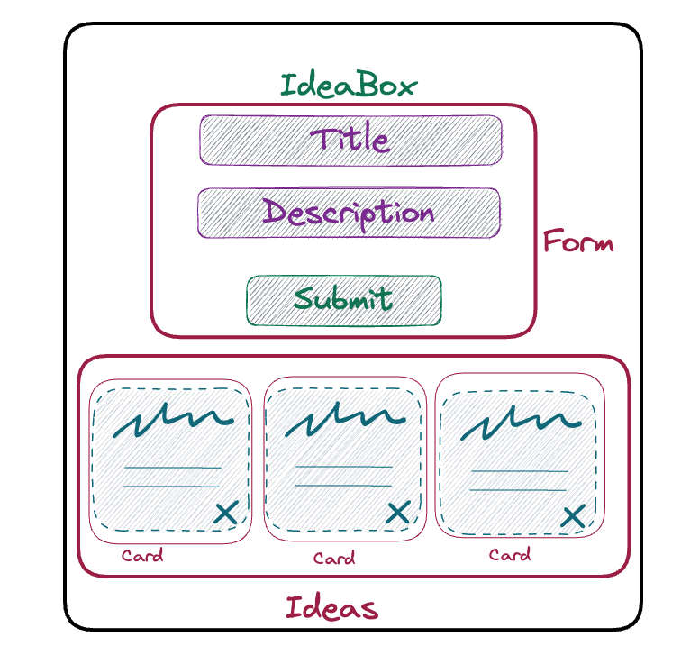
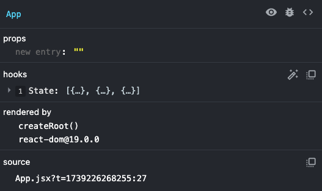
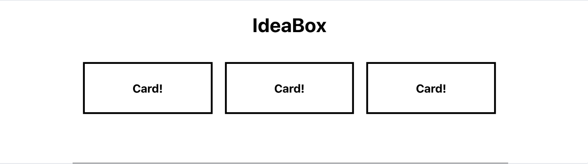

## Learning Goals

- Create functional components
- Use state and props to manage application data
- Use Hooks with functional components
- Use the fetch API to make API requests
- Create a controlled form
- Use JSX

## Before you get started...

<section class="note">
  This tutorial was repurposed from another tutorial called IdeaBox, therefore, names have been updated for Task Manager. Provided images are there as reference.
</section>

You will complete this lesson on your own. Read each section carefully and completely. Moving quickly through this lesson is **not** the goal. You should move through the lesson at a pace that allows you to take solid notes and fully understand the code you are writing. We will provide lots of code blocks for you. Resist the temptation to copy and paste the code from those examples. Doing this will only hurt you in the end, as you'll be missing out on a lot, a lot, a lot of learning.

As you are working through it, please write down any questions that pop up for you. If a blocker pops up, post your question in your codehelp slack channel. Work with your classmates to try to figure it out.

## What You're Building

Here is a peak at what you're going to build during this lesson:


<section class="call-to-action">
### Stop and Think

How would you build this application using vanilla JS? What functions would need to exist?

</section>

## React Developer Tools

React has its own set of developer tools that are extremely helpful. [Install the dev tools Chrome extension](https://chromewebstore.google.com/detail/react-developer-tools/fmkadmapgofadopljbjfkapdkoienihi?hl=en). Now, anytime you're looking at a React app, you'll see a "Components" and "Profiler" tab in your dev tools! As you're working through this tutorial, pay attention to those tabs (especially the "Components" tab).

## Creating a new React app with Vite

For this lesson, we will be using [Vite](https://vite.dev/guide/) to spin up a React application.  
❌ [`create-react-app`](https://facebook.github.io/create-react-app/) used to be a good option but is no longer maintained.

Many of the dependencies and configuration files will be obscured, since we won't need to worry about them. This is a fast way to set up a React application so we can concentrate on building out the app, instead of spending our time and energy on tooling.

_Note_: Hand-rolling a React application will make you more familiar with how React works but isn't something you need to understand right now. (A good personal project is to learn how to configure React.)

### Get started with Vite

#### Prerequisites:

Vite requires Node.js version 18+ or 20+. Let's use nvm (node version manager) to install the latest version of Node.js.

Run:

```bash
nvm install 22
```

You can confirm you have Node version 22 by running `node -v`.
If you have trouble with the nvm command, ensure you have `nvm` installed by running `nvm -v`.

To set up a new react application, run the command:

```bash
$ npm create vite@latest task-manager --template react
```

You will see something like this run in your terminal:
Select `y` to proceed then select `React` and `JavaScript`

```bash
Need to install the following packages:
  create-vite@latest
Ok to proceed? (y) y

> npx
> create-vite task-manager react

│
◇  Select a framework:
│  React
│
◇  Select a variant:
│  JavaScript
│
◇  Scaffolding project in /Users/abdulredd/Desktop/turing/2mod/my_stuff/projects/task-manager...
│
└  Done. Now run:

  cd task-manager
  npm install
  npm run dev
```

As the instructions say, let's change directories `cd` into our new task-manager application and install dependencies by running `npm install`.

Open the repo in VS Code with `code .`

Finally run `npm run dev` to see our new boilerplate application displayed at <a href="http://localhost:5173/">http://localhost:5173/</a>

<section class="call-to-action">
### Explore

Take a few minutes and look around the boilerplate. Hint: start at the `src/` folder!

What happens if you:

- Change some of the HTML you see in the `App.jsx` file?
- Change some of the CSS you see in the `App.css` file?

You'll also notice an `main.jsx` file. What is going on in there?  
This is a great time to do some googling or ask chatGPT for help understanding.

```jsx
// main.jsx

createRoot(document.getElementById("root")).render(
  <StrictMode>
    <App />
  </StrictMode>
);
```

</section>

## Modular File Structure

React lets us keep our code modular, but what does it look like to have our code and project files be modular?

One small example is to keep a modular file structure. Any and all files related to a particular component live in the same directory! We recommend setting up your file structure like the example below each time you build a new project.

Take a moment now to create a `components` directory within your `src` directory. Create a directory for `App` within that `components` directory. Move the 2 `App` files into the `App` directory. Create a directory for `Form`, `Tasks` and `Card` - we'll add files to them later.

```plaintext
src 📁
├─ components 📁
│  ├─ App 📁
│  │  ├─ App.jsx
│  │  └─ App.css
│  ├─ Card 📁
│  ├─ Form 📁
│  └─ Tasks 📁
```

Uh-oh! Changing the file structure will impact our imports. VS Code will offer to update App imports. But we'll still need to update the reactLogo import in App.jsx. That import would now be `import reactLogo from '../../assets/react.svg'`

## Task Manager

Let's get rid of all the boilerplate inside the `App.jsx` file. Yep. Just ERASE THAT CODE - including the imports!

You'll notice that as soon as we save our changes, the browser re-renders. Look into the terminal, and you'll see another build kick off. This is because Vite gives us hot-reloading. Any time we make a change, the browser will update to show our changes. However, sometimes if we hit a significant error, **we may still have to refresh the page or re-run `npm run dev` to get things going again after implementing the fix.** You may need to refresh your browser after deleting the code in App in order to see the error outlined below.

Look at the console in our dev tools now that we've deleted our `App.jsx` code, and you'll see an error that reads:

_"Uncaught SyntaxError: The requested module '/src/components/App/App.jsx?t=1739225023971' does not provide an export named 'default' (at main.jsx:4:8)"_

Back in our `main.jsx` file we're trying to render a React component: App. However, we're no longer exporting a valid React component!

While JavaScript error messages aren't always very clear or helpful, React error messages are much better at telling us what's going on. The often even include a link to the appropriate part of the React docs!

Let's start building out our App component.

### Planning our app

Let's figure out what should be a component in our app.


- We have an App component. That should probably hold onto our list of tasks.

- We need a Form component so we can create new tasks. The Form component will have to be able to add new task to App's list of tasks.

- We need a Card component to display our tasks.

- We can create an Tasks component to hold all of our Cards.



### App.jsx

Because we want App to hold onto our list of tasks, let's think about how we're going to store that information.

We will use **_state_** to store data, like our list of tasks. You learned about state in Mod 1 when used to store information about a class. It is a very similar concept here. It might be helpful to recall some of those notes. ChatGPT and google are also great options to understand state, but you should really make the official [React Documentation](https://react.dev/) your first stop.

In order to use component state, we need to import useState hook from React. So, let's import useState hook from React, and create our App component!

```jsx
// App.jsx

import { useState } from 'react';

function App() {
  // Logic and other needed functions will go here

  return (
    //Your JSX code goes here
  )
}

export default App;
```

The above code is defining the App functional component in React. App returns JSX code via the `return` keyword just like any ol' function.

<section class="note">
  It's important to note that this code is using functional components, rather than class components and OOP. This allows us to manage our component in a more concise and streamlined way, without relying on class inheritance and traditional OOP principles.
</section>
Let's keep writing our App component!

```jsx
// App.jsx

import { useState } from "react";

function App() {
  return <h1>Task Manager</h1>;
}

export default App;
```

Save this code and go check your browser. What do you see?

Let's take a minute and examine that return statement.

<section class="note">
### Understanding JSX

It looks like we are returning some HTML! Very easy to read, right?

What we're actually writing here is known as JSX. It's an abstraction that makes React easier to write!

JSX is "JavaScript and XML" - it's a handy mashup language that allows us to write HTML with a bit of JavaScript injected in. You can read more on it [here](https://reactjs.org/docs/introducing-jsx.html) (and a bit more in depth [here](https://react.dev/learn/writing-markup-with-jsx)). It's not something you need to be an expert on, but you should know that it's being used in React. In the meantime, we'll see how JSX makes our lives easier throughout this lesson!

</section>

Okay. Now try to add a paragraph tag after your `<h1>` tag. What happened?

```jsx
// App.jsx

import { useState } from "react";

function App() {
  return (
    <h1>Task Manager</h1>
    <p>Hi!</p>
  );
}

export default App;
```

You should receive this error:

```plaintext

Failed to compile.

...src/components/App/App.jsx: Adjacent JSX elements must be wrapped in an enclosing tag. Did you want a JSX fragment <>...</>? (6:4)

  4 |     return(
  5 |       <h1>Task Manager</h1>
> 6 |       <p>Hi!</p>
    |       ^
  7 |     )
  8 |   }

```

Let's figure out what this error is saying. "Adjacent JSX elements must be wrapped in an enclosing tag."

If we think about this logically, it makes sense! Our component is just a function. And how many things can a function return at once? Just one! So in order to return multiple JSX elements, we have to wrap them in a single JSX element!

Since this is our App component, let's wrap everything in a `<main>` tag!

<section class="note">
### NOTE

If you're just looking for an unflavored container for your elements (aka they are not semantically related to one another, and the best element to use would be a `<div>`), then instead, use a `<React.Fragment>`! You can read more about Fragments [here](https://react.dev/reference/react/Fragment).

</section>

We'll also import our App.css file. And give our <main> element a class of 'App' like so:

```jsx
// App.jsx

import { useState } from "react";
import "./App.css";

function App() {
  return (
    <main className="App">
      <h1>Task Manager</h1>
      <p>Hi!</p>
    </main>
  );
}

export default App;
```

You'll notice that instead of "`class`", we're using a "`className`" attribute on our `<main>` element. Why do you think this is?

### App.jsx state

Okay. Let's come back to our App component and create _state_ - our "source of truth" for the data the app will be using.

```jsx
// App.jsx

import { useState } from "react";
import "./App.css";

function App() {
  const [tasks, setTasks] = useState([]);

  return (
    <main className="App">
      <h1>Task Manager</h1>
      <p>Hi!</p>
    </main>
  );
}

export default App;
```

<section class="call-to-action">
### Reflect

- What is `useState`?
- What is the `setTasks`?

</section>

For our application, we want to create a list (aka an array) of tasks.

Let's start out with a couple of default tasks, just so we can have something to look at when we begin building out the rest of our components.

```jsx
// App.jsx

import { useState } from "react";
import "./App.css";

function App() {
  const dummyTasks = [
    { id: 1, title: "Prank Travis", description: "Stick googly eyes on all his stuff" },
    {
      id: 2,
      title: "Make a secret password app",
      description: "So you and your rideshare driver can both know neither one of you is lying",
    },
    { id: 3, title: "Learn a martial art", description: "To exact vengeance upon my enemies" },
  ];
  const [tasks, setTasks] = useState(dummyTasks);

  return (
    <main className="App">
      <h1>Task Manager</h1>
      <p>Hi!</p>
    </main>
  );
}

export default App;
```

Open up your React Dev Tools (open your dev tools, then go to the Components tab). You can see that App now has state:



Neat!

**Consider the following...**

Okay. Let's pause for a second. `App.jsx` is a functional component, and we used `useState` to setup a state for our component.

### State

**State** holds data that represents the actual state of our application. State can be changed and mutated through user interactions.

React Hooks is a feature that was introduced at the end of 2018. It allows functional components to access and manipulate state. In future lessons, we'll learn about other types of components as well. However, for now, it's essential to understand functional components and how React Hooks enable them to manage state in a more concise and streamlined way.

## Tasks.jsx

Next, let's focus on getting our tasks to render!

We already said that we want to have a container for all of our task Cards. So let's create that component! In your VS Code, within the `src/components/Tasks` directory, create two new files: `Tasks.jsx` and `Tasks.css`.

<section class="note">
### Note

You may have noticed that our App component was capitalized. And now our Tasks component file is capitalized, too. In React, component names should be written in PascalCase, which is a naming convention where the first letter of each word in the name is capitalized, and there are no underscores or hyphens between words. By following this naming convention, it becomes clear to other developers that a particular element in the codebase is a React component.

When an element starts with a lowercase letter, it refers to (and will be treated as) a built-in component like `<div>` or `<span>`, which can lead to silent errors or unexpected side-effects. It's also important to note that capitalizing component names makes for good developer empathy, because they can look at the file tree and see at a glance which files are are components and which are not.

</section>

Will this Tasks component need to have state? What do you think?

Since the Tasks component will just be rendering Card components, it will not need to have its own state.

Let's create a function called Tasks that returns an h2 that reads "Tasks go here!"

```jsx
// Tasks.jsx

import "./Tasks.css";

function Tasks() {
  return <h2>Tasks go here!</h2>;
}

export default Tasks;
```

Then, back in our `App.jsx`, we can import our shiny new `Tasks` component and add it to our return so it will render!

```jsx
// App.jsx

import { useState } from "react";
import "./App.css";
import Tasks from "../Tasks/Tasks";

function App() {
  const dummyTasks = [
    { id: 1, title: "Prank Travis", description: "Stick googly eyes on all his stuff" },
    {
      id: 2,
      title: "Make a secret password app",
      description: "So you and your rideshare driver can both know neither one of you is lying",
    },
    { id: 3, title: "Learn a martial art", description: "To exact vengeance upon my enemies" },
  ];
  const [tasks, setTasks] = useState(dummyTasks);

  return (
    <main className="App">
      <h1>Task Manager</h1>
      <p>Hi!</p>
      <Tasks />
    </main>
  );
}

export default App;
```

When we look at our browser, we should see our h2! That's nice and all, but not very useful.

We have to pass our tasks array from the App component to our `Tasks` container component. We accomplish that by using **props**.

### Props

Props (along with state) are the heart and soul, the meat and potatoes, of React. They are what allow us to pass information between components. Let's take a look at how that might work.

We've mentioned that components are reusable pieces of code, that allow us to create unique instances of certain UI elements. We can do this by passing props to each of our components. Think about how you create a new function and pass arguments into it.

Props allow us to pass information from parent components to child components. We can pass strings, numbers, booleans, arrays, objects, functions, pretty much any piece of data we want access to in our child component. We can name them whatever we'd like, as long as we're consistent and semantic with the names that we choose.

When we pass props down to a child component, it comes through as a simple JavaScript object with key value pairs.

Let's start with an example, just to keep things simple. For now, since our `Tasks` component just contains an h2, let's make that h2 say something different than "Tasks go here!"

In our App component's return statement, let's get rid of our <p> tag and pass some data as a prop when rendering our `Tasks` component.

```jsx
// App.jsx

// ...
return (
  <main className="App">
    <h1>Task Manager</h1>
    <Tasks name="Travis" />
  </main>
);
// ....
```

Now, let's adjust our `Tasks` component so it can receive and use that data coming in as props.

```jsx
// Tasks.jsx

function Tasks(props) {
  return <h2>Hello, {props.name}!</h2>;
}
```

What are those curly brackets doing? In JSX, whenever we're writing something that is JavaScript (aka "not HTML"), we have to wrap it in curly brackets. In this case, "name" acts like a variable. It's not a string that reads "name" - it's a placeholder that represents the value of the property (in this case, "Travis")! Because it's a variable, we have to surround it in curly brackets to tell the JSX to treat the contents like JavaScript.

In your browser, you should see "Hello, Travis!" In `App.jsx`, add another `Tasks` component to the `App.jsx` `return()` , but pass in a different name. What do you see in the browser? Try creating new props to use!

Okay, so just WHAT exactly is going on here?

**props** is the name of an object that contains key-value pairs. From our above example, the key is "name", and the value is "Travis". So, in our `Tasks` component, we can access the value by writing `props.name` (which gives us a string of "Travis"). This is the same dot notation we learned in Mods 1 and 2 to access data stored in objects.

If, in the `return` of our `App` component, we called the property "potato" instead of "name", we would have to access it by (inside the `Tasks` component) writing `props.potato`. This is the same dot notation we learned in Mod 2 to access data stored in objects.

We can even destructure the props object, because it's just a regular object!

```jsx
// Tasks.jsx

function Tasks(props) {
  const { name } = props;

  return <h2>Hello, {name}!</h2>;
}
```

In _this_ example, destructuring is a bit over-engineered, yes. However, we'll see in our `Card` component that destructuring will save us from having to type `props.` over and over again.

And here's YET ANOTHER super-fancy way to destructure:

```jsx
// Tasks.jsx

function Tasks({ name }) {
  return <h2>Hello, {name}!</h2>;
}
```

We can destructure props ON THE WAY IN. Whoa! It's accomplishing the same thing as destructuring on a separate line, like in the previous example. Be aware of destructuring but don't stress it at this time.

<section class="note">
### State vs. Props

Understanding the difference between props and state can be tricky. Read through the top three answers on this [stackoverflow question](https://stackoverflow.com/questions/27991366/what-is-the-difference-between-state-and-props-in-react), and go through any links or resources provided in the answers. Just because one answer has the most upvotes, doesn't mean it's going to be the one that makes everything click for you. Take your time reading through the explanations here.

</section>

### Mapping over the tasks array

All right. We don't actually want to render an h2 in our `Tasks` component. We want to render some Cards with some gosh dang TASKS!

Let's create a `Card` component to use.

In the `Card` directory we created earlier, create the `Card.jsx` and `Card.css` files.

```jsx
// Card.jsx

import "./Card.css";

function Card() {
  return (
    <div className="card">
      <h3>Card!</h3>
    </div>
  );
}

export default Card;
```

Then, in your `Tasks` component, let's just try to get these hooked up properly.

```jsx
// Tasks.jsx

import Card from "../Card/Card";
import "./Tasks.css";

function Tasks(props) {
  const { name } = props;

  return (
    <div className="tasks-container">
      <Card />
      <Card />
      <Card />
    </div>
  );
}

export default Tasks;
```

And let's throw some CSS in just to make our cards look like not a hot garbage fire:

```css
/* Tasks.css */

.tasks-container {
  padding: 20px;
  display: grid;
  grid-template-columns: repeat(3, 1fr);
  grid-gap: 20px;
}
```

And in your `Card` css file:

```css
/* Card.css */

.card {
  box-sizing: border-box;
  border: 3px solid black;
  padding: 10px;
}
```

Okay! Hopefully your app looks like this:



All right, friends. Let's get to passing some PROPS! Let's go all the way back to our `App` component and pass our list of tasks to the `Tasks` container component, so that it can then create `Card` components out of each individual task.

```jsx
// App.jsx

return (
  <main className="App">
    <h1>Task Manager</h1>
    <Tasks tasks={tasks} />
  </main>
);
```

Let's unpack what we're doing here. We created a new prop called "tasks", and the value we're passing in is our array of `tasks` (data) which lives in the `App` component's state. Remember, `tasks` is JavaScript, not HTML, so we need to wrap it in curly brackets!

Go look at the `Tasks` component in your React dev tools in the browser. You should see that the props contain a key of "tasks" with a value of the array of `tasks` from App state!

We now want to iterate through our array and create a `Card` component, passing it the information it needs to display the proper information!

```js
// Tasks.jsx

import Card from "../Card/Card";
import "./Tasks.css";

function Tasks({ tasks }) {
  const taskCards = tasks.map((task) => {
    return <Card title={task.title} description={task.description} id={task.id} key={task.id} />;
  });

  return <div className="tasks-container">{taskCards}</div>;
}

export default Tasks;
```

Okay - we've made a few changes! You'll notice that we're now destructuring the props _as we pass them in_! W H A T. I know. Then, we're mapping over the `tasks` array and creating a new array of `Card` components, each with props of `title` and `name`. The `key` property is something that React requires when using `map()` to create elements. In this case, I'm just using the unique `id` that each task has.

> Remember that map takes an array and transforms all of the elements. Here, we are transforming all of the JS objects into `Card` components.

If you look in your React dev tools, you'll see that the `Card` components now has props of "title" and "description"!

Go ahead a change `Card` so we display that information.

```js
// Card.jsx

import "./Card.css";

function Card({ title, description, id }) {
  return (
    <div className="card">
      <h3>{title}</h3>
      <p>{description}</p>
      <button>🗑</button>
    </div>
  );
}

export default Card;
```

I created a button to delete the Card, but we'll get to that later. For now, let's celebrate, because we just got this sucker to display some tasks!!

## Conditional Rendering

Before me move on, lets tighten up the UX here a bit.

<section class="call-to-action">
### Explore

- What if we didn't have any `dummyTasks` to start?
  - In your `useState` line of code, replace the `dummyTasks` with an empty array so that our `tasks` state starts as an empty array.
- What happens? Why?
- What would make for a better user experience?
</section>

To handle the logic for this, we can use **Conditional Rendering**.

Conditional rendering is exactly what it sounds like: telling a component to render something based on a condition. We put some JS into our component's render function, and tell it what to put on the DOM based on some set of conditions. Let's add some here!

Currently your `App` component looks like this:

```jsx
// App.jsx

import { useState } from "react";
import "./App.css";
import Tasks from "../Tasks/Tasks";

function App() {
  const dummyTasks = [
    { id: 1, title: "Prank Travis", description: "Stick googly eyes on all his stuff" },
    {
      id: 2,
      title: "Make a secret password app",
      description: "So you and your rideshare driver can both know neither one of you is lying",
    },
    { id: 3, title: "Learn a martial art", description: "To exact vengeance upon my enemies" },
  ];
  const [tasks, setTasks] = useState([]);

  return (
    <main className="App">
      <h1>Task Manager</h1>
      <Tasks tasks={tasks} />
    </main>
  );
}

export default App;
```

We want to add conditional logic that essentially says, _if there aren't any tasks to display, display an `<h2>` inviting users to add some tasks._

<section class="answer">
### In plain JS, what could this conditional look like?
```javascript
if (!tasks.length) {
  // return an h2 saying to add some tasks
}
```
</section>

We can use curly braces to inject JS into our JSX. However, we need whatever is inside of our curlies to _evaluate_ to the HTML we want rendered, so we'll use React's conditional rendering syntax like this:

```jsx
// App.jsx

return (
  <main className="App">
    <h1>Task Manager</h1>
    {!tasks.length && <h2>No tasks yet -- add some!</h2>}
    <Tasks tasks={tasks} />
  </main>
);
```

<section class="note">
### If this syntax feels weird, take a look at the [logical && operator's docs](https://developer.mozilla.org/en-US/docs/Web/JavaScript/Guide/Expressions_and_Operators#Logical).

What does the operator return?

</section>

The code above says that, if the expression on the left side of the `&&` is true, return the expression on the right side. So if there are no tasks in state, return (aka render) our h2!

Go ahead and pass your `dummyTasks` back into your `useState` hook. Later, when we set up the ability to delete tasks, we should see our `<h2>` anytime there are no tasks in the `tasks` array in state.

## Form.jsx

Let's move on to our `Form` component. We're going to create what is known as a controlled form.

In the `Form` directory we created earlier, create the `Form.jsx` and `Form.css` files.

```css
/* Form.css */

form {
  margin: auto;
}

input,
button {
  margin: 5px;
  width: 30%;
  border: 2px solid black;
  font-size: 18px;
}
```

Our `Form` component will start like this:

```jsx
// Form.jsx

import { useState } from "react";
import "./Form.css";

function Form() {
  const [title, setTitle] = useState("");
  const [description, setDescription] = useState("");

  return (
    <form>
      <input type="text" placeholder="Title" name="title" value={title} />

      <input type="text" placeholder="Description" name="description" value={description} />

      <button>SUBMIT</button>
    </form>
  );
}

export default Form;
```

Now that we have our Form files started, we can connect our `Form` to our `App` component so it will render.  
First, import the Form in App.jsx.

```jsx
import Form from "../Form/Form";
```

Then, render the Form in App's return.

```jsx
// App.jsx

return (
  <main className="App">
    <h1>Task Manager</h1>
    {!tasks.length && <h2>No tasks yet -- add some!</h2>}
    <Form />
    <Tasks tasks={tasks} />
  </main>
);
```

But we also need to write some functions. Let's go back to our Form and make sure that when we type into our inputs, they update the Form's state.

```jsx
// Form.jsx

import { useState } from "react";
import "./Form.css";

function Form({ addTask }) {
  const [title, setTitle] = useState("");
  const [description, setDescription] = useState("");

  function submitTasks(event) {
    event.preventDefault();

    const newTask = {
      title,
      description,
    };

    addTask(newTask);
    clearInput();
  }

  function clearInput() {
    setTitle("");
    setDescription("");
  }

  return (
    <form>
      <input
        type="text"
        placeholder="Title"
        name="title"
        value={title}
        onChange={(event) => setTitle(event.target.value)}
      />

      <input
        type="text"
        placeholder="Description"
        name="description"
        value={description}
        onChange={(event) => setDescription(event.target.value)}
      />

      <button onClick={(event) => submitTasks(event)}>SUBMIT</button>
    </form>
  );
}

export default Form;
```

What is this `setTitle` business?

It's a function created using `useState` hook to manage the state of the title.

The `useState` hook returns an array with two elements. The current state value in this case an empty string and a function to update the state in this case `setTitle`.

OK, let's go back to `setTitle` and what is happening in the `onChange`.

So when the `onChange` event listener is triggered by the user typing something into the input field, the `setTitle` function is called with the new value of the input as an argument. This updates the state of the `title` variable with the new value, causing a re-render of the component with the updated state.

Take a look at your React dev tools - is the state updating as you type into the inputs?

When we click the submit button, what do we want to happen?

We want to create an object out of the new task and add it to the list of tasks that `App` is holding onto in state. How do we access `App`'s state from inside our `Form` component?

### Passing functions

In `App`, we're going to have to create an `addTask` function that updates `App`'s state. Then we'll pass that function into our `Form` as a prop.

Place the `addTask` function underneath the `useState` line.

```jsx
// App.jsx

function addTask(newTask) {
  setTasks([...tasks, newTask]);
}

return (
  <main className="App">
    <h1>Task Manager</h1>
    {!tasks.length && <h2>No tasks yet -- add some!</h2>}
    <Form addTask={addTask} />
    <Tasks tasks={tasks} />
  </main>
);
```

This is a callback function that takes a `newTask` object as an argument, and adds it to the existing tasks array by creating a new array using the **spread operator** (`...`), to copy the existing tasks array and adding the new task to the end of it.

This updated array is then set as the new state of `tasks` using the `setTasks` function which is the state updater function created by the `useState` hook.

This is good, because we're passing it down as a prop to the `Form` component!

Now, in the `Form` component, let's make use of the `addTask` function we passed as a prop. To access `addTask` we'll need to declare 'props' as a parameter in our functional `Form` component then use dot notation to access `props.addTask`. Or, we could use destructuring to allow us to directly reference `addTask` without having to use dot notation.

We're also creating a `submitTasks` function in the `Form` component that will format the `newTask` to be passed into the invocation of the `addTask` prop. The `submitTasks` function will be invoked on the Form's button click.

```jsx
// Form.jsx

import { useState } from "react";
import "./Form.css";

function Form({ addTask }) {
  const [title, setTitle] = useState("");
  const [description, setDescription] = useState("");

  function submitTasks(event) {
    event.preventDefault();

    const newTask = {
      title,
      description,
    };

    addTask(newTask);
    clearInput();
  }

  function clearInput() {
    setTitle("");
    setDescription("");
  }

  return (
    <form>
      <input
        type="text"
        placeholder="Title"
        name="title"
        value={title}
        onChange={(event) => setTitle(event.target.value)}
      />

      <input
        type="text"
        placeholder="Description"
        name="description"
        value={description}
        onChange={(event) => setDescription(event.target.value)}
      />

      <button onClick={(event) => submitTasks(event)}>SUBMIT</button>
    </form>
  );
}

export default Form;
```

Now that we have the ability to add new tasks, go a head a give it a whirl. Neat huh?

### Deleting a Card

Now that you know how to use a function and props to allow a different component to update App's state, see if you can get each Card's delete button to work.

First, write the App function to delete an task from state and pass it to the `Tasks` component:

```jsx
// App.jsx

import "./App.css";
import Tasks from "../Tasks/Tasks";
import Form from "../Form/Form";
import { useState } from "react";

function App() {
  const dummyTasks = [
    { id: 1, title: "Prank Travis", description: "Stick googly eyes on all his stuff" },
    {
      id: 2,
      title: "Make a secret password app",
      description: "So you and your rideshare driver can both know neither one of you is lying",
    },
    { id: 3, title: "Learn a martial art", description: "To exact vengeance upon my enemies" },
  ];
  const [tasks, setTasks] = useState(dummyTasks);

  function addTask(newTask) {
    setTasks([...tasks, newTask]);
  }

  function deleteTask(id) {
    console.log(id);
    const filteredTasks = tasks.filter((task) => task.id !== id);
    setTasks(filteredTasks);
  }

  return (
    <main className="App">
      <h1>Task Manager</h1>
      {!tasks.length && <h2>No tasks yet -- add some!</h2>}
      <Form addTask={addTask} />
      <Tasks tasks={tasks} deleteTask={deleteTask} />
    </main>
  );
}

export default App;
```

Second, pass the `deleteTask` function to each `Card` that the Tasks component creates:

```jsx
// Tasks.jsx

import "./Tasks.css";
import Card from "../Card/Card";

function Tasks({ tasks, deleteTask }) {
  const taskCards = tasks.map((task) => {
    return (
      <Card
        title={task.title}
        description={task.description}
        id={task.id}
        key={task.id}
        deleteTask={deleteTask}
      />
    );
  });

  return <div className="tasks-container">{taskCards}</div>;
}

export default Tasks;
```

Third, create an event listener on the `Card` button:

```jsx
// Card.jsx

import "./Card.css";

const Card = ({ title, description, id, deleteTask }) => {
  return (
    <div className="card">
      <h3>{title}</h3>
      <p>{description}</p>
      <button onClick={() => deleteTask(id)}>🗑</button>
    </div>
  );
};

export default Card;
```

Voila! You've created a React application!

---

Great, we now have a fully functioning React application that has the ability to display tasks. But right now all of the tasks we're displaying are hard-coded. Wouldn't it be great if we could actually fetch data dynamically from a server? Let's do that!

## The `fetch` API

The `fetch` API is a built-in JavaScript interface that allows you to make HTTP requests to servers. Instead of using our hard-coded `dummyTasks`, we can use `fetch` to get real data from a server.

### Setting up our API requests

First, let's create a separate file to handle our API calls. This helps keep our code organized and makes it easier to maintain.

1. Create a new directory called `apiCalls` in your `src` directory
2. Inside that directory, create a file called `apiCalls.js`
3. Add the following code to the file:

```javascript
// src/apiCalls/apiCalls.js

const baseEndpoint = "http://localhost:3000/api/v1/tasks";

async function getTasks() {
  const response = await fetch(baseEndpoint);

  if (!response.ok) {
    throw new Error(`HTTP error! Status: ${response.status}`);
  }

  return response.json();
}

async function postTask(newTask) {
  const response = await fetch(baseEndpoint, {
    method: "POST",
    headers: {
      "Content-Type": "application/json",
    },
    body: JSON.stringify(newTask),
  });

  if (!response.ok) {
    throw new Error(`HTTP error! Status: ${response.status}`);
  }

  return response.json();
}

async function deleteTask(id) {
  const response = await fetch(`${baseEndpoint}/${id}`, {
    method: "DELETE",
  });

  if (!response.ok) {
    throw new Error(`HTTP error! Status: ${response.status}`);
  }

  return response.json();
}

export { getTasks, postTask, deleteTask };
```

In this file, we've created three functions that handle different types of API requests:

1. `getTasks()` - Fetches all tasks (GET request)
2. `postTask(newTask)` - Creates a new task (POST request)
3. `deleteTask(id)` - Deletes a task by ID (DELETE request)

Each function uses `async/await` syntax. Adding `async/await` to our functions is like saying, "I know this operation could take a while, and I want to make sure it doesn't block the rest of my application while I am performing this task".

### Updating App.jsx to use fetch

Now, let's modify our `App.jsx` file to use these API calls instead of the hard-coded data:

```jsx
// App.jsx

import "./App.css";
import Tasks from "../Tasks/Tasks";
import Form from "../Form/Form";
import { useState, useEffect } from "react";
import { getTasks, postTask, deleteTask } from "../../apiCalls/apiCalls";

function App() {
  const [tasks, setTasks] = useState([]);
  const [error, setError] = useState("");

  // Fetch tasks when component mounts
  useEffect(() => {
    const fetchTasks = async () => {
      try {
        const responseData = await getTasks();
        setTasks(responseData);
        setError("");
      } catch (error) {
        setError("Unable to fetch tasks.");
      }
    };

    fetchTasks();
  }, []);

  // Add a new task
  async function addTask(newTask) {
    try {
      const data = await postTask(newTask);
      setTasks([...tasks, data]);
      setError("");
    } catch (error) {
      setError("Unable to create task.");
    }
  }

  // Delete a task
  async function deleteTaskById(id) {
    try {
      await deleteTask(id);
      const filteredTasks = tasks.filter((task) => task.id !== id);
      setTasks(filteredTasks);
      setError("");
    } catch (error) {
      setError("Unable to delete task.");
    }
  }

  return (
    <main className="App">
      <h1>Task Manager</h1>
      {error && <h2 className="error-msg">{error}</h2>}
      {!tasks.length && !error && <h2>No tasks yet -- add some!</h2>}
      <Form addTask={addTask} />
      <Tasks tasks={tasks} deleteTask={deleteTaskById} />
    </main>
  );
}

export default App;
```

Let's break down the changes we've made:

### The `useEffect` Hook

The `useEffect` hook allows us to perform side effects in our components. In this case, we're using it to fetch data from our API when the component first renders.

```jsx
// App.jsx

useEffect(() => {
  const fetchTasks = async () => {
    try {
      const responseData = await getTasks();
      setTasks(responseData);
      setError("");
    } catch (error) {
      setError("Unable to fetch tasks.");
    }
  };

  fetchTasks();
}, []);
```

Key points about this implementation:

- The empty array `[]` as the second argument tells React that this effect should only run once, when the component mounts.
- We're using error handling with `try/catch`:
  - The `try` block contains the code that might throw an error, similar to `begin` in Ruby.
  - The `catch` block handles any errors that occur, similar to `rescue` in Ruby.

### Updated Form Component

Let's update our Form component to work with our API:

```jsx
// Form.jsx

import { useState } from "react";
import "./Form.css";

function Form({ addTask }) {
  const [title, setTitle] = useState("");
  const [description, setDescription] = useState("");

  function submitTasks(event) {
    event.preventDefault();

    // Remove `id` since we'll be getting the id for each task from the server
    const newTask = {
      title,
      description,
    };

    addTask(newTask);
    clearInput();
  }

  function clearInput() {
    setTitle("");
    setDescription("");
  }

  return (
    <form>
      <input
        type="text"
        placeholder="Title"
        name="title"
        value={title}
        onChange={(event) => setTitle(event.target.value)}
      />

      <input
        type="text"
        placeholder="Description"
        name="description"
        value={description}
        onChange={(event) => setDescription(event.target.value)}
      />

      <button onClick={(event) => submitTasks(event)}>SUBMIT</button>
    </form>
  );
}

export default Form;
```

### Testing Your API Integration

To test your API integration:

1. In your Task Manager API application, make sure that `gem "rack-cors"` is included in your `Gemfile`.
2. In `app/config/initializers/cors.rb`, ensure you whitelist your React app as a trusted source:

```ruby
# app/config/initializers/cors.rb

Rails.application.config.middleware.insert_before 0, Rack::Cors do
  allow do
    origins "localhost:5173"

    resource "*",
      headers: :any,
      methods: [:get, :post, :put, :patch, :delete, :options, :head]
  end
end
```

3. Make sure your API server is running at `http://localhost:3000`
4. Ensure your endpoints match (`/api/v1/tasks`)
5. Restart your React app and try adding, viewing, and deleting tasks

If you haven't created the Task Manager API yet, follow the [Task Manager API tutorial](https://github.com/turingschool-examples/se_task_manager_rails/blob/main/README.md).

<section class="call-to-action">
### Reflection

- How does using `fetch` improve your application compared to using hard-coded data?
- What challenges might arise when dealing with API requests in a real-world application?
- How could you add error handling to your API to improve the error handling in this application?
- How would you implement more complex features like sorting or filtering tasks?
</section>

## Review

<section class="call-to-action">
## Want to dig deeper? 
*Fully Optional Extensions - Not at all Expected*

- Look ahead to the [React: Advanced Data Management lesson](https://curriculum.turing.edu/module3/lessons/react_advanced_data_management)
- Open a branch.
  - Update the UI to add some additional styling.
    - colors
    - flexbox
    - etc.
  - Try adding functionality for showing a single task when you click that task, and updating a task. (Hint: You will need to create a form for the update.)
  </section>

<section class="checks-for-understanding">

Take a few minutes to journal:

- What "aha" moments did you have?
- Which concepts are the fuzziest for you right now?
- Which concepts are the clearest for you right now?
- What do you know about functional components?
- What do you know about hooks?
- What do you know about state?
- What do you know about passing props?
- What questions do you have? (post these in codehelp!)

</section>
