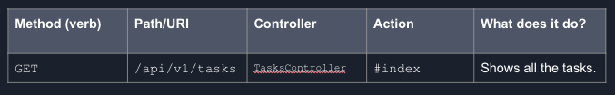

## Learning Goals

- Explain CRUD in the context of web applications.
- Explain what is REST
- Be able to distinguish between a RESTful vs non-RESTful route.

## Vocabulary

- CRUD
- REST
- HTTP Verbs
- URI

## Review: CRUD

- C - Create
- R - Read
- U - Update
- D - Delete

This is a list of the operations we can perform on a *resource*.

What is a resource?

- “A conceptual object that has identity, state, and behavior. “
- Generic term for something that we have in our application (e.g. tasks, people, movies)
- Can also refer to files, web pages, sessions, search results, anything on the web.
- Often corresponds to a database table (but not always!)
- The nouns of an application (tweets, users, friends, posts, etc.)

Often, our applications will have a separate controller and model for each resource.

## What is REST?

- **Representational State Transfer** (ReST)  is a style of web architecture
- Roy Fielding, doctoral dissertation in 2000
- Seeks to give every web resource a URI (Uniform Resource Identifier) that can be manipulated, and let the software determine what to do from there.

In other words…

- A pattern for combining HTTP verbs, URIs, and the actions they correspond to
in order to access (CRUD) resources
- In a Rails app, in which file would you find this information?
    - config/routes.rb
- For our purposes, these are guidelines for how we build our routes

## HTTP Verbs

Part of an HTTP Request that indicates a type of action to perform on a resource.

- GET: retrieve a resource
- POST: create a new resource
- PUT: update an entire existing resource
- PATCH: update part of an existing resource
- DELETE: remove/destroy a resource

What’s the difference between PUT and PATCH…?

Think “flat tire”: 

- PUT a whole new tire on (replaces the entire resource)
- PATCH the existing tire (only replace the part you need)

## URI

- **Uniform Resource Identifier**

The portion of the URL after the domain.

For the URL `https://en.wikipedia.org/wiki/Uniform_Resource_Identifier`, the domain would be `https://en.wikipedia.org` and the URI would be `/wiki/Uniform_Resource_Identifier`.

**Think to yourself**

What is the Domain and URI for this address? `http://www.tatteredcover.com/book/9781626722934`

## Put it all together and you get… Five RESTful API Routes!

### AKA what you need to know about REST

- get /resources				=> resources#index
- get /resources/:id			=> resources#show
- post /resources				=> resources#create

- patch /resources/:id		=> resources#update
- delete /resources/:id		=> resources#destroy

There are also two additional routes that return webpages for forms to create and edit objects. We haven't used these yet because we are building APIs:
- get /resources/new			=> resources#new
- get /resources/:id/edit		=> resources#edit

Notes:
- The routes often start with a namespace and version
- The resource name is plural
- /resources represents the whole table
- /resources/:id represents one row in the table
- Can also have nested resources
   - ex: /artists/:id/songs
   - All the songs for a specific artist

## The Web Before REST

No rules! Make whatever URLs you want!
- get /articles/new 			=>   articles#make_a_new_one
- post /articles/write  		=>   articles#make 
- get /articles/create 		=>   articles#new
- post /articles/save			=>   articles#sophia
- put /articles/1/destroy		=>   articles#index
- delete /articles/destroy&id=1 	=>   articles#BALEETED
    
These are not RESTful routes

Are these routes good or bad? Why?

## Identifying RESTful Routes in Rails

Pull up your Task Manager application. 

Create a table for 5 RESTful routes, allowing us to perform all CRUD actions on a Task. 

When finished, add a few non-RESTful routes. What makes a route non-RESTful?

### Is there an easier way to see all the routes in a Rails app?

Yes!    

`rails routes`

## CFU

If asked in a technical interview, how would you answer the following questions?

- What is each part of CRUD?
- What is REST?
- How do we combine CRUD and REST in web applications?

## Further Reading
- [What RESTful Actually Means](https://codewords.recurse.com/issues/five/what-restful-actually-means)
- [Representational State Transfer](https://en.wikipedia.org/wiki/Representational_state_transfer) on Wikipedia
- [What is REST anyway? (video)](https://www.restapitutorial.com/lessons/whatisrest.html)
- [How DHH organizes controllers for REST](http://jeromedalbert.com/how-dhh-organizes-his-rails-controllers/)