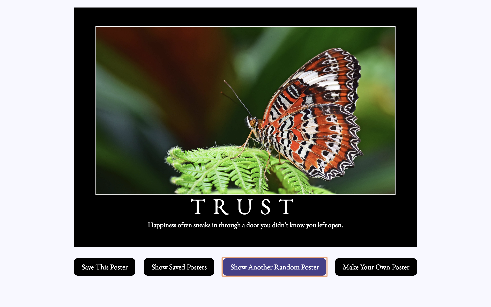
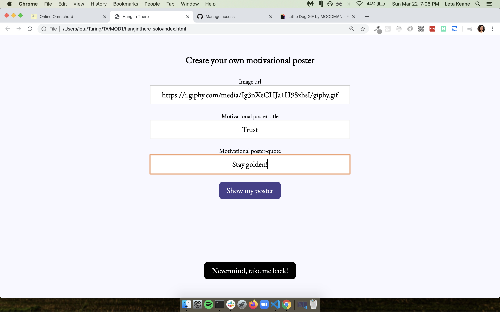
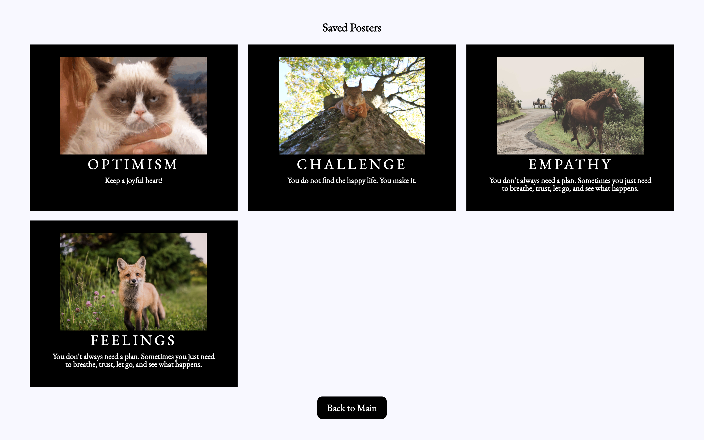

## Learning Goals

* Write clean, DRY JavaScript
  * Build out functionality using functions that show trends toward SRP
  * Manipulate the page after it has loaded adding, removing, and updating elements on the DOM
* Begin to understand the connection between HTML, CSS and JavaScript
  * Practice reading, understanding, and using provided code
* Use array prototype iterator methods to display data on the DOM

## Overview

Sometimes you need a pick me up. Remember those motivational posters that were all over the place in classrooms and online? We're going to make our own!

## Resources 

<section class="dropdown">
### Helpful Hints

<section class="dropdown">
### What's the deal with deploying?

Deploying your repos allows you to have a live site for your application. You'll be able to share this link with friends and family to show off what you're learning! You will also include deploy links on your resume so potential employers can see what you've built! 

Deploying takes time, so it's not a good idea to use your deployed site as your point of reference while building your app. While you're coding, you'll want to run `open index.html` in your terminal to see the current local version of your app. You need to refresh the browser each time you make an update to your code. Once you've pushed up your code and merged into the main branch, the deployed site should update within an hour. 

Below are instructions for deploying to GH Pages:  

    - Repo Settings » Pages » Select the main branch as your Source branch » Save. Then, wait up to an hour, hit refresh, and your deployed link should appear at the top of the screen.  

    - If you don't want to wait, your GH pages URL will follow this format: "https://username.github.io/hang-in-there/". Replace "username" with the repo owner's GH username and "hang-in-there" with your repo's name (if different). The URL will not work right away - that's ok! Add it to the Project Submission form anyway. 
</section>

<section class="dropdown">
### Why are our PRs pushing to the Turing repo?

Forks are typically used to let someone propose changes to your project, that would eventually be merged back into the original repo you forked from. So a fork will always remain connected to the original repo.

When merging a PR, you should see a dropdown to select which repo you want to merge to. You can select the original repo or your fork (you want to choose your fork). 

If you want to change the default, follow the steps [here](https://stackoverflow.com/questions/44466618/default-branch-for-pull-request).
</section>

<section class="dropdown">
### Where are our console logs?

If you console log something in your project, you’ll see it in the dev tools console when you open the page in your browser (`open index.html`). Nothing will appear in your terminal. Remember, you need to refresh the browser each time you make an update to your code.
</section>
</section>

<section class="dropdown">
### Refactoring as You Go

Between each iteration, take some time to look at the code you've written and make any changes that might improve the readability of your code. Refactoring as you go can help ensure that everyone understands the code you've written so far AND make it easier to build on top of that code.

Here are some ideas of what to look for:
- Is our indentation and spacing consistent?
- Are our variable names descriptive of the values they hold? Do they follow common convention (i.e. arrays are plural, etc)?
- Are our function names descriptive of what the function does? Are they named with present tense verbs?
- Are any of our functions too big or doing too many things? Should we break any of them up?
- Is any of our JS code too repetitive? Could we make any reusable functions with parameters and arguments?

Remember - shorter code isn't always better! 
</section>

## Progression

<section class="answer">
### Set Up + Day 1 Deliverables

1. Fork the repository found here: [https://github.com/turingschool-examples/hang-in-there-boilerplate/](https://github.com/turingschool-examples/hang-in-there-boilerplate/).
2. Use the command `git clone <url> <newNameYouWantItToHave>` to clone down your new, forked repo and rename it. The name should not include "boilerplate". 
3. `cd` into the repository
4. Open it in your text editor `code .`
5. View the project in the browser by running `open index.html` in your terminal

Then:

* Explore the repository to see what's going on in the code. Look at each file.
  * What pieces of the existing code might you use to complete iterations, and what pieces will you have to create?
* All of your JavaScript will be written in `main.js`. You will make edits and additions to the html and css files.

**By EOD on Kick Off Day:** 

* Read the entire project spec and rubric.  Post questions in slack.
* Complete [this project submission form](https://docs.google.com/forms/d/1kW1JPMpZUhAjzIDnW_wDrGB8PtRDTIFh9ohpkd5h0xk/edit) to ensure your project manager has the necessary links. See `Helpful Hints` for help with deploying!
* Add your project manager as a collaborator to your forked repository.
</section>

<section class="dropdown">
### Iteration 0 - Main Page

- When the page loads, users should see a poster with a randomly selected image, title, and quote
- Every time the user clicks the Show Random Poster button, a new random poster is displayed.
</section>

<section class="dropdown">
### Iteration 1 - Switching Views

Form view:

Saved posters view:

- When a user clicks the "Make Your Own Poster" button, we should see the form, and the main poster should be hidden
- When a user clicks the "Show Saved Posters" button, we should see the saved posters area, and the main poster should be hidden
- When a user clicks the "Nevermind, take me back!" or "Back to Main" buttons, we should only see the main poster section
- In summary: Be able to switch between the three views (main poster, form, and saved posters) on the correct button clicks

_Hint: 
We aren't actually navigating different pages of a website here. Instead, we will fake that navigation by hiding and unhiding entire sections. Go check out the HTML and CSS files to see how the form and saved posters sections are being hidden in the first place_
</section>

<section class="dropdown">
### Iteration 2 - Creating a New Poster

Result after clicking Show My Poster button:

- On the new poster form view, users should be able to fill out the three input fields and then hit the Show My Poster button
- When the Show My Poster button is clicked, several things will happen:
  - First, use the values from the inputs to create a new, unique poster object and save it as the value of the `currentPoster` global variable (part of your data model)
  - Save the submitted data into the respective arrays (image URL into the images array, etc - all part of your data model) so that future random posters can use the user-created data
  - Change back to the main poster view (hiding the form view again)
  - Use the new, unique poster object (which should be saved in the `currentPoster` variable - part of your data model) to display the newly created poster image, title, and quote in the main view on the DOM

<section class="dropdown">
### Hint!

Something weird is probably happening when you click the button to submit the form? Try googling `event.preventDefault()`! 
</section>
</section>

<section class="dropdown">
### Iteration 3 - Saving & Viewing Posters

- When a user clicks the "Save This Poster" button, the current main poster will be added to the `savedPosters` array.
- If a user clicks the "Save This Poster" more than once on a single poster, it will still only be saved once (no duplicates)
- When a user clicks the "Show Saved Posters" button, we should see the saved posters section
- All the posters in the `savedPosters` array should be displayed in the saved posters grid section
- Ensure styling, sizes and layouts of the Saved Posters view match the comp photo shown in Iteration 1
</section>

<section class="dropdown">
### Iteration 4 - Deleting Saved Posters

- From the saved posters view, if a user double clicks a saved poster, it will be deleted
  -  HTML `onclick` attributes should not be used in any HTML code - all functionality should be through JavaScript.  

</section>

<section class="dropdown">
### Optional Extensions

Here's a list of possible extensions to implement - but **ONLY IF** your team has completed all the previous iterations **AND** have cleaned up your code to make it DRYer and more readable.

You are welcome to add your own extensions. Be sure they are thoughtful in terms of UX/UI, and that they do not break any prior functionality.

- Implement data validation and error handling into the form (disable button, provide error messages if data entered is not correct, etc)
- In the main poster view, allow users to click each piece of the poster (image, title, quote) to update just that piece with another random item from the appropriate array
- When a user single clicks a saved poster, create a modal to view it larger
- Allow users to drag and drop saved posters into whatever order they want them to appear
</section>

---

## Project Feedback

When projects are graded, we want you to view the evaluation + feedback as a means to inform your learning, rather than as static "grades". Feedback from instructors will focus on areas where you have an opportunity to deepen your understanding. 

The evaluation will provide feedback by answering this important question: **Does the project demonstrate student understanding of the learning goals & concepts?**

Projects will answer that question, with each section of the rubric (see below) receiving a `yes`, `not yet`, or `wow` marking.

The overall project outcome is determined by "averaging" each rubric's outcome. You can think of a "yes" being worth a 1, a "not yet" being worth a 0, and a "wow" being worth a 2. For this project, an average of 0.5 is considered a passing project that demonstrates good student understanding!

## Rubric

This project has 4 evaluated concepts:

- JavaScript
- Workflow & Professional Habits
- Reading Code
- Functionality

<section class="note">
### Note about the below criteria

Competency & understanding of these concepts can be demonstrated in many ways. **The following examples are not checklists to complete!** They are illustrations to guide your team as you develop this project and continue your learning.
</section>

<section class="dropdown">
### JavaScript

💫ON TRACK💫 can look like:
- JS is formatted according to the [Turing JS style guide](https://github.com/turingschool-examples/javascript/tree/main/es5)
- The main JS file is organized thoughtfully (DOM variables together, event listeners together, functions together)
- Variable and function naming is meaningful, readable, and follow convention. (Arrays are plural, functions begin with present-tense verb, etc.) 
- Functions are DRY (Don't Repeat Yourself) and demonstrate SRP (Single Responsibility Principle)
- Global variables are limited to only those that are necessary.
- Only semantic/organizational comments remain in file (if any). No console logs remain in any files.

✨WOW✨ can look like:

- Team keeps the data model logic separate from the DOM logic
- Functions make use of arguments and parameters to be dynamic and reusable where possible without overengineering
</section>

<section class="dropdown">
### Workflow & Professional Habits

💫ON TRACK💫 can look like:
- The team's norming document is taken seriously, with thoughtful reflections from all team members regarding their skills, learning goals, work styles, etc. 
- The work is distributed equitably; Commit/code contributions (viewable under `Insights` tab) are roughly even for each team member.
- Commits are made regularly to describe small chunks of working code. Commit messages are descriptive, concise, and consistent across all team members.
- The team keeps the main branch clean by using branches for new, unreviewed code. No one pushes code directly to the main branch.
- PRs have clear, thorough descriptions, such that a new person joining the codebase can clearly understand the proposed changes and evolution of the codebase.
- The README template is filled out thoughtfully and completely.

✨WOW✨ can look like:   
- Team uses a [PR template](https://docs.github.com/en/communities/using-templates-to-encourage-useful-issues-and-pull-requests/creating-a-pull-request-template-for-your-repository).
- Meaningful decisions are documented through code reviews. Suggested/requested edits are made before merging.
</section>

<section class="dropdown">
### Reading Code

💫ON TRACK💫 can look like:
- The team takes time to thoroughly understand the provided code
- Provided code is used effectively (the provided createPoster function, the provided assets, the provided HTML & CSS)
  - The team does not directly edit the HTML or CSS file
  - The team does not ignore provided styling
  - No code is added that makes the provided code redundant

✨WOW✨ can look like:
- Creating and sharing a document (with your PM) for the team's observations of and questions about the existing code
</section>

<section class="answer">
### Functionality

Functionality is the least important piece of the rubric. It’s included because it is another benchmark to gauge proficiency (for example, we can’t grade your JS if there isn’t enough of it written!). However, you should not pursue functionality at the expense of code quality or the learning/growth of all team members.

This means, we DO NOT want to see:

* Code that completes iterations but is sloppy
* One or both team members do not understand every single line of code
* One or both team members skips the problem solving process (pseudocoding, talking out the problem, articulating, planning) in the pursuit of completing functionality

**Well-refactored, thoughtful code is better than sloppy extra features.**

💫ON TRACK💫 can look like:
- All of the expectations of iterations 0-4 are complete without bugs

✨WOW✨ can look like:
- All of the expectations of iterations 0-4 and an extension are complete without bugs
</section>

<!-- Notes for repo updates:
- add ids so we can use to query by id

- add prompting??
- prompt for show/hide iteration encouraging functions with params/arg

- how to incorporate larger dataset of object that they have to iterate through
- maybe get rid of iteration 4 - delete??
- how to incorporate more html and styling and flexbox?
- Maybe Iteration 5?

Maybe iteration 5 introduces new dataset of existing objects that they have to:
- clean the data to get rid of unneeded keys and format it to match existing poster objects with id, image, title, quote - using map and createPoster() to do it. return the new array of cleaned data from the function
- create an html section to display unmotivationals 
  - should start with hidden class applied in html
  - should have a div to hold the posters
  - should have a back to main button
- Create a button on main page to view unmotivationals 
- Use JS to show unmotivational page on button click
- Use JS to hide unmotivational page and show main page on back-to-main click
- Use JS and cleanedData to display all 15 unmotivationals om the unmotivational page when clicking button to go there.  using js to add html for each poster to the section/div you created in the HTML
- Use CSS flexbox not grid (and maybe tweak HTML) to control the layout of the posters to match comp.  
- Use CSS to size and style the posters to match comp
- afterwards try opening your dev console while on the unmotivational view and see how flexbox adapts to the size available.  compare that to the saved view which uses grid

- iterator over the data to display it in the new section
- do css styling and flexbox layout for the new section 

Maybe css and flexbox 4 buttons:
- wrap in div and apply flexbox
- stack vertically
- centered
- could start with no border radius and need to apply
- change button color and hover color  "designer wants to change the button look"

Code:
button {
  background: black;
  border: none;
  border-radius: 10px;
  color: white;
}

button:hover {
  background: darkslateblue;
}

  //div added to buttons
.main-buttons {
  display: flex;
  width: 100%;
  border: 1px solid green;
  /* justify-content: space-around; */
  align-items: center;
  flex-direction: column;
}

-->