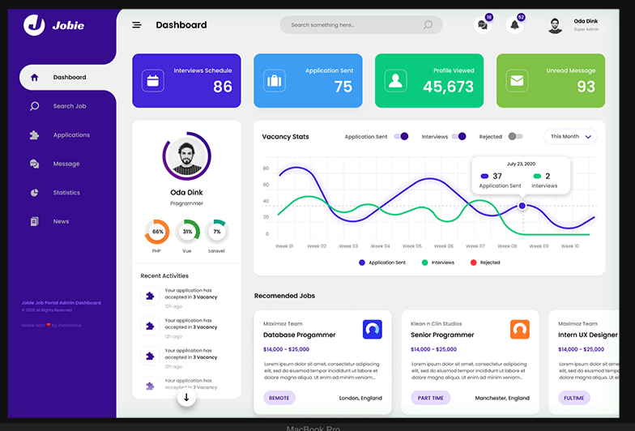

_[Back to Little Shop Home](./index)_

## Connecting to the FE

Upon successful completion of the backend requirements, groups will be able to see their endpoint data within [this front end boilerplate repo](https://github.com/turingschool-examples/little-shop-fe-group-starter).  This front end repo uses vanilla JavaScript, CSS and HTML and was built with Vite - a fast and modern development build tool. You can (and should) learn more about Vite's features [here](https://vitejs.dev/).

Follow the directions in repo's README to fork, clone, install and run the front end.  

The front end is built to make network requests to your locally running rails server using the endpoints at localhost:3000.   

Take time to digest the front end code and features.  Then, complete the front end requirements listed below.

## Explore

As a user, walk through the CRUD functionality for merchants.  

- Choose a merchant and view that merchant's items.
- Add a new merchant, how did the application indicate to you that adding a new merchant was successful?
- Edit a merchant's name
  - Edit their name and submit the changes.
  - Edit another name but discard the changes.
- Delete a merchant

As a developer, explore the code under the hood.  Take time to look through the CSS, HTML and most importantly, the Javascript.

- Follow the code that happens on page load to display the merchants.
- Follow the code as a user clicks on the Add New button.  Keep following the code through the new merchant being submitted.
- Follow the code as a user clicks on a View Merchant Items button.  
- Follow the code as a user clicks on a delete button.

## Front End Requirements

After confirming that your forked FE repo successfully consumes data from your BE rails application, your group will need to complete 3 additional tasks in the FE repo.  Styling, refactoring to use prototype methods, and your choice of an added feature. See below.

Each requirement below asks you to complete a specific task/feature in your front end application.  Remember that you may need to refactor the code in several different areas in order to accomplish any given task, even a small-ish feature add.  The tasks below will likely have you making edits across all 3 main files - html, css and javascript.

<section class="dropdown">
### Style it (Required)

Spend some time working through the following styling tasks:
  1. One small way to make a user's experience better is to make it obvious when something is clickable. Notice on this lesson page what happens when you hover over a clickable item (the dropdown arrow, nav elements, Turing logo, etc). **Update the CSS so that the mouse changes when a user hovers over any button on your application.**
  2. The layout for the Items page isn't great. **Implement flexbox so the item cards are more visually appealing.** Think about things like text alignment, margins and spacing, and using rows/columns. There's no right way to make the Items page look - just be prepared to defend your choices.
  3. **Make at least TWO other styling improvements to your front end application.** You can add colors, change the spacing, round off the buttons, add micro-animations and hover states, etc. In your eval, you'll need to point out and speak to these styling improvements and why you made chose to make them. 

 It can be helpful to find an inspo pic and work towards it - you won't be exactly matching anything so don't lose time struggling to get something pixel-perfect. If you're struggling to find an inspo pic, use this one:  

 
</section>

<section class="dropdown">
### Prototype Methods (Required)

We're actively practicing working with array prototype methods as helpful tools we can use instead of a for loop.  Let's do some refactoring!
  - Refactor the filterByMerchant function to use a filter instead of a for loop.
  - Refactor the findMerchant function to use a find instead of a for loop.
</section>

**Choose 1 of the following features to implement:**

<section class="dropdown">
### Handle No Items

Add a new merchant.  Then, try to view that new merchant's items.  What happens?  Is it helpful or confusing to a user?  How could we make it a better user experience?
  - Refactor the `displayItems` function so that if the `items` argument it recieves is an empty array, a message is displayed to the user that says "No Items Yet For This Merchant".  You may need to touch several parts of the code to add this feature thoroughly.  Make sure that message is not there when a user navigates to a different merchant who _does_ have items to display.
</section>

<section class="dropdown">
### Sort Merchants

We want to be able to sort our merchants in alphabetical order by name.  
  - Add a sort button next to the "Add New" button.
  - Write in the functionality so that users can click the sort button and the merchants will be displays in ABC order.  You'll need to create a function to sort the merchants in ABC order.  You should be able to use the existing displayMerchants function to display those sorted merchants on the DOM.

Sorting data can be kind of a drag on the front end.  Perhaps this shows the value of building this sort of data manipulation into the backend?
</section>

<section class="dropdown">
### Client Side Validation - Add Merchant

Try to submit a new merchant without ever typing anything into the New Merchant Name input field.  What happens?  Is this helpful or confusing to the user?  Do we actually want users to be able to do this?  
  - Refactor the submitMerchant function to make sure there is data in that input field before trying to post that data.  This is called client-side validation.  There are several appropriate ways you could accomplish this. 
</section>

<section class="dropdown">
### Client Side Validation - Edit Merchant

Similarly, we dont want to go through the effort of doing a PATCH network request if there haven't been any changes to the merchant name when a user edits the merchant name.  
  - Add client-side validation to ensure we aren't doing the PATCH request unless we've confirmed that a change has actually been made to the merchant name _and_ that the merchant's edited name field isn't blank.
</section>

## Front End Evaluation

Your front end work will be evaluated alongside your backend work. All of the work completed on the FE application should be thorough, bug-free and completed with the user experience in mind.  You will need to demonstrate and speak to your decision making and approach for implementing the styling changes, refactoring to use prototype methods, and the added feature of your choice. The README of your FE application should outline the improvements you made to the FE boilerplate and highlight the decision making, approach, challenges and learnings that went into it along the way.  You're encouraged to include gifs/screenshots in the README to demonstrate the work you did. 

See the [evaluation spec](evaluation) for more details.

## Deployment (Not Required for FE application)

You are not required to deploy your FE application. If you do choose to deploy your application, you will want to refactor the base url used for the GET/POST/PATCH/DELETE requests to have your FE fetching data from your deployed backend application, rather than the locally hosted backend.  Without this change, the deployed frontend will only be able to display and manipulate data if the user also has the backend running locally. 
