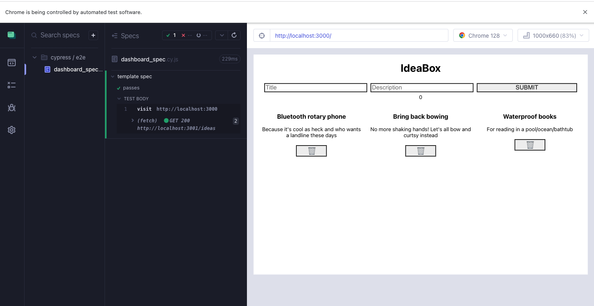
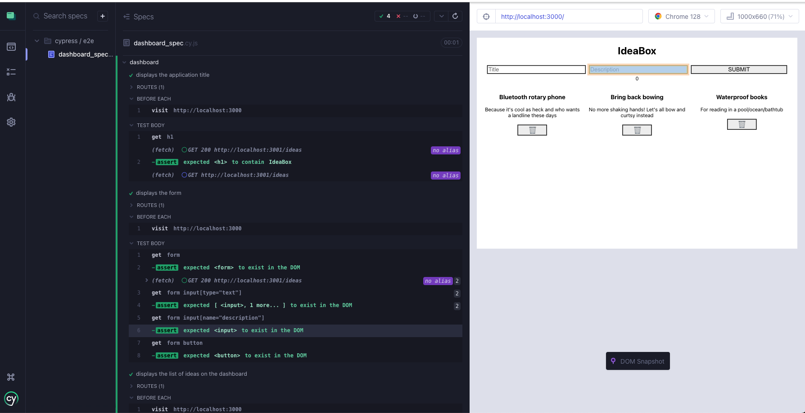

<!-- Keep the pre-work separated from the lesson 
Pre-work needs to be moved to the new curriculum site 
- I think we make this lesson too long, and pin pointed, part of the pre-work, small react app 
- ideabox repo few test files and written out and then after they look through the item, this is how we do E2E testing, let us show them 
look how to typing in the value and look how the post works, and corresponding test suits. 
before feedback - section some other application and something similar and has the test suit and make sense of it
now download these 2 repos and setup the cypress and see functional test suits. 
What si on the page load.

 -->
## Prework:
In this lesson, we will first walk through how to set up Cypress and create a test suite for our IdeaBox application. 

After, you're going to be working with a new codebase and testing multiple scenarios to explore the power of end-to-end tests and the tools **Cypress** provides.  

## A little background

So far in your time at Turing, you've learned a lot about unit testing. The paradigm you've learned so far is testing individual functions with unit tests to verify that they produce the same output every time, and testing the interactions between those functions (integration tests).

We haven't tested anything on the DOM yet. So far, our testing has been from the developer's point of view, focused on ensuring that our codebase functions correctly. However, since our apps are built for users, we also need to verify that they work from their perspective!

However, because the apps we build are meant to be used by, well, _users_, it's also important that we ensure that our apps work from their perspective!

In this lesson, we're going to learn about **acceptance testing** and **end-to-end testing** (also known as E2E testing).

## What are acceptance tests?

In our User Stories lesson, we learned about describing user flows. We also learned about writing _acceptance criteria_. A user story describes the WHAT of a user flow: what is supposed to happen? Acceptance criteria describes the HOW of a user flow: how is that accomplished?

Acceptance testing ensures that the acceptance criteria were successfully implemented. It doesn't just manually call functions; it runs the actual application and walks through a user flow via the app UI. When we run acceptance tests, we use the client, and stub out (we'll learn about this later) our network requests and other services.

You can think of testing complexity moving from unit testing to integration testing, from integration testing to acceptance testing.

Consider testing a site like Twitter. When the developers build out the login functionality, it's mission critical that it works as expected in all cases, including obscure edge cases. Just testing the functions in isolation wouldn't be enough. For true confidence in an app, we need to test that the user experiences the expected user flow.

Most of the tests we write in Cypress are going to be acceptance tests!

## What are end-to-end tests?
`End-to-end` ("E2E") tests add another layer of confidence to your testing by running your entire application including the client, API, database, and other services.  This helps boost a developer's confidence with their app ensuring that the **user flow** works correctly in the production environment (or something very similar to the production environment). Although they can be expensive to set up initially, they test how a user would interact with an application.

This is the final layer that should be added in addition to `unit` and `integration` tests.  While these tests focus more on the code written and help pinpoint potential errors for the developer, `acceptance` and `end-to-end` tests are useful for the end user.  Think about the various happy and sad path user flows your last project encompassed.  This could include the *happy paths* of displaying a list of movies or adding a movie to their favorites.  Maybe the route changes if a user clicks on a button.  There are also the *sad paths* to those user flows.  What if the movie has already been favorited?  What if a route doesn't exist?

## Frontend Testing vs Backend Testing

As you've progressed through Turing, you've gained experience with backend testing, primarily focusing on unit and integration tests for server-side code. Frontend testing, while sharing some similarities, has its own unique characteristics and challenges. Let's explore the key differences:
<section class="dropdown">
### The Answer  

1. **Environment**: 
   - Backend tests run in controlled server environments, while frontend tests run in browsers, which introduce variables like screen sizes, browsers, and user interactions.

2. **Focus**:
   - Backend tests typically focus on data processing, database interactions, and API responses.
   - Frontend tests focus on user interface, user interactions, and how data is displayed to the user.

3. **Asynchronous Operations**:
   - While backend tests deal with some asynchronous operations (like database queries), frontend tests often have to handle more complex asynchronous scenarios due to API calls, user interactions, and DOM updates.

4. **User Simulation**:
   - Backend tests rarely need to simulate user behavior.
   - Frontend tests often involve simulating user actions like clicks, form submissions, and page navigation.

5. **Visual Elements**:
   - Backend tests don't deal with visual elements.
   - Frontend tests often need to verify that UI elements are rendered correctly, visible, and respond appropriately to user interactions.

6. **Network Requests**:
   - In backend testing, you're often testing the creation and handling of network requests.
   - In frontend testing, you're often testing how your application handles responses from network requests, including error states and loading indicators.

7. **State Management**:
   - Backend tests typically focus on the state of the database or the server.
   - Frontend tests need to consider the state of the UI, which can be more complex and change rapidly based on user interactions.

</section>


As we dive into Cypress for frontend testing, keep these differences in mind. Cypress is designed to address many of the unique challenges of frontend testing, providing tools to handle asynchronous operations, simulate user behavior, and interact with the DOM in ways that feel intuitive to frontend developers.

## Introduction to Cypress Test Syntax

As you begin writing tests with Cypress, you'll encounter a new syntax for testing in JavaScript. While this may look different from the past tests you're familiar with, the core concepts of testing remain the same. Let's break down the basic structure of a Cypress test and explain its components.
```js

    describe('My First Test', () => {
      it('Does not do much!', () => {
      expect(true).to.equal(true)
      })
    })
```
Let's break this down:

- `describe()`: This function is used to group related tests. It's similar to how you might group related tests in Ruby.
- `it()`: This function defines an individual test case. In Ruby, you might have used `test` or `it` depending on the testing framework.
- The arrow function `() => { ... }` is a JavaScript way of defining a function. This is where you put your test code.

### Assertions

Cypress provides its own assertion syntax, which is both powerful and easy to read. 
Here are some examples:

<section class="dropdown">  
### The Answer  

```js
// Basic assertion
cy.get('h1').should('contain', 'IdeaBox')
// Checking existence
cy.get('.idea-card').should('exist')
// Checking count
cy.get('.idea-card').should('have.length', 3)
// Checking attributes
cy.get('input[name="title"]').should('have.attr', 'placeholder', 'Enter title')
// Checking visibility
cy.get('button').should('be.visible')
// Checking text content
cy.get('.error-message').should('have.text', 'Please fill out all fields')
```
These assertions use Cypress's `should` command, which is chainable and can be used with various assertions. The syntax is designed to be readable and expressive, allowing you to write tests that closely resemble how you'd describe the expected behavior in plain language.

Remember, Cypress automatically waits for elements to exist before running assertions, which helps handle asynchronous behavior without explicit waits.
</section >  


### Interacting with the Page

A key aspect of frontend testing is the need to interact with web pages.
Cypress provides commands for this:
<section class="dropdown">    
### The Answer  

```js
Cypress
cy.visit('/') // Navigate to a page
cy.get('button').click() // Find an element and click it
cy.get('input').type('Hello, World!') // Type into an input field
```
</section>    
These commands simulate user actions in the browser, which is a core part of frontend testing.

### Asynchronous Operations

Frontend applications often involve asynchronous operations (like waiting for data to load). Cypress can handle this for us. We'll talk more about this in the next chapter, where we'll cover the Cypress tests for our IdeaBox application.


## IdeaBox practice with Cypress :

We know that in our IdeaBox, we have a page that contains a list of ideas and a form to add new ideas. Let's see how to add a few Cypress test files to test the following user flows:
- As a user, I want to be able to see the title of the application. 
- As a user, I want to be able to see the form to add a new idea. 
- As a user, I want to be able to see the list of ideas on the dashboard when I load the page. 
- As a user, I want to be able to add a new idea to the list.
### Step 1
We need to set up the Cypress testing framework in our application.
Let's add the Cypress npm package to our application. 
```bash
npm i -D cypress
```
Next, we need to add a script to our `package.json` file to run Cypress.
```js
  {
    "scripts": {
      "cypress": "cypress open"
    }
  }
```
Now it's time to run Cypress. 
```bash
npm run cypress
```
**This will open the Cypress Test Runner, a user-friendly interface for managing your tests.** Follow these steps to create your first test file:

1. In the Cypress Test Runner, you'll see a list of browsers. Select "Chrome" (or your preferred browser).

2. Click the "Create new spec" button in the top right corner.

3. A dialog will appear. Enter `dashboard_spec.cy.js` as the file name.

4. Click "Create spec" to generate the new test file.

5. Cypress will create the file and show it in the list of specs.
6. Go back to your text editor and open the `dashboard_spec.cy.js` file. You can see the file structure in the IDE.and the code that was generated for us. 

This process creates a new test file specifically for testing your dashboard functionality. As you become more familiar with Cypress, you'll find this interface makes it easy to organize and manage your test suite.
Here is the code that was generated for us:
```js
describe('template spec', () => {
  it('passes', () => {
    cy.visit('https://example.cypress.io')
  })
})

```
### Step 2: Writing your first test

Ok now we have the file structure lets tweak the test to see how it works. 
First, let's make sure that our application is running and we can navigate to it in the browser.
Now let's go back to our test file and make sure that we can navigate to the dashboard. We need to change the `cy.visit` to navigate to `http://localhost:3000`.

Here is the Cypress UI running our test and opening the application inside the Cypress UI.



As you can see Cypress is running our test and opening the application in the Cypress UI for us to see the results. It looks like our test is also running the fetch call to get the ideas and display them on the page. 
But before we go on with writing tests for our GET request, let's first go back to our user flow and see what else we need to test. Based on the user flow, we want to make sure the dashboard has a title, a form to add a new idea, and a list of ideas. 
Let's add our first `it` block test to make sure that the title is displayed on the page. Cypress helps us here by ensuring that our React application is rendering the correct content to the DOM for our end users.

Here is the code for the test: 
```js
it('displays the application title', () => {
    cy.get('h1').should('contain', 'IdeaBox')
  })
```
It looks like our test is not passing, as the application is only visited in the first test and not in the second it block.
In order to run the visit before every `it` block, we need to add a `beforeEach` hook to our test.
<section class="note">

`beforeEach` is a Cypress test hook that allows you to run a set of commands before each test (`it` block) in a `describe` block.
</section>
Let's add that to our test.

```js
describe('Dashboard', () => {
  beforeEach(() => {
    cy.visit('http://localhost:3000')
  })
})
```
Now before each test, Cypress will visit the application and run the test. 
- In real-world scenarios, users typically start from a fresh page load.
- This approach more closely mimics actual user interactions.
- Also, it's a good practice to have a fresh page load so each test is independent and does not rely on the results of another test.

Now our h1 title test is passing, let's add our second test to check if the form is displayed on the page. 
```js
  it('displays the form ', () => {
    cy.get('form').should('exist')
    cy.get('form input[name="title"]').should('exist')
    cy.get('form input[name="description"]').should('exist')
    cy.get('form button').should('exist')
  })
```
Next we want to check if the list of ideas is displayed on the page. 
```js
  it('displays the list of ideas', () => {
    cy.get('.ideas-container').should('exist')
    cy.get('.ideas-container').should('have.length.at.least', 1)
  })
```
Great, now we have checked the dashboard to see if it contains the title, form, and list of ideas, let's move on to write tests for our GET request and Post request. 

### Testing the GET request

As we saw in the demo image, the application makes GET requests to the server and displays the response in the DOM. There is a filled green circle, next to the GET request in the Cypress UI. This is the indicator that the request is being made to the server.

However, these network requests can be expensive and slow down our tests. To keep our tests fast and reliable, we want to avoid making actual network calls during testing. Instead, we'll use a technique called 'stubbing' to simulate these requests with mock data.

Stubbing allows us to control network requests and the data our tests work with. This approach helps ensure our tests are fast, reliable, and isolated from external dependencies like network requests. By using mock data, we can test various scenarios without relying on the actual server responses.
If you look at the Cypress UI, you see that before adding intercept, the UI for the fetch is showing a filled circle, which means that the request is being made to the server and the data is being displayed on the page. To avoid making actual network calls, we can use `cy.intercept` to simulate the server response, using a fixture file that contains mock data.
```js
// dashboard_spec.cy.js
describe('dashboard', () => {
  beforeEach(() => {
    cy.intercept("GET", "http://localhost:3001/ideas", {
      statusCode: 200,
      fixture: "ideas" // here is where we are referencing the fixture file name
    })

    cy.visit('http://localhost:3000')
  })
})
```
```json

//fixtures/ideas.json We are storing our mock data in ideas.json fixture file. 
[
  {
  "id": 1,
  "title": "Bluetooth rotary phone",
  "description": "Because it's cool as heck and who wants a landline these days"
  },
  {
  "id": 2,
  "title": "Bring back bowing",
  "description": "No more shaking hands! Let's all bow and curtsy instead"
  },
  {
  "id": 3,
  "title": "Waterproof books",
  "description": "For reading in a pool/ocean/bathtub"
  }
  ]
```


### Testing the POST request

Now let's test adding a new idea to the list. This involves interacting with the form and verifying that the new idea appears in the list.

Here is the code for the test:
```js
it('adds a new idea to the list', () => {
    cy.get('form input[name="title"]').type('newIdeaTitle')
    cy.get('form input[name="description"]').type('newIdeaDescription')
    //After typing in the form, we need to click the submit button but wait isn't this going to trigger the POST request? 
   cy.get('form button').click()
})
```
As you see after adding testing the click we are actually triggering the POST request, and we don't want that to happen. Cypress provides a helpful feature called `cy.intercept`, which allows us to handle POST requests without actually sending them to the server.
However, since post is happening when the user clicks the submit, we don't need to have that intercept in the beforeEach block, since that doesn't need to happen for every test. But instead of adding it in after click we want to add it at the beginning of the test. 
```js
it('adds a new idea to the list', () => {
    cy.intercept("POST", "http://localhost:3001/ideas", {
      statusCode: 201,
      body: {
        title: "newIdeaTitle",
        description: "newIdeaDescription"
      }
    }) 
    cy.get('form input[name="title"]').type('newIdeaTitle')
    cy.get('form input[name="description"]').type('newIdeaDescription')
    cy.get('form button').click()
})     
```
Note that we add the `cy.intercept` at the beginning of the test block, before any interactions. This ensures that Cypress is ready to intercept the POST request as soon as it's made. If we placed it after the click, we might miss intercepting the request.

```js
it('adds a new idea to the list', () => {
    cy.intercept("POST", "http://localhost:3001/ideas", {
      statusCode: 201,
      body: {
        title: "newIdeaTitle",
        description: "newIdeaDescription"
      }
    }) 
    cy.get('form input[name="title"]').type('newIdeaTitle')
    cy.get('form input[name="description"]').type('newIdeaDescription')
    cy.get('form button').click()
    cy.get('.ideas-container > :nth-child(4)').should('contain', 'Test new idea')
    cy.get('.ideas-container > :nth-child(4)').should('contain', 'Test new idea')
})
```
When testing POST requests, it's crucial to set up the interception before any user actions that trigger the request.
This ensures that Cypress is prepared to intercept and mock the response as soon as the request is made. Here's why this approach is important:

1. It allows us to control the response data, enabling consistent and predictable tests.
2. It prevents actual network requests during testing, which can make tests faster and more reliable.
3. It enables us to test various scenarios, including error states, without modifying the server." to "It enables us to test various scenarios, including error states, without modifying the server.

Remember to place your `cy.intercept()` call at the beginning of your test (`it` block), before any interactions that might trigger the POST request.

After clicking the submit button, we need to add more assertions to verify that the new idea has been successfully added to the list. This is crucial because:

1. It confirms that the UI has been updated correctly after the POST request.
2. It ensures that the user can see the newly added idea, which is a key part of the user experience.
3. It verifies that our application is correctly handling the response from the intercepted POST request.

Let's add these assertions:


## Deliverables : **Clone down the following repos:**
<section class="note">

Deliverable: After setting up Cypress in the Feedback Loop UI repo, create a simple test that visits the homepage and verifies the presence of the login form. Submit a screenshot of your passing test in the Cypress Test Runner.
</section>

**[UI](https://github.com/turingschool-examples/feedback-loop-ui){:target='blank'}**
```bash
git clone https://github.com/turingschool-examples/feedback-loop-ui.git
cd feedback-loop-ui
npm i
npm start
```

**[API](https://github.com/turingschool-examples/feedback-loop-api){:target='blank'}**
```bash
git clone https://github.com/turingschool-examples/feedback-loop-api.git
cd feedback-loop-api
npm i
npm start
```

Once you have the application running, spend 15 minutes using the application and examining the FE code to see how the application runs. *The fake log-in information is located in [this file](https://github.com/turingschool-examples/feedback-loop-api/blob/main/mockData/users.js){:target='blank'}.* It's not important to understand every line of code, but take note of the various user flows and how the various API calls work.

For example, you don't need to know how Router works. Instead, use the application and see how the URL changes as you navigate through the website.

### Setting Up Cypress
You'll need to use the Cypress docs to figure out how to get it set up in your repo.  This might feel uncomfortable and unfamiliar, thats ok - these docs ARE unfamiliar to you right now. Take your time working through them.  Ask questions in your cohort channel if you get stuck - but only ***after*** doing some research and troubleshooting to try to get yourself unstuck first.

* First use [the Cypress docs](https://docs.cypress.io/guides/getting-started/installing-cypress.html#Installing){:target='blank'} to figure out how to use npm to install Cypress within the Feedback Loop UI repo.
* There are multiple ways of opening up Cypress.  Use the docs to figure out how to setup a `script` in the `package.json` that you'll be able to use to open up Cypress.  
* Open Cypress with the script you added. A new window will appear with two testing options.  
  * Select **E2E Testing**.  
  * There are some config options on the next window...but for now just select **Continue** at the bottom.  
    * *Hint: If you see an error that references webpack, you likely chose Component Testing by mistake in the previous step.*
  * Then select your browser (*Chrome*) and the **Start E2E Testing in Chrome** button. *Pause here for now and keep working thru this prework lesson.*  

Having completed these steps, you should notice some new directories and files added to your application.


<section class="dropdown">
### The Answer

If you get stuck!  Look at the Cypress docs or our IdeaBox example.
</section>


### Writing your first test!
You'll notice in your code that there are a few directories including `downloads`, `fixtures`, and `support` inside of a `cypress` directory.  Make note of these directories and go back to the main window on Cypress, then follow the [instructions here](https://docs.cypress.io/guides/end-to-end-testing/writing-your-first-end-to-end-test#What-you-ll-learn){:target="_blank"} for adding your first test file.

### Creating some test files
As we consider what we will be testing, let's consider a few ways to set up our files.

We could make one giant file and test absolutely everything there: `feedback_loop_spec.cy.js`.  But it's probably more maintainable to group up our related user flows.

**Create a few files in the `e2e` directory (located inside the `cypress` directory) using the Cypress UI** (do not add them manually within your repo):
- `cypress/e2e/login_spec.cy.js`
- `cypress/e2e/dashboard_spec.cy.js`
- `cypress/e2e/form_spec.cy.js`

<section class="note">


Notice that each of these describes actions tied to our data/server/network requests. When viewing feedback from coworkers, there are several different user flows. But they all involve GETTING feedback data from the back end.

Figuring out how to group user flows/stories can be tricky, and ultimately there are no hard-and-fast rules about how to do so. Over time, you'll develop a sense of what to put together, just like how you are learning what to break out into a React component and what to leave as is. And, of course, these conventions change from team to team.
</section>

