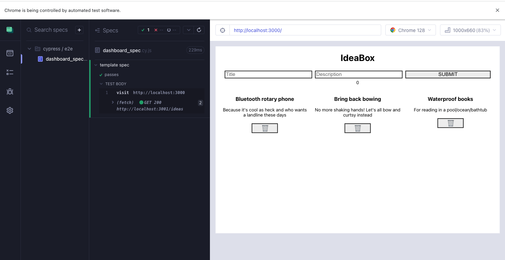
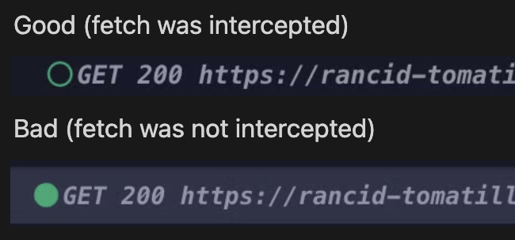
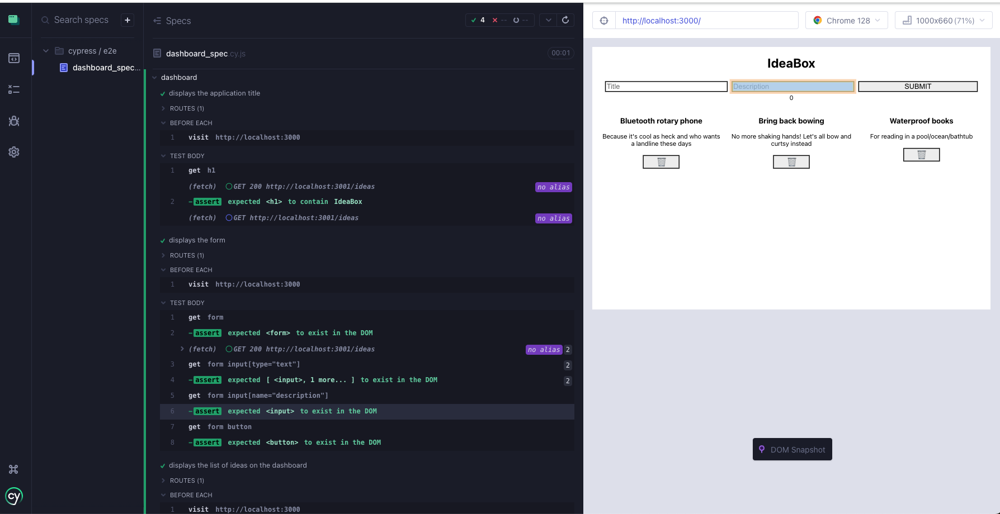

***As prework for the Intro to Cypress lesson, complete this entire Prework activity. Submit the deliverable, write down any questions you have, and bring them to the Intro to Cypress class.***
  
In this lesson, we will first walk through how to set up Cypress and create a test suite for our IdeaBox application. 

After, you're going to be working with a new codebase and testing multiple scenarios to explore the power of end-to-end tests and the tools **Cypress** provides.  

## A little background

So far in your time at Turing, you've learned a lot about unit testing. The paradigm you've learned so far is testing individual functions with unit tests to verify that they produce the same output every time, and testing the interactions between those functions (integration tests).

We haven't tested anything on the DOM yet. So far, our testing has been from the developer's point of view, focused on ensuring that our codebase functions correctly. However, since our apps are built for users, we also need to verify that they work from their perspective!

However, because the apps we build are meant to be used by, well, _users_, it's also important that we ensure that our apps work from their perspective!

In this lesson, we're going to learn about **acceptance testing** and **end-to-end testing** (also known as E2E testing).

## What are acceptance tests?

In our User Stories lesson, we learned about describing user flows. We also learned about writing _acceptance criteria_. A user story describes the WHAT of a user flow: what is supposed to happen? Acceptance criteria describes the HOW of a user flow: how is that accomplished?

Acceptance testing ensures that the acceptance criteria were successfully implemented. It doesn't just manually call functions; it runs the actual application and walks through a user flow via the app UI. When we run acceptance tests, we use the client, and stub out (we'll learn about this later) our network requests and other services.

You can think of testing complexity moving from unit testing to integration testing, from integration testing to acceptance testing.

Consider testing a site like Twitter. When the developers build out the login functionality, it's mission critical that it works as expected in all cases, including obscure edge cases. Just testing the functions in isolation wouldn't be enough. For true confidence in an app, we need to test that the user experiences the expected user flow.

Most of the tests we write in Cypress are going to be acceptance tests!

## What are end-to-end tests?
`End-to-end` ("E2E") tests add another layer of confidence to your testing by running your entire application including the client, API, database, and other services.  This helps boost a developer's confidence with their app ensuring that the **user flow** works correctly in the production environment (or something very similar to the production environment). Although they can be expensive to set up initially, they test how a user would interact with an application.

This is the final layer that should be added in addition to `unit` and `integration` tests.  While these tests focus more on the code written and help pinpoint potential errors for the developer, `acceptance` and `end-to-end` tests are useful for the end user.  Think about the various happy and sad path user flows your last project encompassed.  This could include the *happy paths* of displaying a list of movies or adding a movie to their favorites.  Maybe the route changes if a user clicks on a button.  There are also the *sad paths* to those user flows.  What if the movie has already been favorited?  What if a route doesn't exist?

## Frontend Testing vs Backend Testing

As you've progressed through Turing, you've gained experience with backend testing, primarily focusing on unit and integration tests for server-side code. Frontend testing, while sharing some similarities, has its own unique characteristics and challenges. Let's explore the key differences:
<section class="dropdown">
### The Answer  

1. **Environment**: 
   - Backend tests run in controlled server environments, while frontend tests run in browsers, which introduce variables like screen sizes, browsers, and user interactions.

2. **Focus**:
   - Backend tests typically focus on data processing, database interactions, and API responses.
   - Frontend tests focus on user interface, user interactions, and how data is displayed to the user.

3. **Asynchronous Operations**:
   - While backend tests deal with some asynchronous operations (like database queries), frontend tests often have to handle more complex asynchronous scenarios due to API calls, user interactions, and DOM updates.

4. **User Simulation**:
   - Backend tests rarely need to simulate user behavior.
   - Frontend tests often involve simulating user actions like clicks, form submissions, and page navigation.

5. **Visual Elements**:
   - Backend tests don't deal with visual elements.
   - Frontend tests often need to verify that UI elements are rendered correctly, visible, and respond appropriately to user interactions.

6. **Network Requests**:
   - In backend testing, you're often testing the creation and handling of network requests.
   - In frontend testing, you're often testing how your application handles responses from network requests, including error states and loading indicators.

7. **State Management**:
   - Backend tests typically focus on the state of the database or the server.
   - Frontend tests need to consider the state of the UI, which can be more complex and change rapidly based on user interactions.

</section>


As we dive into Cypress for frontend testing, keep these differences in mind. Cypress is designed to address many of the unique challenges of frontend testing, providing tools to handle asynchronous operations, simulate user behavior, and interact with the DOM in ways that feel intuitive to frontend developers.

## Introduction to Cypress Test Syntax

As you begin writing tests with Cypress, you'll encounter a new syntax for testing in JavaScript. While this may look different from the past tests you're familiar with, the core concepts of testing remain the same. Let's break down the basic structure of a Cypress test and explain its components.
```js

    describe('My First Test', () => {
      it('Does not do much!', () => {
      expect(true).to.equal(true)
      })
    })
```
Let's break this down:

- `describe()`: This function is used to group related tests. It's similar to how you might group related tests in Ruby.
- `it()`: This function defines an individual test case. In Ruby, you might have used `test` or `it` depending on the testing framework.
- The arrow function `() => { ... }` is a JavaScript way of defining a function. This is where you put your test code.

### Assertions

Cypress provides its own assertion syntax, which is both powerful and easy to read. 
Here are some examples:

<section class="dropdown">  
### The Answer  

```js
// Basic assertion
cy.get('h1').should('contain', 'IdeaBox')
// Checking existence
cy.get('.idea-card').should('exist')
// Checking count
cy.get('.idea-card').should('have.length', 3)
// Checking attributes
cy.get('input[name="title"]').should('have.attr', 'placeholder', 'Enter title')
// Checking visibility
cy.get('button').should('be.visible')
// Checking text content
cy.get('.error-message').should('have.text', 'Please fill out all fields')
```
These assertions use Cypress's `should` command, which is chainable and can be used with various assertions. The syntax is designed to be readable and expressive, allowing you to write tests that closely resemble how you'd describe the expected behavior in plain language.

Remember, Cypress automatically waits for elements to exist before running assertions, which helps handle asynchronous behavior without explicit waits.
</section >  


### Interacting with the Page

A key aspect of frontend testing is the need to interact with web pages.
Cypress provides commands for this:
<section class="dropdown">    
### The Answer  

```js
Cypress
cy.visit('/') // Navigate to a page
cy.get('button').click() // Find an element and click it
cy.get('input').type('Hello, World!') // Type into an input field
```
</section>    
These commands simulate user actions in the browser, which is a core part of frontend testing.

### Asynchronous Operations

Frontend applications often involve asynchronous operations (like waiting for data to load). Cypress can handle this for us. We'll talk more about this in the next chapter, where we'll cover the Cypress tests for our IdeaBox application.

## Cypress Walkthrough with Ideabox:

We are going to use our **[IdeaBox repo](https://github.com/turingschool-examples/react-ideabox){:target='blank'}** to practice some Cypress testing. We will test the following user flows:
- As a user, I want to be able to see the title of the application. 
- As a user, I want to be able to see the form to add a new idea. 
- As a user, I want to be able to see the list of ideas on the dashboard when I load the page. 
- As a user, I want to be able to add a new idea to the list.  

### Step 0: Set Up

Navigate to your **[IdeaBox repo](https://github.com/turingschool-examples/react-ideabox){:target='blank'}** directory (which you should have from other lessons).  
  
Switch to the correct branch:  

```bash
# In the react-ideabox directory:

git fetch
git checkout cypress-testing
```
Run the app:  

```bash
npm start
```
Get the **[Ideabox API](https://github.com/turingschool-examples/ideabox-api){:target='blank'}** up and running (again, you should already have this one cloned down):  

```bash
# In the ideabox-api directory:

node server.js
```
Check that it's working by going to `localhost:3000` in your browswer. You should see your Ideabox app running, with 3 cards on the page. 

### Step 1: Installing Cypress

We need to set up the Cypress testing framework in our application.
Let's add the Cypress npm package to our application. 
```bash
npm i -D cypress
```
Next, we need to add a script to our `package.json` file to run Cypress.
```js
  {
    "scripts": {
      "start": "react-scripts start",
      "build": "react-scripts build",
      // ...
      "cypress": "cypress open" /* <----- Add this line */
    }
  }
```
Now it's time to run Cypress. 
```bash
npm run cypress
```
This will open the Cypress Test Runner, a user-friendly interface for managing your tests. Follow these steps to create your first test file:

1. In the Cypress Test Runner, select "E2E Testing".

1. Keep everything checked ✅ and press "Continue".

1. Next, you'll see a list of browsers. Select "Chrome" and press "Start E2E Testing in Chrome".

1. Select "Create new spec".

1. A dialog will appear. Enter `cypress/e2e/dashboard_spec.cy.js` as the file name.

1. Click "Create spec" to generate the new test file, then "Okay, run the spec" to run the tests.

1. Cypress will create some files and run the sample test.

1. Go back to your text editor and notice the new `cypress` directory. You can see there are many files there for us. We'll explore them as we go. Let's start by focusing on the `cypress/e2e/dashboard_spec.cy.js` file, which has some code in there already:  

```js
describe('template spec', () => {
  it('passes', () => {
    cy.visit('https://example.cypress.io')
  })
})
```

### Step 2: Writing your first tests

Ok now we have the file structure lets tweak the test to see how it works. 
First, let's make sure that our application is running and we can navigate to it in the browser.
Now let's go back to our test file and make sure that we can navigate to the dashboard. We need to change the `cy.visit` to navigate to `http://localhost:3000`.

Here is the Cypress UI running our test and opening the application inside the Cypress UI.



As you can see Cypress is running our test and opening the application in the Cypress UI for us to see the results. It looks like our test is also running the fetch call to get the ideas and display them on the page. 
But before we go on with writing tests for our GET request, let's first go back to our user flow and see what else we need to test. Based on the user flow, we want to make sure the dashboard has a title, a form to add a new idea, and a list of ideas. 
Let's add our first `it` block test to make sure that the title is displayed on the page. Cypress helps us here by ensuring that our React application is rendering the correct content to the DOM for our end users.

Here is the code for the test: 
```js
it('displays the application title', () => {
    cy.get('h1').should('contain', 'IdeaBox')
  })
```
It looks like our test is not passing, as the application is only visited in the first test and not in the second it block.
In order to run the visit before every `it` block, we need to add a `beforeEach` hook to our test.
<section class="note">

`beforeEach` is a Cypress test hook that allows you to run a set of commands before each test (`it` block) in a `describe` block.
</section>
Let's add that to our test change that first test to include a `beforeEach`:

```js
describe('Dashboard', () => {
  beforeEach(() => {
    cy.visit('http://localhost:3000')
  })

  it('displays the application title', () => {
    cy.get('h1').should('contain', 'IdeaBox')
  })
})
```
Now before each test, Cypress will visit the application and run the test. 
- In real-world scenarios, users typically start from a fresh page load.
- This approach more closely mimics actual user interactions.
- Also, it's a good practice to have a fresh page load so each test is independent and does not rely on the results of another test.

Now our h1 title test is passing, let's add our second test to check if the form is displayed on the page. Remember, all of these `it` blocks should be INSIDE of your `describe` block.
```js
it('displays the form ', () => {
  cy.get('form').should('exist')
  cy.get('form input[name="title"]').should('exist')
  cy.get('form input[name="description"]').should('exist')
  cy.get('form button').should('exist')
})
```
Next we want to check if the list of ideas is displayed on the page. 
```js
it('displays the list of ideas', () => {
  cy.get('.ideas-container').should('exist')
  cy.get('.card').should('have.length', 3)
})
```

Let's be more specific in that last test, though. It's not enough to just check that there are 3 idea cards. We want to actually check the contents of those card. Let's change that last test to look like this:
```js
it('displays the list of ideas', () => {
  cy.get('.ideas-container').should('exist')
  cy.get('.card').should('have.length', 3)
  cy.get('.card').first().find('h3').should('have.text', 'Sweaters for pugs')
  cy.get('.card').first().find('p').should('have.text', 'To keep them warm')
  cy.get('.card').first().find('button').should('exist')
  cy.get('.card').last().find('h3').should('have.text', 'A game show called Ether/Or')
  cy.get('.card').last().find('p').should('have.text', 'When you lose you get an un-potty trained puppy')
  cy.get('.card').first().find('button').should('exist')
})
```
Whenever we are rendering many copies of the same component, we want to confirm that:
- There are the number of components we expect to see (i.e. 3 cards)
- All of the content is correct for the first AND last card (i.e. `h3`, `p`, and `button`)

### Step 3: Intercepting the GET request

As we know, our Ideabox is making GET requests to the server. Right now, our Cypress testing is actually causing those requests to be made - we want to avoid that.

Network requests can be expensive and slow down our tests. To keep our tests fast and reliable, we want to avoid making actual network calls during testing. Instead, we'll use a technique called 'stubbing' to simulate these requests with mock data.

Stubbing allows us to control network requests and the data our tests work with. This approach helps ensure our tests are fast, reliable, and isolated from external dependencies like network requests. By using mock data, we can test various scenarios without relying on the actual server responses.  

If you look at the Cypress UI, you see that before adding intercept, the UI for the fetch is showing a filled circle, which means that the request is being made to the server and the data is being displayed on the page. After we successfully intercept this request, we should see an empty circle:    


To avoid making actual network calls, we can use `cy.intercept` to simulate the server response, using a fixture file that contains mock data.
```js
// dashboard_spec.cy.js
describe('dashboard', () => {
  beforeEach(() => {
    cy.intercept("GET", "http://localhost:3001/api/v1/ideas", {
      statusCode: 200,
      fixture: "ideas" // here is where we are referencing the fixture file name
    })

    cy.visit('http://localhost:3000')
  })
})
```
We will use a fixtures file to store our mock data. Create a `fixtures/ideas.json` file and add this mock data:
```json
[
  {
  "id": 1,
  "title": "Bluetooth rotary phone",
  "description": "Because it's cool as heck and who wants a landline these days"
  },
  {
  "id": 2,
  "title": "Bring back bowing",
  "description": "No more shaking hands! Let's all bow and curtsy instead"
  },
  {
  "id": 3,
  "title": "Waterproof books",
  "description": "For reading in a pool/ocean/bathtub"
  }
]
```

Okay now we have good news and bad news. Good news is that our GET request is being intercepted (notice the open green circles). Bad news is that now we are failing a previous test. No problem - we just need to update that test to be looking for the mock data, not the data from the server since we aren't actually hitting the API in our tests anymore.  

```js
it('displays the list of ideas', () => {
  cy.get('.ideas-container').should('exist')
  cy.get('.card').should('have.length', 3)
  cy.get('.card').first().find('h3').should('have.text', 'Bluetooth rotary phone')
  cy.get('.card').first().find('p').should('have.text', 'Because it\'s cool as heck and who wants a landline these days')
  cy.get('.card').first().find('button').should('exist')
  cy.get('.card').last().find('h3').should('have.text', 'Waterproof books')
  cy.get('.card').last().find('p').should('have.text', 'For reading in a pool/ocean/bathtub')
  cy.get('.card').first().find('button').should('exist')
})
```
Boom! We're passing AND we're not actually hitting the API 🥳 
  


### Step 4: Intercepting and testing the POST request

Now let's test adding a new idea to the list. This involves interacting with the form and verifying that the new idea appears in the list.

Here is the code for the test:
```js
it('adds a new idea to the list', () => {
  cy.get('form input[name="title"]').type('Remote Finder')
  cy.get('form input[name="description"]').type('A button on your couch that makes your TV remote beep')
  cy.get('form button').click()
  cy.get('.card').last().find('h3').should('have.text', 'Remote Finder')
  cy.get('.card').last().find('p').should('have.text', 'A button on your couch that makes your TV remote beep')
})
```
If you look at the Cypress testing UI, you'll notice that the green cirlce next to the POST is filled in - we're actually sending a POST request to our API.  

You may also notice in your actual React App on `http://localhost:3000/`, that the tests are actually making new cards 😱 Uh oh! We need to intercept that POST.  

The POST is happening when the user clicks the submit, so we don't need to have that intercept in the `beforeEach` block, since that doesn't need to happen for every test. We need to make sure that the intercept is written BEFORE the request is triggered (button click), so let's put that intercept at the top of that test block:  

```js
it('adds a new idea to the list', () => {
  cy.intercept("POST", "http://localhost:3001/api/v1/ideas", {
    statusCode: 201,
    body: {
      title: "Remote Finder",
      description: "A button on your couch that makes your TV remote beep"
    }
  }) 

  cy.get('form input[name="title"]').type('Remote Finder')
  cy.get('form input[name="description"]').type('A button on your couch that makes your TV remote beep')
  cy.get('form button').click()
  cy.get('.card').last().find('h3').should('have.text', 'Remote Finder')
  cy.get('.card').last().find('p').should('have.text', 'A button on your couch that makes your TV remote beep')
})     
```
Note that we add the `cy.intercept` at the beginning of the test block, before any interactions. This ensures that Cypress is ready to intercept the POST request as soon as it's made. If we placed it after the click, we would miss intercepting the request.

<section class="call-to-action">
### Why we intercept network requests

This is a common interview question!  
1. Intercepting allows us to control the response data, enabling consistent and predictable tests.
2. Intercepting prevents actual network requests during testing, which can make tests faster and more reliable and keeps us from modifying the API data with mock data.
3. Intercepting enables us to test various scenarios, including error states, without modifying the server.
</section>

### Step 5: Challenge! Testing the DELETE

Our app is almost fully tested! We still need to write the test for the delete functionality. Go ahead and try to do it on your own. Notice that the DELETE does send a network request, so we're going to need to intercept it! You got this!  

Consider:
- What actions does the user take to delete a card?  
- What should happen when that action occurs?  
- What can I check on the page to make sure the correct things have occurred?  

<section class="dropdown">
### Solution

If you'd like to see an example of this completed test suite, checkout to the `cypress-testing-complete` branch:
```bash
git fetch
git checkout cypress-testing-complete
```
</section>


## Deliverables

In order to be ready for the **[live Cypress Lesson](./intro-to-cypress-testing){:target='blank'}**, we need you to follow the instructions below carefully. You will not be writing any tests yet - You're just getting prepared for the live lesson. **There are deliverables to turn in.** 

**1. Get the frontend running.** Clone the **[frontend Feedback Loop repo](https://github.com/turingschool-examples/feedback-loop-ui){:target='blank'}**:
```bash
git clone https://github.com/turingschool-examples/feedback-loop-ui.git
cd feedback-loop-ui
npm i
npm start
```  

**2. Get the backend running.** Clone the **[backend Feedback Loop repo](https://github.com/turingschool-examples/feedback-loop-ui){:target='blank'}**:
```bash
git clone https://github.com/turingschool-examples/feedback-loop-api.git
cd feedback-loop-api
npm i
npm start
```

**3. Explore.** Once you have the application running, spend 15 minutes using the application and examining the FE code to see how the application runs. *The fake log-in information is located in **[this file](https://github.com/turingschool-examples/feedback-loop-api/blob/main/mockData/users.js){:target='blank'}**.*  

Note: It's not important to understand every line of code, but take note of the various user flows and how the various API calls work. For example, you don't need to know how Router works. Instead, use the application and see how the URL changes as you navigate through the website.

**4. Brainstorm.** Now that you've explored the functionality of this app, write down at least 4 user flows that you will want to test using Cypress. Which of those user flows will require an intercept? Keep these notes handy for your live lesson.  

**5. Set up Cypress.** Go back to `Step 1: Installing Cypress` from the Ideabox activity and get Cypress set up in the frontend repo. You don't need to write tests, but make sure:  
- Cypress is installed
- The command `npm run cypress` works as expected
- The sample test is passing

**6. Create the test files.** As we consider what we will be testing, let's consider a few ways to set up our files. We could make one giant file and test absolutely everything there: `feedback_loop_spec.cy.js`. But it's probably more maintainable to group up our related user flows. Create a few files in the `e2e` directory (located inside the `cypress` directory) using the Cypress UI:
- `cypress/e2e/login_spec.cy.js`
- `cypress/e2e/dashboard_spec.cy.js`
- `cypress/e2e/form_spec.cy.js`

Notice that each of these describes actions tied to our data/server/network requests. When viewing feedback from coworkers, there are several different user flows. But they all involve GETTING feedback data from the back end.

Figuring out how to group user flows/stories can be tricky, and ultimately there are no hard-and-fast rules about how to do so. Over time, you'll develop a sense of what to put together, just like how you are learning what to break out into a React component and what to leave as is. And, of course, these conventions change from team to team.

**7. Turn in your deliverable.** Take a screenshot of your `e2e` files (there should be 3). Follow your instructor's instructions on how to submit your screenshot. Most likely the instructions will be in the calendar event for this pre-work and/or on Slack.

<section class="note">
### You will want the Feedback Loop repos up and running for your live Cypress lesson. 
</section>