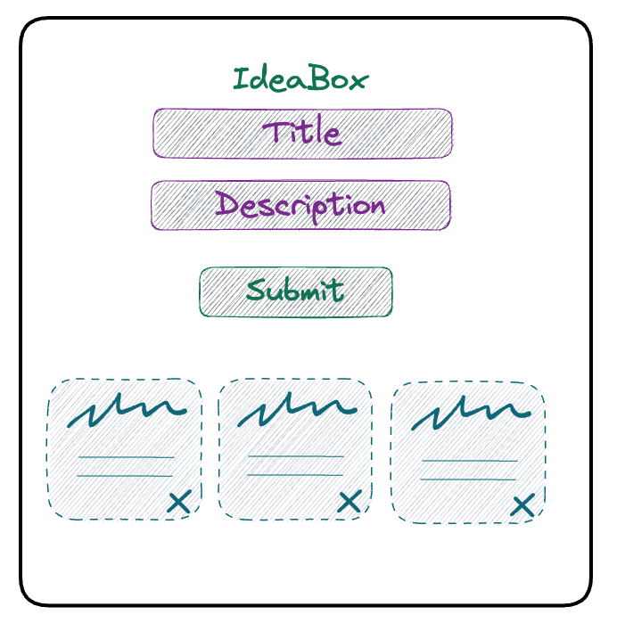
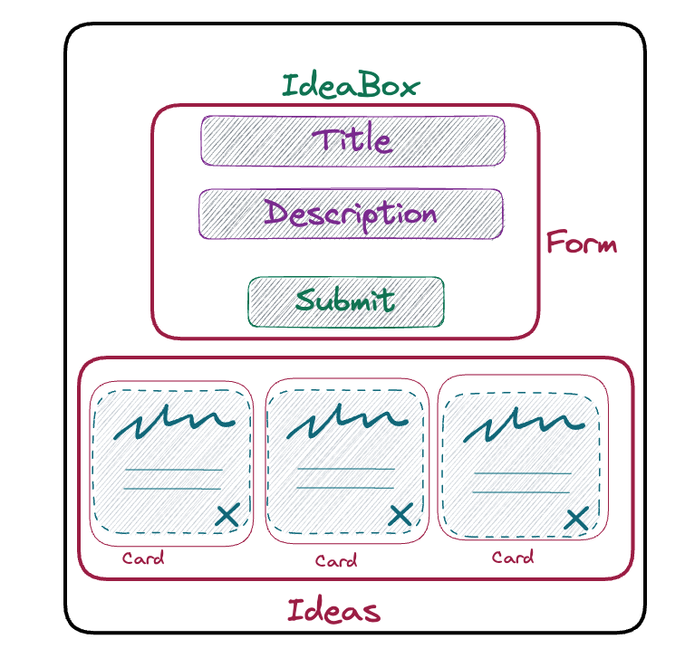
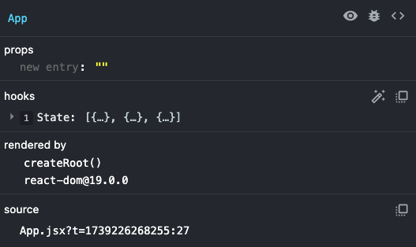
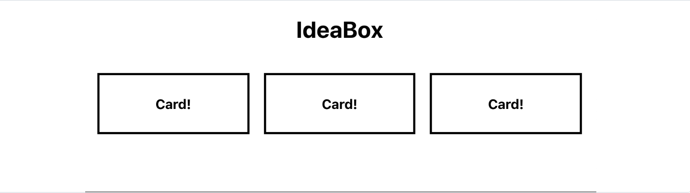

## Learning Goals

* Create functional components
* Use state and props to manage application data
* Use Hooks with functional components
* Create a controlled form
* Use JSX

## Before you get started...
You will complete this lesson on your own. Read each section carefully and completely. Moving quickly through this lesson is **not** the goal. You should move through the lesson at a pace that allows you to take solid notes and fully understand the code you are writing. We will provide lots of code blocks for you.  Resist the temptation to copy and paste the code from those examples. Doing this will only hurt you in the end, as you'll be missing out on a lot, a lot, a lot of learning.    

We will have a review session where we will cover the major themes and key points from this lesson. As you are working through it, please write down any questions that pop up for you. These questions will help drive our review.  If a blocker pops up, post your question in your codehelp slack channel.  Work with your classmates to try to figure it out.

DELIVERABLE: **You are expected to complete this entire lesson before Day 1 of Mod 3.**  You will submit your Ideabox project with your intermission deliverables.

## What You're Building
Here is a peak at what you're going to build during this lesson:  


<section class="call-to-action">
### Stop and Think

How would you build this application using vanilla JS? What functions would need to exist?
</section>

## React Developer Tools

React has its own set of developer tools that are extremely helpful. [Install the dev tools Chrome extension](https://chromewebstore.google.com/detail/react-developer-tools/fmkadmapgofadopljbjfkapdkoienihi?hl=en). Now, anytime you're looking at a React app, you'll see a "Components" and "Profiler" tab in your dev tools! As you're working through this tutorial, pay attention to those tabs (especially the "Components" tab).

## Creating a new React app with Vite

For this lesson, we will be using [Vite](https://vite.dev/guide/) to spin up a React application. [`create-react-app`](https://facebook.github.io/create-react-app/) used to be a good option but is no longer maintained.

Many of the dependencies and configuration files will be obscured, since we won't need to worry about them. This is a fast way to set up a React application so we can concentrate on building out the app, instead of spending our time and energy on tooling.

_Note_: A good intermission or post-graduation project is to learn how to configure React. Hand-rolling a React application will make you more familiar with how React works.

### Get started with Vite

#### Prerequisites:
Vite requires Node.js version 18+ or 20+.   Let's use nvm (node version manager) to install the latest version of Node.js.

Run:
```bash
nvm install 22
```
You can confirm you have Node version 22 by running `node -v`.
If you have trouble with the nvm command, ensure you have `nvm` installed by running `nvm -v`.

To set up a new react application, run the command:

```bash
$ npm create vite@latest ideabox --template react
```

You will see something like this run in your terminal:
Select `y` to proceed then select `React` and `JavaScript`

```bash
Need to install the following packages:
  create-vite@latest
Ok to proceed? (y) y
npm WARN EBADENGINE Unsupported engine {
npm WARN EBADENGINE   package: 'create-vite@6.2.0',
npm WARN EBADENGINE   required: { node: '^18.0.0 || ^20.0.0 || >=22.0.0' },
npm WARN EBADENGINE   current: { node: 'v16.14.2', npm: '8.5.0' }
npm WARN EBADENGINE }
✔ Select a framework: › React
✔ Select a variant: › JavaScript

Scaffolding project in /Users/heatherf/Turing/se-modules/se3/react-prep/ideabox-vite...

Done. Now run:

  cd ideabox-vite
  npm install
  npm run dev

```

As the instructions say, let's change directories `cd` into our new ideabox application and install dependencies by running `npm install`. 

Open the repo in VS Code with `code .`

Finally run `npm run dev` to see our new boilerplate application displayed at <a href="http://localhost:5173/">http://localhost:5173/</a>

<section class="call-to-action">
### Explore

Take a few minutes and look around the boilerplate. Hint: start at the `src/` folder!

What happens if you:

* Change some of the HTML you see in the `App.jsx` file?
* Change some of the CSS you see in the `App.css` file?

You'll also notice an `main.jsx` file. What is going on in there?  
This is a great time to do some googling or ask chatGPT for help understanding.  

```jsx
createRoot(document.getElementById('root')).render(
  <StrictMode>
    <App />
  </StrictMode>,
)
```
</section>

## Modular File Structure

React lets us keep our code modular, but what does it look like to have our code and project files be modular?

One small example is to keep a modular file structure. Any and all files related to a particular component live in the same directory! We recommend setting up your file structure like the example below each time you build a new project. 

Take a moment now to create a `components` directory within your `src` directory. Create a directory for `App` within that `components` directory.  Move the 2 `App` files into the `App` directory.  We'll build directories and files for Form, Ideas, etc later.

src 📁
- components 📁
    - App 📁
        - App.jsx
        - App.css
    - Form 📁
    - Ideas 📁
    - Etc

Uh-oh!  Changing the file structure will impact our imports.  VS Code will offer to update App imports.  But we'll still need to update the reactLogo import in App.jsx.  That import would now be `import reactLogo from '../../assets/react.svg'`

## Ideabox

Let's get rid of all the boilerplate inside the `App.jsx` file. Yep. Just ERASE THAT CODE - including the imports!

You'll notice that as soon as we save our changes, the browser re-renders. Look into the terminal, and you'll see another build kick off. This is because Vite gives us hot-reloading. Any time we make a change, the browser will update to show our changes.  However, sometimes if we hit a significant error, **we may still have to refresh the page or re-run `npm run dev` to get things going again after implementing the fix.**

Look at the console in our dev tools now that we've deleted our `App.jsx` code, and you'll see an error that reads:

*"Uncaught SyntaxError: The requested module '/src/components/App/App.jsx?t=1739225023971' does not provide an export named 'default' (at main.jsx:4:8)"*

Back in our `main.jsx` file we're trying to render a React component: App. However, we're no longer exporting a valid React component!  

While JavaScript error messages aren't always very clear or helpful, React error messages are much better at telling us what's going on. The often even include a link to the appropriate part of the React docs!  

Let's start building out our App component.

### Planning our app

Let's figure out what should be a component in our app.



- We have an App component. That should probably hold onto our list of ideas.  

- We need a Form component so we can create new ideas. The Form component will have to be able to add new ideas to App's list of ideas.  

- We need a Card component to display our ideas.  

- We can create an Ideas component to hold all of our Cards.  



### App.jsx

Because we want App to hold onto our list of ideas, let's think about how we're going to store that information. 

We will use **_state_** to store data, like our list of ideas. We will learn more about the concept of _state_ in Mod 3 but it might be helpful to research a bit now.  ChatGPT and google are great options but you should really make the official [React Documentation](https://react.dev/) your first stop.  

In order to use component state, we need to import useState hook from React. So, let's import useState hook from React, and create our App component!

```jsx
import { useState } from 'react';

function App() {
 
 // Logic and other needed functions will go here

 return (
  //Your JSX code goes here
 )
}

export default App;
```

The above code is defining the App functional component in React.  App returns JSX code via the `return` keyword just like any ol' function. 

<section class="note">
  It's important to note that this code is using functional components, rather than class components and OOP. This allows us to manage our component in a more concise and streamlined way, without relying on class inheritance and traditional OOP principles.
</section>
Let's keep writing our App component!

```jsx
import  { useState } from 'react';

function App() {
    return (
      <h1>IdeaBox</h1>
    )
}

export default App;
```

Save this code and go check your browser. What do you see?

Let's take a minute and examine that return statement.

<section class="note">
### Understanding JSX

It looks like we are returning some HTML! Very easy to read, right?  

What we're actually writing here is known as JSX. It's an abstraction that makes React easier to write!  

JSX is "JavaScript and XML" - it's a handy mashup language that allows us to write HTML with a bit of JavaScript injected in. You can read more on it [here](https://reactjs.org/docs/introducing-jsx.html) (and a bit more in depth [here](https://react.dev/learn/writing-markup-with-jsx)). It's not something you need to be an expert on, but you should know that it's being used in React. In the meantime, we'll see how JSX makes our lives easier throughout this lesson!
</section>

Okay. Now try to add a paragraph tag after your <h1> tag. What happened?


You should receive this error:
```
Failed to compile.

...src/components/App/App.jsx: Adjacent JSX elements must be wrapped in an enclosing tag. Did you want a JSX fragment <>...</>? (6:4)

  4 |     return(
  5 |       <h1>IdeaBox</h1>
> 6 |       <p>Hi!</p>
    |       ^
  7 |     )
  8 |   }

```

Let's figure out what this error is saying. "Adjacent JSX elements must be wrapped in an enclosing tag."

If we think about this logically, it makes sense! Our component is just a function. And how many things can a function return at once? Just one! So in order to return multiple JSX elements, we have to wrap them in a single JSX element!

Since this is our App component, let's wrap everything in a `<main>` tag!

<section class="note">
### NOTE  

If you're just looking for an unflavored container for your elements (aka they are not semantically related to one another, and the best element to use would be a `<div>`), then instead, use a `<React.Fragment>`! You can read more about Fragments [here](https://react.dev/reference/react/Fragment).
</section>

We'll also import our App.css file.  And give our <main> element a class of 'App' like so:


```jsx
import  { useState } from 'react';
import './App.css';

function App() {
  
    return(
      <main className='App'>
        <h1>IdeaBox</h1>
        <p>Hi!</p>
      </main>
    )
  
}

export default App;
```

You'll notice that instead of "`class`", we're using a "`className`" attribute on our `<main>` element. Why do you think this is?

### App.jsx state

Okay. Let's come back to our App component and create state - our "source of truth" for the data the app will be using.

```jsx
import { useState } from 'react'
import './App.css';

function App(){
  const [ideas, setIdeas] = useState([]);

  return (
    <main className='App'>
        <h1>IdeaBox</h1>
        <p>Hi!</p>
      </main>
  )
}

export default App;
```

<section class="call-to-action">
### Reflect

* What is "useState"?
* What is the setIdeas?

</section>

For our application, we want to create a list (aka an array) of ideas.

Let's start out with a couple of default ideas, just so we can have something to look at when we begin building out the rest of our components.

```jsx

import  { useState } from 'react';
import './App.css';

function App(){
  const dummyIdeas = [
        { id: 1, title: 'Prank Travis', description: 'Stick googly eyes on all his stuff' },
        { id: 2, title: 'Make a secret password app', description: 'So you and your rideshare driver can both know neither one of you is lying' },
        { id: 3, title: 'Learn a martial art', description: 'To exact vengeance upon my enemies' },
    ]
  const [ideas, setIdeas] = useState(dummyIdeas)

  return(
    <main className='App'>
        <h1>IdeaBox</h1>
        <p>Hi!</p>
    </main>
  )
}

export default App;

  
```

Open up your React Dev Tools (open your dev tools, then go to the Components tab). You can see that App now has state:



Neat!

**Consider the following...**

Okay. Let's pause for a second. `App.jsx` is a functional component, and we used useState to setup a state for our component.

### State

**State** holds data that represents the actual state of our application. State can be changed and mutated through user interactions.

React Hooks is a feature that was introduced at the end of 2018. It allows functional components to access and manipulate state. In future lessons, we'll learn about other types of components as well. However, for now, it's essential to understand functional components and how React Hooks enable them to manage state in a more concise and streamlined way.

## Ideas.jsx

Next, let's focus on getting our two ideas to render!

We already said that we want to have a container for all of our idea Cards. So let's create that component! In your VS Code, make an `Ideas` directory within the `components` directory and give it two new files: `Ideas.jsx` and `Ideas.css`.

<section class="note">
### Note

You may have noticed that our App component was capitalized. And now our Ideas component is capitalized, too.In React, component names should be written in PascalCase, which is a naming convention where the first letter of each word in the name is capitalized, and there are no underscores or hyphens between words.By following this naming convention, it becomes clear to other developers that a particular element in the codebase is a React component.   

When an element starts with a lowercase letter, it refers to (and will be treated as) a built-in component like `<div>` or `<span>`, which can lead to silent errors or unexpected side-effects. It's also important to note that capitalizing component names makes for good developer empathy, because they can look at the file tree and see at a glance which files are are components and which are not. 
</section>

Will this Ideas component need to have state? What do you think?

Since the Ideas component will just be rendering Card components, it will not need to have its own state.

Let's create a function called Ideas that returns an h2 that reads "Ideas go here!"

```jsx
// Ideas.jsx

import './Ideas.css';

function Ideas(){
  return (
    <h2>Ideas go here!</h2>
  )
}

export default Ideas;
```

Then, back in our `App.jsx`, we can import our shiny new Ideas component and add it to our return so it will render!

```jsx
// App.jsx

import { useState } from 'react'
import './App.css';
import Ideas from '../Ideas/Ideas'

function App(){
  const dummyIdeas = [
        { id: 1, title: 'Prank Travis', description: 'Stick googly eyes on all his stuff' },
        { id: 2, title: 'Make a secret password app', description: 'So you and your rideshare driver can both know neither one of you is lying' },
        { id: 3, title: 'Learn a martial art', description: 'To exact vengeance upon my enemies' },
    ]
  const [ideas, setIdeas] = useState(dummyIdeas)

  return(
    <main className='App'>
        <h1>IdeaBox</h1>
        <p>Hi!</p>
        <Ideas/>
    </main>
  )
}

export default App;

```

When we look at our browser, we should see our h2! That's nice and all, but not very useful.

We have to pass our ideas array from the App component to our Ideas component. We accomplish that by using **props**.

### Props

Props (along with state) are the heart and soul, the meat and potatoes, of React. They are what allow us to pass information between components. Let's take a look at how that might work.

We've mentioned that components are reusable pieces of code, that allow us to create unique instances of certain UI elements. We can do this by passing props to each of our components. Think about how you create a new function and pass arguments into it.

Props allow us to pass information from parent components to child components. We can pass strings, numbers, booleans, arrays, objects, functions, pretty much any piece of data we want access to in our child component. We can name them whatever we'd like, as long as we're consistent and semantic with the names that we choose.

When we pass props down to a child component, it comes through as a simple JavaScript object with key value pairs.

Let's start with an example, just to keep things simple. For now, since our Ideas component just contains an h2, let's make that h2 say something different than "Ideas go here!"

In our App component's return statement, let's get rid of our <p> tag and pass some data as a prop when rendering our Ideas component.

```jsx
// App.jsx
// ...
  return(
    <main className='App'>
        <h1>IdeaBox</h1>
        <Ideas name='Travis'/>
    </main>
  )
// ....
```

Now, let's adjust our Ideas component so it can receive and use that data coming in as props.

```jsx
// Ideas.jsx

function Ideas(props){

  return (
    <h2>Hello, {props.name}!</h2>
  )
}
```

What are those curly brackets doing? In JSX, whenever we're writing something that is JavaScript (aka "not HTML"), we have to wrap it in curly brackets. In this case, "name" acts like a variable. It's not a string that reads "name" - it's a placeholder that represents the value of the property (in this case, "Travis")! Because it's a variable, we have to surround it in curly brackets to tell the JSX to treat the contents like JavaScript.

In your browser, you should see "Hello, Travis!" In `App.jsx`, add another Ideas component to the `App.jsx` `return()` , but pass in a different name. What do you see in the browser? Try creating new props to use!

Okay, so just WHAT exactly is going on here?

 **props** is the name of an object that contains key-value pairs. From our above example, the key is "name", and the value is "Travis". So, in our Ideas component, we can access the value by writing `props.name` (which gives us a string of "Travis"). This is the same dot notation we learned in Mods 1 and 2 to access data stored in objects.

If, in the `return` of our App component, we called the property "potato" instead of "name", we would have to access it by (inside the Ideas component) writing `props.potato`.

We can even destructure the props object, because it's just a regular object!

```jsx
// Ideas.jsx

function Ideas(props){
  const { name } = props;

  return (
    <h2>Hello, {name}!</h2>
  )
}
```

In _this_ example, destructuring is a bit over-engineered, yes. However, we'll see in our Card component that destructuring will save us from having to type `props.` over and over again.

And here's YET ANOTHER super-fancy way to destructure:

```jsx
// Ideas.jsx

function Ideas({ name }){
  return (
    <h2>Hello, {name}!</h2>
  )
}
```

We can destructure props ON THE WAY IN. Whoa! It's accomplishing the same thing as destructuring on a separate line, like in the previous example.  Be aware of destructuring but don't stress it at this time.


<section class="note">
### State vs. Props  

Understanding the difference between props and state can be tricky. Read through the top three answers on this [stackoverflow question](https://stackoverflow.com/questions/27991366/what-is-the-difference-between-state-and-props-in-react), and go through any links or resources provided in the answers. Just because one answer has the most upvotes, doesn't mean it's going to be the one that makes everything click for you. Take your time reading through the explanations here.
</section>

### Mapping over the ideas array

All right. We don't actually want to render an h2 in our Ideas component. We want to render some Cards with some gosh dang IDEAS!

Let's create a Card component to use.

Create a `Card` directory and put a `Card.jsx` and `Card.css` file in it. 

```jsx
// Card.jsx


import './Card.css';

function Card(){
  return (
    <div className='card'>
      <h3>Card!</h3>
    </div>
  )
}

export default Card;
```

Then, in your Ideas component, let's just try to get these hooked up properly.

```jsx
// Ideas.jsx


import Card from '../Card/Card';
import './Ideas.css';

function Ideas(props){
  const { name } = props;

  return (
    <div className='ideas-container'>
      <Card />
      <Card />
      <Card />
    </div>
  )
}

export default Ideas;
```

And let's throw some CSS in just to make our cards look like not a hot garbage fire:

```css
/* Ideas.css */

.ideas-container {
  padding: 20px;
  display: grid;
  grid-template-columns: repeat(3, 1fr);
  grid-gap: 20px;
}
```

And in your Card css file:

```css
/* Card.css */

.card {
  box-sizing: border-box;
  border: 3px solid black;
  padding: 10px;
}
```

Okay! Hopefully your app looks like this:



All right, friends. Let's get to passing some PROPS! Let's go all the way back to our App component and pass our list of ideas to the Ideas container component, so that it can then create Card components out of each individual idea.

```jsx
// App.jsx


  return(
    <main className='App'>
      <h1>IdeaBox</h1>
      <Ideas ideas={ideas} />
    </main>
  )
```

Let's unpack what we're doing here. We created a new prop called "ideas", and the value we're passing in is our array of ideas (data) which lives in the App component's state. Remember, `ideas` is JavaScript, not HTML, so we need to wrap it in curly brackets!

Go look at the Ideas component in your React dev tools in the browser. You should see that the props contain a key of "ideas" with a value of the array of ideas from App state!

We now want to iterate through our array and create a Card component, passing it the information it needs to display the proper information!

```js
// Ideas.jsx
import Card from '../Card/Card';
import './Ideas.css';

function Ideas({ ideas }){

  const ideaCards = ideas.map(idea => {
    return (
      <Card
        title={idea.title}
        description={idea.description}
        id={idea.id}
        key={idea.id}
      />
    )
  })

  return (
    <div className='ideas-container'>
      {ideaCards}
    </div>
  )
}

export default Ideas;

```

Okay - we've made a few changes! You'll notice that we're now destructuring the props _as we pass them in_! W H A T. I know. Then, we're mapping over the ideas array and creating a new array of Card components, each with props of `title` and `name`. The `key` property is something that React requires when using `map()` to create elements. In this case, I'm just using the unique id that each idea has.

If you look in your React dev tools, you'll see that both Card components now has props of "title" and "description"! Go ahead a change Card so we display that information.

```js
// Card.jsx
import './Card.css';

function Card({ title, description, id }){
  return (
    <div className='card'>
      <h3>{title}</h3>
      <p>{description}</p>
      <button>🗑</button>
    </div>
  )
}

export default Card;

```

I created a button to delete the Card, but we'll get to that later. For now, let's celebrate, because we just got this sucker to display some ideas!!

## Conditional Rendering

Before me move on, lets tighten up the UX here a bit.

<section class="call-to-action">
### Explore  

* Try assigning  an empty array to the state of our App data .
* What happens? Why?
* What would make for a better user experience?
</section>

To handle the logic for this, we can use **Conditional Rendering**.

Conditional rendering is exactly what it sounds like: telling a component to render something based on a condition. We put some JS into our component's render function, and tell it what to put on the DOM based on some set of conditions. Let's add some here!

Currently our App looks like this:

```jsx
// App.jsx

function App () {
    const [ideas,setIdeas] = useState([])
    return (
      <main className="App">
        <h1>IdeaBox</h1>
        <Ideas ideas={ideas} />
      </main>
    )
}


```

We want to add conditional logic that essentially says, *if there aren't any ideas to display, display an <h2> inviting users to add some ideas.*

<section class="answer">
### In plain JS, what could this conditional look like?
```javascript
if (!ideas.length) {
  // return an h2 saying to add some ideas
}
```
</section>

We can use curly braces to inject JS into our JSX. However, we need whatever is inside of our curlies to _evaluate_ to the HTML we want rendered, so we'll use React's conditional rendering syntax like this:

```jsx
// App.jsx

 return ( 
  <main className="App">
    <h1>IdeaBox</h1>
    {!ideas.length && <h2>No ideas yet -- add some!</h2> }
    <Ideas ideas={ideas} />
  </main>
 )


```

<section class="note">
### If this syntax feels weird, take a look at the [logical && operator's docs](https://developer.mozilla.org/en-US/docs/Web/JavaScript/Guide/Expressions_and_Operators#Logical).

What does the operator return?
</section>

The code above says that, if the expression on the left side of the `&&` is true, return the expression on the right side. So if there are no ideas in state, return our h2!

## Form.jsx

Let's move on to our Form component. We're going to create what is known as a controlled form.

Create the Form directory and the `Form.jsx` and `Form.css` files.

```css
/* Form.css */

form {
  margin: auto;
}

input, button {
  margin: 5px;
  width: 30%;
  border: 2px solid black;
  font-size: 18px;
}

```

Our Form will start like this:

```jsx
// Form.jsx

import { useState } from 'react';
import './Form.css';

function Form(){
  const [title, setTitle] = useState("");
  const [description, setDescription] = useState("");

    return (
      <form>
        <input
          type='text'
          placeholder='Title'
          name='title'
          value={title}
        />

        <input
          type='text'
          placeholder='Description'
          name='description'
          value={description}
        />

        <button>SUBMIT</button>
      </form>
    )
}

export default Form;
```

Now that we have our Form files started, we can connect our Form to our App component so it will render.  
First, import the Form in App.jsx.  
```jsx
import Form from '../Form/Form';
```
Then, render the Form in App's return.
```jsx
  return ( 
    <main className="App">
      <h1>IdeaBox</h1>
      {!ideas.length && <h2>No ideas yet -- add some!</h2> }
      <Form/>
      <Ideas ideas={ideas} />
    </main>
   )
```

But we also need to write some functions. Let's go back to our Form and make sure that when we type into our inputs, they update the Form's state.

```jsx
// Form.jsx

    return (
      <form>
        <input
          type='text'
          placeholder='Title'
          name='title'
          value={title}
          onChange={event => setTitle(event.target.value)}
        />

        <input
          type='text'
          placeholder='Description'
          name='description'
          value={description}
          onChange={event => setDescription(event.target.value)}
        />

        <button>SUBMIT</button>
      </form>
    )

```

What is this `setTitle` business?  
It's a function created using useState hook to manage the state of the title.  
The useState hook returns an array with two elements. The current state value in this case an empty string and a function to update the state in this case `setTitle`.  
   
OK let's go back to `setTitle` and what is happening in the `onChange`. So when the `onChange` event listener is triggered by the user typing something into the input field, the `setTitle` function is called with the new value of the input as an argument. This updates the state of the title variable with the new value, causing a re-render of the component with the updated state.

Take a look at your React dev tools - is the state updating as you type into the inputs?

When we click the submit button, what do we want to happen?  
We want to create an object out of the new idea and add it to the list of ideas that App is holding onto in state. How do we access App's state from inside our Form component?

### Passing functions

In App, we're going to have to create an `addIdea` function that updates App's state.  Then we'll pass that function into our Form as a prop.

```jsx
// App.jsx

  function addIdea (newIdea) {
    setIdeas([...ideas, newIdea])
  }

    return(
      <main className='App'>
        <h1>IdeaBox</h1>
        {!ideas.length && <h2>No ideas yet -- add some!</h2> }
        <Form addIdea={addIdea} />
        <Ideas ideas={ideas} />
      </main>
    )

```

This is a callback function that takes a new idea object as an argument, and adds it to the existing ideas array by creating a new array using the **spread operator** ... to copy the existing ideas array and adding the new idea to the end of it.
This updated array is then set as the new state of `ideas` using `setIdeas` function which is the state updater function created by useState hook. 

This is good, because we're passing it down as a prop to the Form component!

Now, in the Form component, let's make use of the `addIdea` function we passed as a prop. To access `addIdea` we'll need to declare 'props' as a parameter in our functional Form component then use dot notation to access `props.addIdea`. Or, we could use destructuring to allow us to directly reference `addIdea` without having to use dot notation.

We're also creating a submitIdeas function in the Form component that will format the newIdea to be passed into the invocation of the addIdea prop.  The submitIdeas function will be invoked on the Form's button click.

```jsx
// Form.jsx
import { useState } from 'react';
import './Form.css';

function Form({addIdea}){
  const [title, setTitle] = useState("");
  const [description, setDescription] = useState("");

  function submitIdeas(event) {
    event.preventDefault()
    const newIdea = {
        id: Date.now(),
        title,
        description
    }
    addIdea(newIdea)
    clearInput()
  }
  function clearInput(){
      setTitle("")
      setDescription("")
  }

  return (
    <form>
      <input
        type='text'
        placeholder='Title'
        name='title'
        value={title}
        onChange={event => setTitle(event.target.value)}
      />

      <input
        type='text'
        placeholder='Description'
        name='description'
        value={description}
        onChange={event => setDescription(event.target.value)}
      />

      <button onClick = { event => submitIdeas(event)}>SUBMIT</button>
    </form>
  )
}

export default Form;

```

### Deleting a Card

Now that you know how to use a function and props to allow a different component to update App's state, see if you can get each Card's delete button to work.

First, write the App function to delete an idea from state and pass it to the Ideas component:

```jsx
// App.jsx

import './App.css';
import Ideas from '../Ideas/Ideas';
import Form from '../Form/Form';
import { useState } from 'react'

function App(){
  const dummyIdeas = [
        { id: 1, title: 'Prank Travis', description: 'Stick googly eyes on all his stuff' },
        { id: 2, title: 'Make a secret password app', description: 'So you and your rideshare driver can both know neither one of you is lying' },
        { id: 3, title: 'Learn a martial art', description: 'To exact vengeance upon my enemies' },
    ]
  const [ideas, setIdeas] = useState(dummyIdeas)
  
  function addIdea (newIdea) {
    setIdeas([...ideas, newIdea])
  }
  function deleteIdea(id){
    console.log(id);
    const filteredIdeas = ideas.filter(idea => idea.id !== id)
    setIdeas(filteredIdeas)
  }

  return(
    <main className='App'>
        <h1>IdeaBox</h1>
        {!ideas.length && <h2>No ideas yet -- add some!</h2> }
        <Form addIdea={addIdea}/>
        <Ideas ideas={ideas} deleteIdea={deleteIdea}/>
    </main>
  )
}

export default App;

```

Second, pass the `deleteIdea` function to each Card that the Ideas component creates:

```jsx
import './Ideas.css';
import Card from '../Card/Card';

function Ideas({ ideas, deleteIdea }){

  const ideaCards = ideas.map(idea => {
    return (
      <Card
        title={idea.title}
        description={idea.description}
        id={idea.id}
        key={idea.id}
        deleteIdea={deleteIdea}
      />
    )
  })

  return (
    <div className='ideas-container'>
      {ideaCards}
    </div>
  )
}
export default Ideas;
```

Third, create an event listener on the Card button:

```jsx

import './Card.css';

const Card = ({ title, description, id, deleteIdea }) => {
    return (
      <div className='card'>
        <h3>{title}</h3>
        <p>{description}</p>
        <button onClick={()=> deleteIdea(id)}>🗑</button>
      </div>
    )
  }
  export default Card;
```

Voila! You've created a React application!

<section class="call-to-action">
## Want to dig deeper? 
*Fully Optional Extensions - Not at all Expected*

* Look ahead to the [React: Advanced Data Management lesson](https://curriculum.turing.edu/module3/lessons/react_advanced_data_management)
* Open a branch.  
  * Refactor to fetch ideas from this [ideabox server](https://github.com/turingschool-examples/ideabox-api) instead of working with the hard coded ideas. *See server README for instructions on running it locally.*
  * Refactor your addIdea functionality to post the newly created idea to the server, then display it on the DOM (if posted successfully)
</section>

## Review
<section class="checks-for-understanding">

Take a few minutes to journal:

* What "aha" moments did you have?
* Which concepts are the fuzziest for you right now?
* Which concepts are the clearest for you right now?
* What do you know about functional components?
* What do you know about hooks?
* What do you know about state?
* What do you know about passing props?
* What questions do you have? (bring these to class!)

</section>
