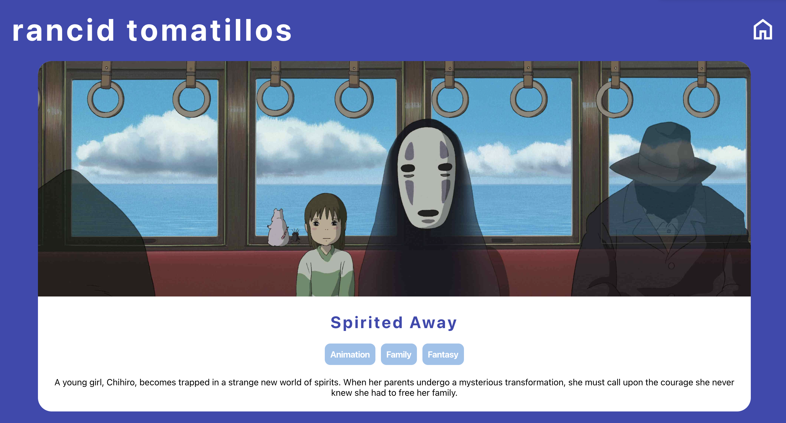
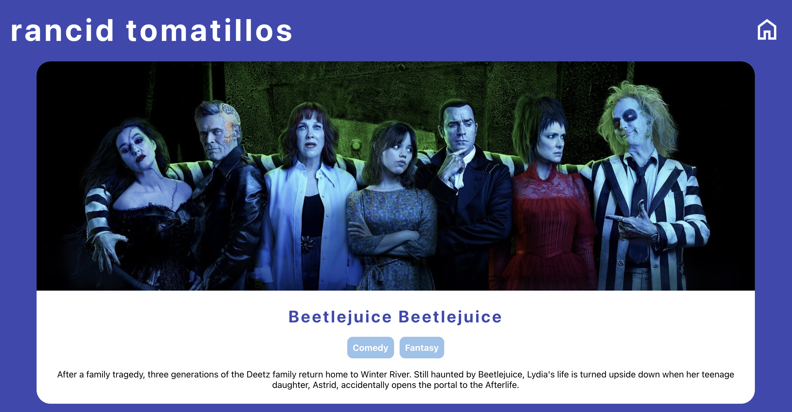
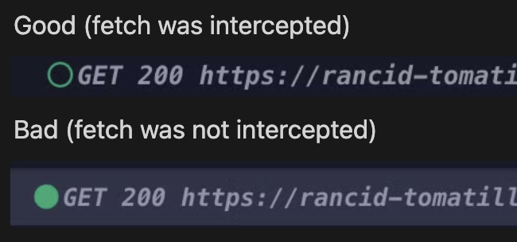
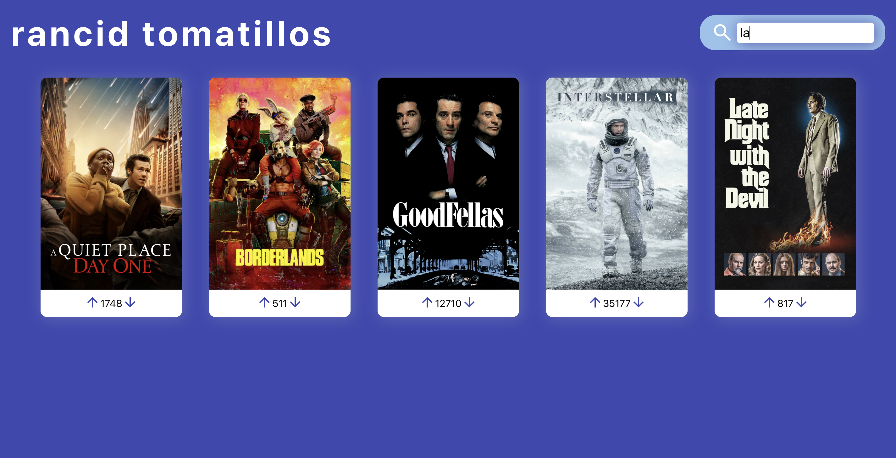

_[Back to Rancid Tomatillos Home](./index)_

## Styling

You do not have to match our styling for this project. That said, we want you to make intentional styling choices and for your final product to look polished. If you'd rather not spend time creating a design for this app, you may choose to match our design exactly. Pay close attention to the details - intentional hover states, spacing, and borders can make a huge difference. Be prepared to defend your styling choices in your evaluation with your instructor.

## Iterations

<section class="dropdown">
### Iteration 0: Set Up & Planning

You will be starting with this boilerplate repo: **[https://github.com/turingschool-examples/rancid-tomatillos-starter](https://github.com/turingschool-examples/rancid-tomatillos-starter)**. Follow the steps in the README carefully.

<section class="note">
### Turn in all deliverables via [this google sheet](https://docs.google.com/spreadsheets/d/1YDI4TAFdkOhpcFatdGONR7QtlDZVOpsvJVimtX77M6I/edit?usp=sharing).
</section>

**By the end of the day, Day 1:**
* The link to your forked repo (should be renamed to NOT include "starter" in the name)
* The link to your DTR

**By the end of the day, Day 2:**
* The link to your **[Project Board](https://docs.github.com/en/issues/planning-and-tracking-with-projects/creating-projects/creating-a-project)**. Your Project Board should include:
  - At least 4 columns, i.e. `To Do`, `In Progress`, `In Review`, `Merged/Done`
  - At least 6 tickets, with each ticket including:
    - The associated user story from this project spec
    - A **[label](https://docs.github.com/en/issues/using-labels-and-milestones-to-track-work/managing-labels)** that indicates the associated iteration (i.e. `iteration 1`)
    - Some details in the description (a ticket's content should not just be the title)
    - At least 2 tickets should be **[assigned](https://docs.github.com/en/issues/tracking-your-work-with-issues/assigning-issues-and-pull-requests-to-other-github-users)** to a person
    - (optional) Ideally, all tickets should be converted to **[issues](https://docs.github.com/en/issues)** in your repo
      - By default, when you fork a repository, Issues are disabled. To enable them go to Settings in the upper right corner, then scroll down to the Features section. Check the Issues box to enable them.
      - Bonus: Remember that **[you can close your issues directly from a PR](https://docs.github.com/en/issues/tracking-your-work-with-issues/using-issues/linking-a-pull-request-to-an-issue)**!
* An initial plan for your component architecture. Any format is fine, though you might find something like **[excalidraw](https://excalidraw.com/)** to be helpful. You should answer the following questions:
  - What components do you envision needing? What is the relationship between these components (parents, siblings, etc)?
  - Where will data be stored? Which components will need **state**?
  - How will information be passed around? What **props** will be necessary? 
</section>

<section class="dropdown">
### Iteration 1: Movie Posters

For this first iteration, we will use mock data to display the movies (we will later refactor our project to consume an API). The purpose of using mock data instead of querying the actual API is to allow us to focus purely on React for now.

Use the data in `src/data/movie_posters.js`. The import is set up for you in `App.js` - just uncomment it.

**User Stories**  
- As a user, I should also see a "Rancid Tomatillos" title on the page.
- As a user, when I visit the app, all movies should be displayed. For each movie, I should see:
  - the movie poster
  - the number of votes (you don't need to include the arrow buttons yet)

<section class="dropdown">
### 👀 Preview

Screenshot:

In Motion:

<iframe src="https://www.loom.com/embed/e75998c4c30447e08b4d492acf3ba035?sid=d0dc143e-2bfd-4c43-ad5e-d956e0acda73" frameborder="0" webkitallowfullscreen mozallowfullscreen allowfullscreen style="position: absolute; top: 0; left: 0; width: 100%; height: 100%;"></iframe>

</section>
</section>

<section class="dropdown">
### Iteration 2: Voting

Again, we will not be making any network requests yet. 

**User Stories**
- As a user, I should see a button for upvoting and downvoting on each movie card
- When I click the up arrow...
  - The data should be updated so that the movie I clicked on has one more vote (state AND the mock data!).
  - I should see the vote increase by one on the movie card.
- When I click the down arrow...
  - The data should be updated so that the movie I clicked on has one less vote (state AND the mock data!).
  - I should see the vote decrease by one on the movie card.

<section class="dropdown">
### 👀 Preview

Screenshot:

In Motion:

<iframe src="https://www.loom.com/embed/4626f40ab216435ca27fe7f70cea386d?sid=6c44835d-3bb7-469c-bc62-fef0c7eda25a" frameborder="0" webkitallowfullscreen mozallowfullscreen allowfullscreen style="position: absolute; top: 0; left: 0; width: 100%; height: 100%;"></iframe>

</section>
</section>

<section class="dropdown">
### Iteration 3: Movie Details

We're still not making a network request! Use the data in `src/data/movie_details.js`. The import is set up for you in `App.js` - just uncomment it. Note that the mock data is hard-coded to return "Spirited Away" details no matter what. That's okay! In the future, when we use the actual API to get individual movie details, the information will change. For now, you can expect that we'll see "Spirited Away" info no matter what movie you click on.

**User Storie**  
- As a user, I can click a movie, and see that movie's details.
  - At minimum, I should see see a movie's backdrop image, genres, and overview. You may choose to display more information if you'd like.
  - When a movie's details are displayed, none of the other movies will be visible, but the page's header is still visible.
  - When a movie's details are displayed, the user should have a way to return to the main view of all movies (i.e. a home button). This button should not be visible if I am on the home page.

<section class="dropdown">
### 👀 Preview

Screenshot:

In Motion:

<iframe src="https://www.loom.com/embed/72d10684d8d84671baecb864f34b5c3f?sid=fe025c68-5c08-40d6-bf03-ebe63f5e921f" frameborder="0" webkitallowfullscreen mozallowfullscreen allowfullscreen style="position: absolute; top: 0; left: 0; width: 100%; height: 100%;"></iframe>

</section>
</section>

<section class="note dropdown">
### A Note About Refactoring

We are about to get into some refactoring iterations. These iterations are designed to require heavy refactoring. It is expected that you will have to re-organize the code you've written. Don't be too attached to the code you have right now - it will need to change! For example, if your goal is to shove Router into your existing code while making as few changes as possible, you're doing it wrong.

If it makes you nervous, remember that you should always be working on a branch. All your previous code is safe and sound on the main branch until you've got your new feature working.  
</section>

<section class="dropdown">
### Iteration 4: Refactor with Network Requests

For this iteration, we'll finally refactor our application to use actual data from a backend instead of our mock data files. 🥳

**[Here are the API Docs.](./api_documentation)**

**User Stories**
- After deleting the entire `data` folder and fetching instead, all prior user stories still work as expected.
- When you click on a movie, you should see that movie's details (no longer always showing "Spirited Away").
- When a user votes, a `PATCH` request is sent so the backend data is updated.

<section class="dropdown">
### 👀 Preview

Screenshot:

In Motion:

<iframe src="https://www.loom.com/embed/87f7179a6e8a440b8432e149424e5c8b?sid=f4fa1691-c0ff-4e6d-9796-fafcc456e008" frameborder="0" webkitallowfullscreen mozallowfullscreen allowfullscreen style="position: absolute; top: 0; left: 0; width: 100%; height: 100%;"></iframe>

</section>
</section>

<section class="dropdown">
### Iteration 5: Test with Cypress

The goal of this iteration is to test all of our user flows using **[Cypress](https://docs.cypress.io/guides/overview/why-cypress)**.

We've already included some basic Cypress files for you, including one test in `cypress/e2e/main.cy.js`. You can run the test suite using the command `npx cypress open`.

We've also given you some mock data to use for your testing. You can find those files in `cypress/fixtures`. Notice that one file has data for you and the other doesn't - you'll need to add that mock data yourself. 

<section class="note">
### Solid Testing Coverage Looks Like...

1. All application views and user flows are fully tested
2. All network requests are intercepted and stubbed so that our test suite never hits the actual API
</section>

**1**. Here are some of the user flows you should be testing:  

  - As a user, when I load the application, I see the title of the application.
  - As a user, when I load the application, I see a collection of movies.
    - Note: When testing a collection of elements, it's good practice to check that...  
      - The number of elements we expect to be there are there (i.e. there are 4 movie posters)  
      - The first element contains all the information we'd epect (i.e. correct image and vote count)  
      - The last element contains all the information we'd epect (i.e. correct image and vote count)  
  - As a user, when I click on a movie, I'm shown additional details about that movie.  
    - Note: We want to check ALL details. Just checking Title is not enough.  
  - As a user, when I upvote a movie, I see the movie's votes increase by one.  
  - As a user, when I downvote a movie, I see the movie's votes decrease by one.  

**2**. To ensure that your network requests have been intercepts correctly, check the 🟢s:  
  

</section>

<section class="dropdown">
### Iteration 6: Refactor with Router

So far the application has worked like a single page application. We have different views that are conditionally rendered, based on extra data you're probably holding in state. Also, the URL never changes.

To create a better UX, we're going to be using [React Router](https://reactrouter.com/en/main) to conditionally render our views based on the URL.

Implement the following routes:

| View | URL Path  |
|:-----|:---------|
| Homepage | `/` |
| Movie Details | `/:movieId`, where `movieId` is the `id` of the movie being displayed |

**User Stories**  
- As a user, when I click on a movie and the details page is rendered, the URL updates to reflect that movie's unique ID
- As a user, when I go back to the main page, the URL changes back to `/`
- I can click the browser forward & back arrows to navigate the application

💡 Hint - Can we remove the `onClick` event on your movie posters altogether now that we are using `Links` and `Routes`? Yes! Yes, we can!   

As you refactor, continue to rely on your test suite to ensure that no functionality is being lost/destroyed as you add in Router. Look into the [Cypress assertions](https://docs.cypress.io/api/commands/location.html#Syntax) which allow us to view our current URL pathname and add those into your tests!
</section>

<section class="dropdown">
### Iteration 7: Deploy

Let's deploy your application so you can share it with friends and family! And, you can share the deployed URL on your portfolio or resume to make it easier for employers to see your work in action 🔥

Note: If you've been running the API locally, be sure to update your network requests to point to the Heroku URL. Otherwise, the app won't work properly without locally running the backend - which defeats the whole purpose of deploying!

We don't care how you deploy, but we do recommend using either **[Netlify](https://www.netlify.com/)** or **[Vercel](https://vercel.com/)**. You may need to do some research and googlin' to get it working - you got this!

**To complete this iteration, please add your deployed URL link to your README.**
</section>

<section class="dropdown">
### Optional Extension: Live Search

This extension is optional and should only be attempted after all previous iterations are completed.

**User Stories**
- As a user, I see a search bar on the top of the main page.
- If I navigate to a movie's details, the search bar disappears.
- As I type into the search bar, the movies filter to show matches. I do not have to click a button or hit "enter" for the search to happen.
- The search is not case sensitive, meaning I can type "BEE," "bee," or "BeE" and "Beetlejuice" will appear as a match.
<section class="dropdown">
### 👀 Preview

Screenshot:

In Motion:

<iframe src="https://www.loom.com/embed/a46429ca92894ae9b3825879e81ad6ec?sid=46d6b2a4-a13a-4594-9b67-ea18fe64eb1d" frameborder="0" webkitallowfullscreen mozallowfullscreen allowfullscreen style="position: absolute; top: 0; left: 0; width: 100%; height: 100%;"></iframe>

</section>
</section>

