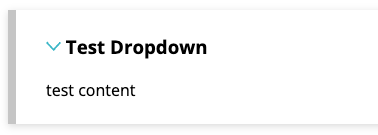

# Turing School of Software and Design
## Software Development Program Curriculum

## License

<a rel="license" href="http://creativecommons.org/licenses/by-nc-sa/4.0/"></a><br />This work is licensed under a <a rel="license" href="http://creativecommons.org/licenses/by-nc-sa/4.0/">Creative Commons Attribution-NonCommercial-ShareAlike 4.0 International License</a>.

## Site for the Turing Program

This site is built with Jekyll. Find the docs [here](https://jekyllrb.com/docs/usage/)

The live site can be found at [https://curriculum.turing.edu/](https://curriculum.turing.edu/)

### Contributing

* Clone the repo `git clone git@github.com:turingschool/curriculum-site.git`
* Note: You will need Ruby 3.2.2 installed ([setup instructions if needed](https://mod0.turing.edu/computer-setup#install-rbenv))
* Run `bundle install`
* You can now begin to edit the website.
* To start the server run `bundle exec jekyll serve --incremental`.
* Navigate to `localhost:4000` to see the site
* You can push changes to production by pushing the `main` branch to github. `git push origin main`.
* The changes may take a minute or two to be recognized on production. Please make sure you review your changes on production.

## Structure of the site and where to find the most important things:

You will find a module specific directory. eg `module1` and within each directory you will find a directory for `lessons` and `projects`. All files within this site can be written as either markdown or html. To link to each you just need to write the relative path to each file without the file extension. For example `lessons/lesson_on_stuff`.

The `navigation.html` file is where you will find the sidebar for the site.

The `today.html` file is where you will find the basic html page for today, and each file for the specific day will live within the `today` directory.

## Some handy tips for editing/creating content

### Creating Dropdowns

To create a dropdown like this:



Use the following structure:

```
<section class="dropdown">

### Test Dropdown - this must be a <h3>
test content

</section>
```

### Headers in your markdown files

Put something like this at the top of all your markdown files:

```yaml
---
title: Name of lesson
subheading: lesson is about stuff
layout: page
---
```

- `subheading` is optional
- `layout` is basically always going to be `page`

### Index.md instead of Readme.md

The system we're using to translate from github to curriculum.turing.edu uses index files instead of readme files. Where you would have created a file called `readme.md`, just use `index.md` instead

### Links and Paths

When linking to a markdown file, drop the `.md` in your link. Instead of linking to `learning_to_pair.md`, just use `learning_to_pair`. Other files, like PDFs and PNGs, keep the original extension.

#### Absolute vs Relative paths

Since you're editing on github, and viewing at curriculum.turing.edu, you'll probably want to use *relative* links instead of *absolute* links. I found a primer on the difference. It's in the context of HTML instead of Markdown, but should basically explain the concept: http://www.boogiejack.com/server_paths.html

### Your markdown will behave differently

Github uses a slightly different system for translating from Markdown than the engine we use for curriculum.turing.edu. Here's some things that I had to change to get things to look right on the site, even if it looks right on Github.

- Put a space after your `#`'s in headers
- Put a blank line between your headers and any content below
- Replace any `|` with `\|` unless you're really trying to do a table
